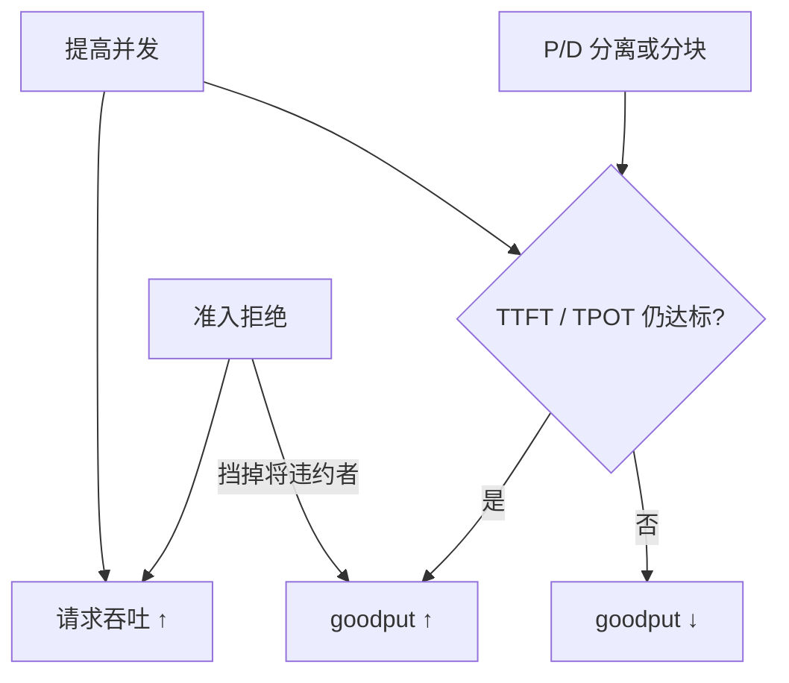

# 有效吞吐 Goodput

引擎可以每秒吃进很多请求、吐出很多 token，其中不满足延迟合同的那些，对交互产品等于零；把达标的速率单独命名，优化才不会把队列当成吞吐。

<footer>—— 对照 Zhong et al., DistServe：在 TTFT 与 TPOT 双 SLO 下最大化达标请求速率</footer>

吞吐计数完成的请求或 token，不管它们是否晚到、是否卡顿。[Goodput]（有效吞吐）把合同写进分子：只统计在截止时间内完成、且关键延迟分位数达标的请求（或 token）。DistServe 把生成服务的 goodput 具体写成：同时满足 TTFT SLO 与 TPOT SLO 的最大可持续请求速率。于是「把批加到 GPU 满载」不再自动算赢——满载若让 P99 穿线，goodput 可以下降。本篇把有效吞吐与请求吞吐、token 吞吐分开：前者是带 SLA 滤镜的容量，后者是引擎忙碌程度。滤镜怎么定，见 [服务指标](/llm/serving-metrics) 与 [SLO](/llm/serving-slo)。

## 问题

连续批与分页 KV 让 GPU 很容易看起来很忙。忙的方向却可能是错的：运行集过大，ITL 超出打字机可接受范围；队列很长，TTFT 以秒计，但最终请求都完成了，QPS 报表一片绿。交互产品的用户在首字之前就已经离开，这些完成对业务是浪费的算力。离线批作业可以只看吞吐；在线助手不能。需要一个指标，在饱和区惩罚违约，而不是奖励违约带来的额外完成数。

请求吞吐与 token 吞吐还会被长度分布操纵。拒长接短，QPS 升；鼓励长思维链，token/s 升。两者都可以在体验变差时上升。Goodput 要求先声明「什么叫一次合格服务」，再数合格次数。没有声明，有效吞吐退回普通吞吐。

### 合格必须是请求级的联合约束

只要求平均 TPOT 达标、不看 TTFT，系统会牺牲新请求的前填去喂解码批。只要求 TTFT、不看逐步间隔，会允许偶发长停顿。DistServe 的双 SLO 是最小联合：一次请求记入 goodput，当且仅当它的 TTFT 与（生成阶段）TPOT 或 TBT 都落在阈值内。E2E 截止可以再加一层。联合比单项更严，也才对应「既开得了口、又说得流畅」。

把 goodput 定义成「P99 达标时的最大 QPS」与「每条请求都达标的速率」不是同一个量。前者是工作点搜索的结果，后者是线上计数器。压测常用前者选配比；监控常用后者看漂移。写进文档时不要混用。

## 方法

令指示 $G(r)=1$ 当请求 $r$ 满足全部适用 SLO（例如 $\mathrm{TTFT}(r)\le T_1$ 且平均 TPOT 或逐步 TBT 满足 $T_2$），否则 $0$。窗口 $T$ 内

$$
\mathrm{goodput}=\frac{1}{T}\sum_{r\ \mathrm{done\ in}\ T} G(r).
$$

分母是墙钟，不是 GPU 秒，以便跨复制实例加总。不合格请求仍消耗 KV 与算力，但不进分子——这是有意的：它们是负资产。可选的 token 级 goodput 只把合格请求的输出 token 计入，用于长文本场景；仍须以请求级 $G(r)$ 为先，否则一条严重超时的万 token 写作会把 token goodput 撑得很漂亮。

测量协议与普通吞吐相同，但必须同时记录每条请求的 TTFT / ITL 序列。扫并发时，普通吞吐往往单调升到某平台，goodput 则呈单峰：峰左是欠载（SLO 都满足但容量没吃满），峰右是过载（完成数仍增、达标数下降）。选工作点应取 goodput 峰，或峰左一点留余量，而不是取吞吐平台。

### 与分离、分块、拒绝的关系

前填/解码分离、分块前填、准入拒绝，都是在移动 goodput 峰。分离减少阶段互抢，常在紧 SLO 下抬峰（DistServe 的核心实证）；KV 传输太慢时峰不升反降。分块改善 ITL 尾部，可能降低单请求 TTFT 达标率，对联合 $G(r)$ 的净效果要实测。拒绝把将违约的请求挡在门外：请求吞吐下降，goodput 可能上升——因为分子少掉的是本来 $G=0$ 的，还避免它们干扰别人。把拒绝当成故障，会逼系统把违约请求硬吃进去，goodput 更差。

## 机制

Goodput 能改变优化方向，是因为它把延迟分布的尾部接到了目标函数上。吞吐的梯度指向「更多完成」；goodput 的梯度指向「更多及时完成」。在排队论里，过载时完成数可以维持（只要最终都做完），等待时间却爆炸；$G(r)$ 在等待越过 $T_1$ 时翻零，于是目标在饱和点之前就会下降。调度器若直接优化吞吐，会越过该点；若优化 goodput，会停在峰附近，或用优先级把峰分给交互类。

### Token 吞吐不能当 goodput 的代理

Token 吞吐作为代理尤其危险。投机解码可以提高接受 token/s，但拒绝导致的 ITL 尖刺会让 $G(r)$ 变 0。提示缓存提高前填效率，命中请求的 TTFT 变好、goodput 升；未命中的长尾若被同一批拖死，联合 goodput 未必升。必须按命中/未命中分列 $G$，否则缓存被当成普遍加速。

成本账应跟 goodput 而不是跟吞吐。违约请求仍烧电、占卡，单位合格请求的成本在过载区上升。只报「每美元 token 数」会在违约区显得更便宜——那些 token 没有交付体验。

## 边界与工程取舍

Goodput 高度依赖 SLO 数字。把 $T_1,T_2$ 放宽，峰右移，看起来「有效吞吐」大涨，实际是合同变松。跨模型、跨精度比较必须锁定同一 SLO 与同一提示长度分布。隐藏思维链、工具调用轮次，要决定中间步骤是否计入 TPOT；计入则工具型请求更容易 $G=0$，不计入则体验与指标再次错位。

离线评测与蒸馏可以继续用原始吞吐。对它们，迟到的完成仍有价值。不要把 DistServe 的交互 goodput 套到批作业集群上，逼批作业无谓拒绝。多租户下应分等级 goodput：交互类与批处理类各有 $G$，再加权；单一全局 goodput 会被大流量低优先级刷掉交互的声音。

实现上，$G(r)$ 的判定要在网关侧按用户可见时间戳，而不是只在 GPU kernel 日志里。排队、分词、KV 传输都在合同里。只在引擎内部算 goodput，会系统性乐观。

零 goodput 不等于零吞吐。压测曲线若只画吞吐，会错过已经该限流的点。发布检查应同时出两条曲线，并标 SLO 线。

## 小结

- Goodput 是满足 TTFT / TPOT（等）SLO 的请求速率；普通吞吐不滤违约。
- 随负载呈单峰，工作点应取峰或峰左，而不是吞吐平台。
- 联合约束防止用一项延迟换另一项；拒绝可以抬 goodput。
- 分离、分块、缓存、投机都要按 $G(r)$ 复评，不能只用 token/s。
- SLO 数字、长度分布、测点一变，goodput 不可比。
- 成本与容量规划应跟合格交付，而不是跟忙碌程度。
- 出处：Zhong et al., *DistServe: Disaggregating Prefill and Decoding for Goodput-optimized Large Language Model Serving*；goodput 作为「有效吞吐」的一般含义来自带 SLO 的服务系统。
