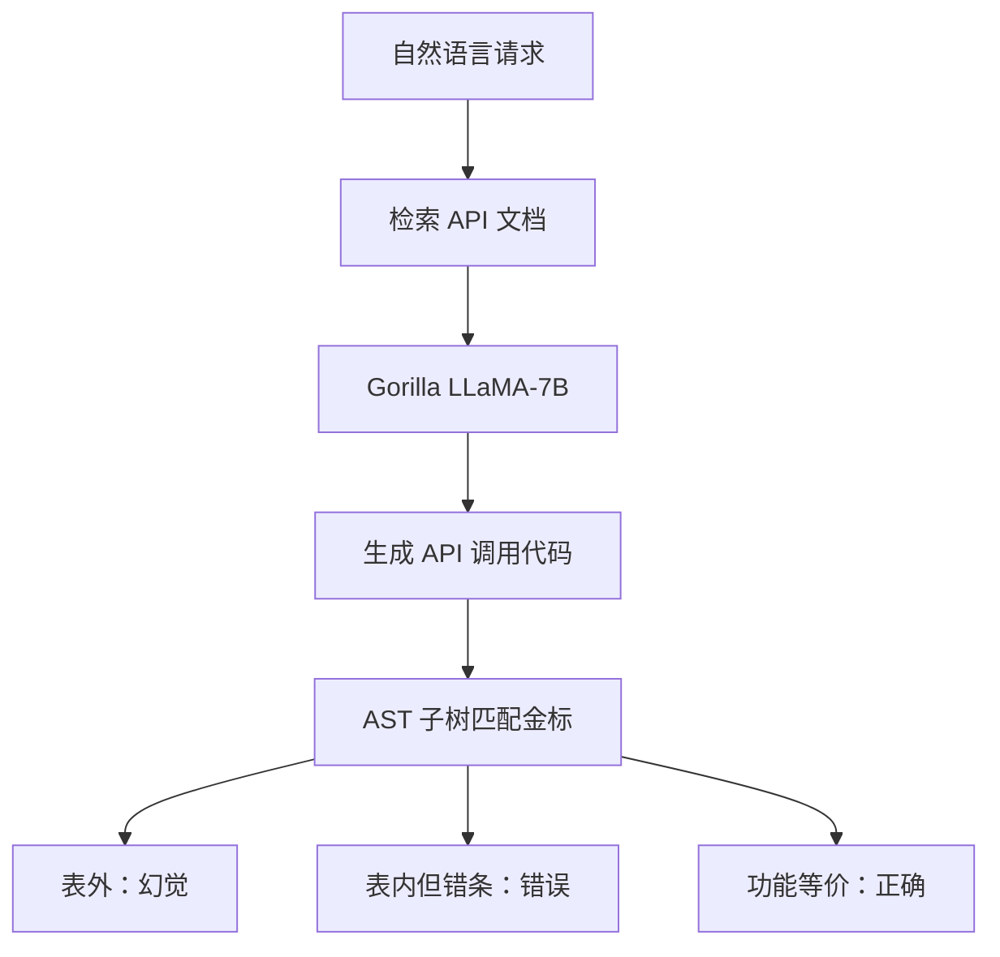

# Gorilla / APIBench

    
工具一旦变成成百上千份互相重叠的模型卡片，提示里塞不下，GPT-4 也会编造不存在的 `hub.load`；把文档检索写进微调，调用才能跟着文档变，幻觉才能从「发明 API」变成「调错已有 API」。

    <footer>—— Patil、Zhang、Wang、Gonzalez，Gorilla: Large Language Model Connected with Massive APIs</footer>

Shishir G. Patil、Tianjun Zhang、Xin Wang 与 Joseph E. Gonzalez（UC Berkeley / Microsoft Research）的 Gorilla（arXiv:2305.15334，后续收入 NeurIPS）把 LLM 的工具问题从「会不会用计算器」换成「能不能在海量、重叠、会改版的 API 里写出可执行调用」。他们构造 **APIBench**：从 Torch Hub、TensorFlow Hub、Hugging Face 模型卡片收约 1645 个 ML API，用 Self-Instruct 为每条生成指令，再用 AST 子树匹配计分。Gorilla 是检索感知微调的 LLaMA-7B：训练时看见「用户请求 + 检索到的 JSON 文档」，测试时文档可换，以降低幻觉。协议层的 function calling 与后来的 [BFCL](/llm/bfcl) 同出 Berkeley 工具团队谱系；本篇写 APIBench 的题怎么出、RAT 教的是解析文档而不是背函数表。只讨论合法模型加载与推理工作流，不涉及未授权接口扫描。

## 问题

[Toolformer](/llm/toolformer) 的工具集合小，可以放进自监督插入。云上的模型 Hub 有十万量级卡片，功能重叠（四十多个图像分类器），约束还带参数量、精度下限。整表塞不进上下文；只提示「写 Python」时，GPT-4 会点名不存在的模型，Claude 会选错库——这是论文图 1 的定性事故。评测也不能靠单元测试：多个 API 功能等价，字符串全等会误杀。

需要三件东西：一份覆盖三大 Hub 的冻结 API 表；一种不依赖文风的功能等价检查；一种让 7B 开源模型在「文档会变」的前提下少幻觉。Gorilla 的自变量是数据加检索感知微调，不是新注意力。

### 幻觉是「表外调用」，不是「参数写错」

作者把 AST 对不上库里任何 API 的输出叫幻觉（发明工具）；对上了但选错条目叫错误。前者是检索与微调要压的主病，后者是功能消歧。Hugging Face 子集因未穷尽全站，对非 Gorilla 基线有时只查域是否正确，表注必须读：不要把「域分类准确率」和 Torch Hub 上的全 AST 准确率拼成一张总榜。

APIBench 的字段做成 `{domain, api_name, api_call, api_arguments, ...}` JSON，是为了将来迁到 REST，但实验主体是 ML Hub 的 `torch.hub.load` / `from_pretrained` 一类加载调用，不是通用 SaaS 计费 API。

## 方法

文档收集：Torch Hub 尽量穷尽（约 94–95 条）；Tensor Hub v2 过滤空卡片后约 626–696 量级；Hugging Face 按任务取下载量前 20，跨多模态 / CV / NLP / 音频等约 925 条。每条卡片转成统一 JSON。指令：GPT-4 Self-Instruct，每 API 约 10 条用户话术，示范里禁止泄露 API 名。划分 holdout。

Gorilla：LLaMA-7B 指令微调成单轮 user–agent。检索感知训练（RAT）在用户话术后追加 `Use this API documentation for reference:` 与检索文档，教模型用后半段回答前半段。推理两种模式：零样本只吃自然语言；检索模式把 BM25 或 GPT-Index 的 top-1 文档拼进去。另有 Oracle 检索给上界。约束题额外要求参数量、精度下限，测的是读卡片里的 `performance` 字段而不是只会匹配功能词。

核对：解析生成代码，找以目标 API 为根的子树（如 `torch.hub.load`），对约定参数（`repo_or_dir`、`model`）做匹配，可选参数可不比。计分报准确率、幻觉率、选错率，按 Hub 分列，再按 0-shot / BM25 / GPT 检索 / Oracle 分列。约束题把「小于 10M 参数且 ImageNet 至少 70%」写成必须同时满足的过滤，测的是读卡片数字，而不是只匹配「图像分类」这个词。

### 检索不是免费午餐

论文发现：零样本微调后的 Gorilla 已可超过当时 GPT-4 的 API 功能准确率、幻觉更低。若**训练时不看文档、测试时硬塞 BM25**，错误文档会误导，准确率反而掉（Torch Hub / Hugging Face 上有大幅度下降的表）。检索要进训练分布，模型才学会「以后半段 JSON 为准」。文档在测试期改版（版本号、函数名）时，RAT 模型可以跟着新文档走，这是相对纯背表微调的产品句。

## 机制

Hub API 的正确调用是「名字 + 关键参数」的树，不是一段像代码的散文。AST 子树匹配把评测从 BLEU 拉到功能等价，与后来 BFCL 的 AST 计分同构，题更窄（单调用、ML 域）。RAT 把检索文档变成条件前缀的一部分，等价于教模型做阅读理解：功能约束在用户句，合法名字在 JSON。重叠 API 靠描述字段与约束字段消歧；没有约束时，多个金标都应被接受，但实现上仍常钉一条参考 API——这是基准的已知粗糙处。

Self-Instruct 的指令若泄漏库名，题会退化成抄写。作者要求生成话术不出现 API 名，并用少量人工种子。评测 holdout 防止模型只记训练指令。

把 Gorilla 写成「比 GPT-4 更强的通用助手」过读。赢的是 APIBench 的 AST 与幻觉，骨干是 7B，日期绑定 gpt-4-0314 等检查点。换 2025 年的工具协议评测应引用 BFCL 版本号。

### 从 APIBench 到 BFCL

APIBench 证明：开源小模型 + 文档可以在固定 Hub 上少幻觉。真实工具协议还有并行调用、多函数选择、不该调用时拒绝、多轮观察，见 BFCL。Gorilla 仓库与 Berkeley Function Calling Leaderboard 是同一方向的后续工程，不要把 2023 年 Hub 准确率抄进 BFCL 总榜。

## 边界与工程取舍

题是单次调用合成，不是多工具工作流，也不是让模型在用户机器上任意 `pip install`。执行层仍要白名单与环境隔离；论文可以「建议 densenet121」，产品必须决定是否真的下载权重。检索器质量是上限：Oracle 与 BM25 的差距是检索研究，不是再训一轮 LLaMA 能抹平。Hugging Face 每日上新，冻结的 925 条会过时，RAT 的价值正在于测试期换文档，但换文档也要换 AST 金标。与 Toolformer：一个学何时插入小工具，一个学在大目录里选对条目。与 [规划 vs 反应式循环](/llm/plan-vs-react)：Gorilla 默认一步出调用，复杂任务要外层控制器。

出处：Patil, Zhang, Wang, Gonzalez，*Gorilla: Large Language Model Connected with Massive APIs*，arXiv:2305.15334。基准 APIBench；后续评测见 BFCL。项目页 gorilla.cs.berkeley.edu。

## 小结

- APIBench 用三大 ML Hub 的模型卡片加 Self-Instruct 指令，用 AST 子树匹配计分。
- Gorilla 检索感知微调 LLaMA-7B，压表外幻觉，并适应测试期文档变更。
- 训练未见过的检索器在测试时可能有害；检索必须进训练。
- 出处：Patil et al.，arXiv:2305.15334。
