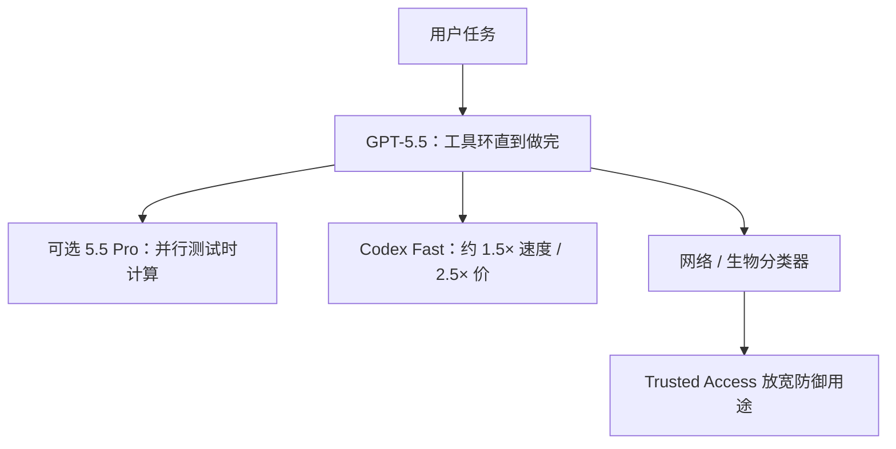

# GPT-5.5

    
GPT-5.5 被设计用来完成复杂的真实工作：写代码、上网查、分析、做文档与表格，并在工具之间移动直到做完；相对前代，它更早理解任务、更少要人带着走。

    <footer>—— OpenAI，Introducing GPT-5.5（2026-04-23）；GPT-5.5 System Card</footer>

**Sol / Terra / Luna 不是 GPT-5.5 的官方分档名。** 2026 年 4 月 23 日 OpenAI 发布的是 **GPT-5.5** 与 **GPT-5.5 Pro**；API 模型 id 为 `gpt-5.5` / `gpt-5.5-pro`。同年 7 月，官方把下一代写成 **GPT-5.6 家族**，并明确三档耐久名：**Sol（旗舰）、Terra（日常平衡）、Luna（成本档）**。GPT-5.6 介绍文甚至用「Terra 与 GPT-5.5 性能相当、更便宜」来锚定 Terra——这恰好证明 5.5 与 Sol/Terra/Luna 是相邻两代，不能混成一个检查点。本篇主体只写 5.5 的博文与系统卡；末节用 5.6 官方页澄清命名。**不编参数量。**

## 问题

GPT-5 把 ChatGPT 写成快通路 + 思考通路 + 路由器。之后的 5.x 快照把「在电脑上把活干完」当成主轴：编码智能体、计算机使用、知识工作、早期科研。5.5 博文要解决的产品问题是：更强的智能体行为，同时把**每 token 延迟对齐 5.4**，并在 Codex 上用更少 token 完成同类任务。第二条是安全：网络与生物能力上升后，分类器更严，同时开 Trusted Access，避免防御方用不上。

系统卡把 5.5 写成复杂真实工作模型；5.5 Pro 是**同一套权重上的并行测试时计算**，多数安全数字可代理，少数风险面单独测。API 于 4 月 24 日上线，卡片同步补了 API 防护说明。

### ChatGPT 里的 5.5 也不是一个开关

Plus / Pro / Business / Enterprise 在 ChatGPT 与 Codex 得到 5.5；Pro 档另有 5.5 Pro。ChatGPT 里的 **GPT-5.5 Thinking** 面向付费用户的硬问题。Codex 上下文博文写 **400K**；API 写 **1M** 上下文，$5 / 百万输入、$30 / 百万输出；5.5 Pro API $30 / $180。Codex Fast mode：生成约 1.5× 快、成本 2.5×。评测表大量是 **reasoning effort = xhigh** 的研究环境，与生产 ChatGPT 默认不必相同。

SWE-Bench Pro 58.6% 的脚注写有记忆化嫌疑，实验室已提示。Terminal-Bench 2.0 **82.7%** 相对 5.4 的 75.1% 是博文主编码数字之一。对照列含 Claude Opus 4.7 与 Gemini 3.1 Pro，口径以脚注为准。

## 方法

训练细节未公开。系统卡只重复「公开网页、合作数据、用户与训练员数据 + 过滤」。推理模型用 RL 先想后答。能写进方法栏的是**产品计算图与评测协议**。博文编码：Terminal-Bench 2.0 82.7%；Expert-SWE（内部、人类中位约 20 小时）73.1% 对 5.4 的 68.5%；SWE-Bench Pro 58.6%（5.4 为 57.7%，Opus 4.7 为 64.3%）。知识工作：GDPval 胜或平 84.9%；OSWorld-Verified 78.7%；τ2-bench Telecom 原提示 98.0%；BrowseComp 84.4%（Pro 90.1%）。学术：GPQA Diamond 93.6%；HLE 无工具 41.4%、有工具 52.2%；ARC-AGI-2 Verified 85.0%。长上下文 Graphwalks / MRCR v2 给到 1M 针。网络：CyberGym 81.8%。科学：GeneBench 25.0%（Pro 33.2%）、BixBench 80.5%。

准备度：博文把 5.5 的生物/化学与网络安全能力按框架标成 **High**；未到 Critical 网络档，但相对 5.4 是一步。防护从 5.2 起的网络分类器收紧，并提供 chatgpt.com/cyber 一类可信访问。服务侧写明与 NVIDIA GB200 / GB300 NVL72 共设计；用 Codex 辅助改分块负载均衡，声称生成速度提升逾 20%——这是基础设施故事，不是新注意力公式。

### 系统卡里能引用的行为面

Production Benchmarks 上多数 disallowed 类与 5.4-thinking 同档；hate 项脚注解释为翻译含违规文本并不违反政策。破坏性操作避免 0.90，高于 5.4-thinking 的 0.86；「完美回滚」从 0.18 到 0.52。计算机使用确认：金融交易 1.00，高风险沟通 0.98。这些是安全工程数字，不是 Arena Elo。

## 机制

5.5 相对 5.4 的公开机制是**更长程的工具使用与更少 token 的同等任务**，外加同延迟服务。Pro 是并行测试时计算，不是第二个预训练。路由器故事不再是 5.0 介绍文的核心：5.5 以单一旗舰名出售，effort 在 API 上可取到 xhigh。不要把 5.0 的 main/thinking 双检查点图硬套过来——卡片没写 5.5 仍是两套权重。

博文评测声明：GPT 侧多在 xhigh、研究环境，与生产 ChatGPT 可能略有差别。HLE、MCP Atlas、τ2 的提示是否调过，脚注写明了才能比。

### 公开信息状态：Sol / Terra / Luna

OpenAI 7 月文：GPT-5.6 三档，数字表示代际，Sol/Terra/Luna 是可独立迭代的能力档。价目当时为 Sol $5/$30、Terra $2.50/$15、Luna $1/$6（之后有过 Luna/Terra 降价与 Sol 限时折扣，以当时定价页为准）。API 模型页写三档均约 **1.05M** 上下文、**128k** 最大输出、知识截止 **2026-02-16**；effort 可到 `max`。预览博文写 Terra 对标 GPT-5.5、约一半价。因此：若有人说「GPT-5.5 Sol」，与官方命名不一致；应写作 GPT-5.5 或 GPT-5.6 Sol。本篇不把 5.6 的 Agents’ Last Exam 等数字算进 5.5。5.6 介绍文还写 `ultra` 为协调多代理并行工作流的最高能力设置，那是 5.6 Sol 的产品开关，5.5 博文没有对等物；不要把 ultra 填进 5.5 的 effort 列表。5.5 API 公开的是 verbosity 类接口之前已有的 reasoning effort（含 xhigh），以 4 月模型页与博文为准。

## 边界与工程取舍

### 评测环境与生产入口

博文大表多在 xhigh、研究环境。ChatGPT 里 Thinking、Codex 默认、API `reasoning.effort` 默认（模型页写 medium）不是同一计算预算。GDPval、OfficeQA、内部投行建模是知识工作合同；GeneBench / BixBench 是科研合同；CyberGym 是防护叙事下的能力数字。混成一条「5.5 分数」会同时错估速度与风险。SWE-Bench Pro 脚注已提示记忆化，编码主叙事更应看 Terminal-Bench 2.0 与内部 Expert-SWE，并写清脚手架。

无参数、无数据配比。High 准备度不等于可写攻击步骤。价高于 5.4，官方用 token 效率辩护。Fast mode 与 Pro 是不同的钱：一个买速度，一个买并行计算。5.6 发布后，5.5 仍是独立快照，不要自动把 Sol 的窗口与截止写进 5.5。知识截止、1.05M 窗口属于 5.6 模型页；5.5 API 博文写的是 1M 上下文与当时定价，不要用 5.6 的 February 16, 2026 截止去填 5.5。

出处：*Introducing GPT-5.5*，2026-04-23；*GPT-5.5 System Card*；命名澄清见 *GPT-5.6* 介绍与 API 模型页。参数量未公开。

ChatGPT 后来还有 GPT-5.5 Instant 作为默认快通路的更新（2026-06 博文），与 4 月旗舰 5.5 Thinking/Pro 不是同一入口。引用「默认模型」必须写 Instant 还是 Thinking。

## 小结

- GPT-5.5 是 2026-04-23 的官方旗舰；Pro 为并行测试时计算。API $5/$30，上下文 1M。ChatGPT 侧另有 Thinking 与后来的 Instant 默认，入口必须写清。
- 公开卖点是智能体编码、计算机使用、知识工作与科研循环；网络/生物按 High 防护，并提供防御向可信访问。
- Sol / Terra / Luna 属于 GPT-5.6 家族，不是 5.5 的三个尺寸；Terra 官方用来对标 5.5 的价绩，恰好说明两代相邻而非同名。
- 评测须标明 effort、是否工具、是否研究环境；SWE-Bench Pro 有污染提示。
- 出处：上述 OpenAI 博文与系统卡。不编参数量。
