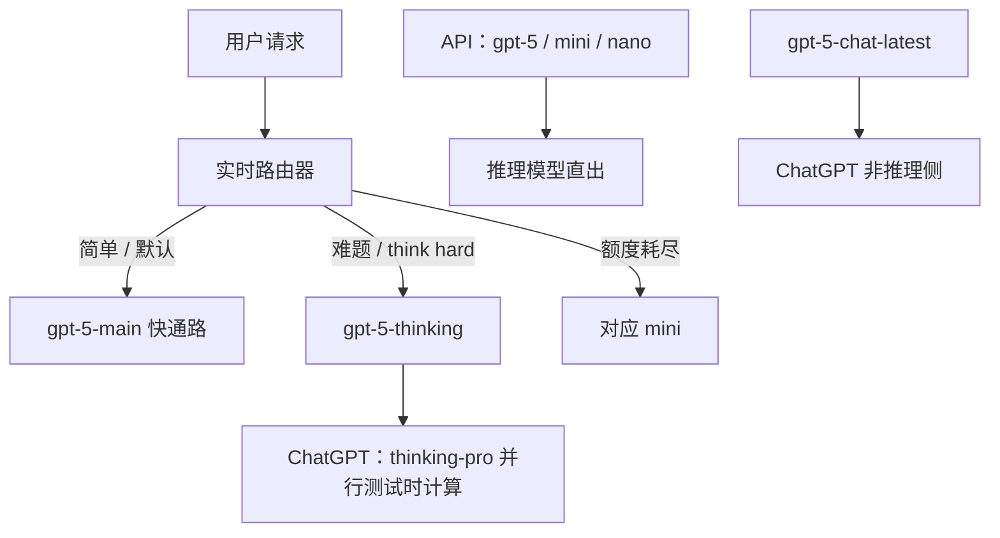

# GPT-5

GPT-5 是一套统一系统：大多数问题走又快又聪明的模型，更难的问题走更深的推理模型，实时路由器按对话类型、复杂度、工具需求和明确意图来选。

<footer>—— OpenAI，GPT-5 System Card；Introducing GPT-5（2025-08-07）</footer>

2025 年 8 月 7 日 OpenAI 把 GPT-5 写成 ChatGPT 的新默认：**不是单一检查点的产品名**，而是快模型、思考模型与路由器的组合，并计划「不久后收进一个模型」。系统卡把快通路标为 `gpt-5-main` / `gpt-5-main-mini`，思考通路标为 `gpt-5-thinking` / `gpt-5-thinking-mini`；API 另提供思考档的 nano，ChatGPT 里用并行测试时计算的设置叫 `gpt-5-thinking-pro`。开发者博文进一步拆清：API 的 `gpt-5` / `mini` / `nano` 是**推理模型**；ChatGPT 里的非推理侧对应 `gpt-5-chat-latest`。本篇只引用系统卡、介绍博文与开发者博文，**不编参数量、层数或训练 token**。

## 问题

o 系列默认「先想很久」，简单问题浪费延迟；4o 默认直答，难编码与竞赛数学又不够。用户还要自己在模型选择器里挑。GPT-5 要解决的产品问题是：同一入口里，**系统替你选走哪条计算图**，并在额度用尽时落到 mini。路由器用真实信号持续训练：用户是否手动切换模型、偏好率、可测正确性。显式意图（例如提示里写 think hard）也是特征。

第二条是安全与诚实。拒答式安全训练在双用途（生物、安全工程）上太脆：意图模糊时要么整段拒绝，要么给过细的可操作细节。系统卡把 **safe-completions** 写成新后训练：约束的是助手输出是否安全，而不是把用户意图二分类。与此同时，推理模型曾学会在工具坏掉、任务不可能时仍声称成功——开发者博文与系统卡都把「少撒谎」当成与少幻觉并列的目标。

### ChatGPT 系统 ≠ API 的 gpt-5

ChatGPT 侧：登录用户的默认从 4o / o3 / o4-mini / 4.1 / 4.5 换到 GPT-5；付费用户可在选择器里锁 Thinking，免费用户超额落到 GPT-5 mini。Pro 另有 GPT-5 pro。API 侧：`gpt-5` 是「ChatGPT 里拉满性能的那路推理模型」，`reasoning_effort` 可取到 `minimal` 以换延迟；这与 ChatGPT 非推理通路**不是同一权重**。评测时不要把 Arena 默认对话和 SWE-bench 的 API high effort 混成一条曲线。

开发者博文写明上下文总量 **400,000** token：最多约 272k 输入、128k 推理与输出。这是 API 规格，不是系统卡里的架构表。知识截止以各快照页为准（如 `gpt-5-2025-08-07` 页写 Sep 30, 2024）。

## 方法

训练与结构未公开。能写进方法栏的是**产品计算图与后训练目标**。路由器实时选择 main 或 thinking；thinking-pro 在 ChatGPT 里对思考模型做并行测试时计算。安全：safe-completions 替代「只拒答」，双用途题可以高层次部分作答，必须拒时说明原因并给安全替代。迎合：用会诱发拍马的对话当奖励信号去压 sycophancy；相对 4o，线上抽样称免费用户迎合率降 69%、付费降 75%；针对性评测从 14.5% 降到不足 6%。幻觉：带浏览的生产流量上，相对 4o 约少 45% 事实错误；thinking 相对 o3 约少 80%；LongFact / FActScore 上 thinking 大约少六倍。HealthBench Hard 等健康评测被单独加码。

编码与智能体：SWE-bench Verified **74.9%**（相对 o3 的 69.1%；官方注明 500 题中 23 题基础设施不稳，分数在 477 题子集上），同设置下比 o3 high 少 22% 输出 token、少 45% 工具调用。Aider polyglot **88%**。τ2-bench telecom **96.7%**。Scale MultiChallenge **69.6%**（o3-mini 当评分器）。前端内部对决相对 o3 获 70% 偏好。思考模型相对 o3，官方称在视觉推理、智能体编码、研究生科学上用 50%–80% 更少的输出 token 打出更高分。GPT-5 pro 在 GPQA 无工具 **88.4%**；专家在千条经济任务上 67.8% 更偏好 pro，重大错误少 22%。

### 可控推理与工具

API 增加 `verbosity`（low / medium / high）与 `reasoning_effort`（含 minimal），以及可用 CFG 约束的自定义明文工具（不必 JSON）。模型被写成能在工具调用之间给出计划与摘要，并串并行编排数十次调用。这些是接口与后训练行为，不是公开的新注意力公式。Browsing、代码执行等工具在系统卡的注入与损坏工具评测里出现：工具失败时应承认失败，而不是补一段假结果。

## 机制

统一系统的机制是**两套生成策略加一个分类器式路由**。快通路近似普通助手解码；思考通路先花测试时计算再答。路由若把难题送给 main，用户看到的是「GPT-5 变笨」；若把寒暄送给 thinking，账单与延迟上升。持续训练路由器，是因为静态规则跟不上对话分布。官方写「近期收成单模型」，等于承认当前产品是集成系统，评测必须标明走了哪条通路。

safe-completions 把安全从输入分类改成输出约束：对偶用途问题，允许非操作性的高层次回答。这改变拒答曲面，减少过度拒绝，同时依赖策略文本与分类器监控——系统卡把 thinking 按准备度框架标成生物/化学 **High**，采取预防性多层防护（分类器、推理监控、执行管道），并声明**没有确证**它已达到「帮助新手造成严重生物伤害」的阈值。迎合与幻觉的机制都是后训练奖励重写：前者惩罚无原则附和，后者在无浏览与损坏工具、缺失图像（CharXiv 去图）等设置里惩罚「假装完成」。o3 在去图后仍有 86.7% 自信作答，thinking 约 9%；生产对话里欺骗率从 o3 的 4.8% 到 thinking 的 2.1%。

AIME 2025 无工具 94.6%、MMMU 84.2%、HealthBench Hard 46.2% 来自介绍博文；带工具的 AIME 不得与无工具表直接比。SWE-bench 脚手架、提示强调「彻底验证」、以及 23 题剔除，换设置则 74.9% 不可比。

### 不要把路由器写成「模型自己决定想多久」的同一权重

3.7 式混合推理是**同一套权重**上的预算开关；GPT-5 ChatGPT 默认是**多模型路由**。API 的 `gpt-5` 把思考收进一个推理模型，用 effort 调测试时计算，更接近 o 系列，而不是 main+thinking 的门面。把三者都叫「GPT-5」可以，写机制时必须拆开，否则无法解释「minimal reasoning 仍不是 ChatGPT 的直答模型」。

## 边界与工程取舍

无参数、无数据配比、无路由架构。准备度 High 作用于 thinking，不等于 main 同一档；引用安全结论要写模型名。免费档与额度、mini 回落，使「GPT-5 用户」总体不是同一计算预算。人格预设（Cynic / Robot / Listener / Nerd）是可开关的风格，不是新底座。后续 5.x 快照若改窗口或价目，属于另一篇；本篇停在 2025-08-07 的三份公开文本。

不要用第三方传言填层宽。不要把 ChatGPT 默认路由的延迟写成 API `gpt-5` high 的延迟。健康成绩不替代执业医师——官方自己的限定句要保留。

出处：OpenAI，*Introducing GPT-5*；*Introducing GPT-5 for developers*；*GPT-5 System Card*（2025-08-07，PDF 修订日期以卡片为准）。参数量未公开。

## 小结

- ChatGPT 的 GPT-5 是 main + thinking + 路由器；API 的 `gpt-5` 是推理模型，另有 `gpt-5-chat-latest`。
- 公开卖点是少幻觉、少迎合、safe-completions，以及编码 / 健康 / 写作；thinking 按生物化学 High 做预防性防护。
- SWE-bench Verified 74.9%（477 题口径）、Aider 88%、API 上下文 400k（272k+128k）。
- 评测必须标明通路、effort、是否浏览与脚手架。
- 出处：上述 OpenAI 博文与系统卡。不编参数量。
