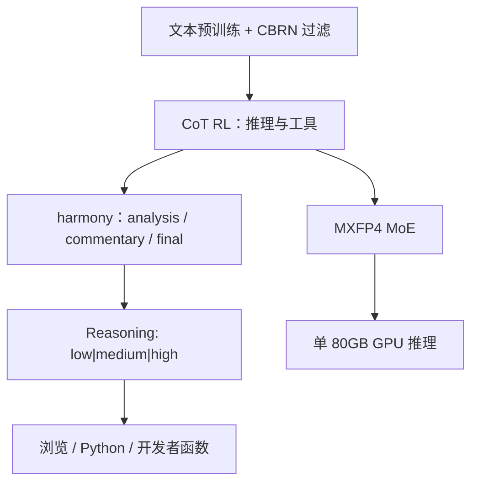

# gpt-oss-120B

gpt-oss-120b 是 Apache 2.0 的开权推理模型：文本进、文本出，可调推理力度，完整思维链，并按 Responses API 的工具习惯来用。

<footer>—— OpenAI，gpt-oss-120b &amp; gpt-oss-20b Model Card，arXiv:2508.10925（2025-08-05）</footer>

2025 年 8 月 5 日 OpenAI 放出两个开权 MoE：`gpt-oss-120b` 与更小的 20b。卡片把 120 档写成生产级推理——**总参约 116.8B，每 token 激活约 5.1B**，36 层，MoE 权重事后训练成 MXFP4，官方目标是单张 80GB GPU（H100 / MI300X）。它不是 [GPT-5](/llm/gpt-5) 的开源版：模态只有文本，许可证是 Apache 2.0 外加 gpt-oss 使用政策，安全故事是「模型卡」而不是「系统卡」，因为下游系统由别人搭。本篇按模型卡与 Hugging Face 卡片写 120b，不把 ChatGPT 路由安到这套权重上。

## 问题

闭源 o 系列把思维链留在服务端。开权推理模型要同时交出：**可变测试时计算、可微调、可在单卡推理的显存点**，以及一条不靠 OpenAI 网关也能复现的聊天格式。风险画像相反：权重一旦下载，攻击者可以绕过拒答甚至对着危害目标微调，发行方无法撤回。卡片因此多问了两句——默认模型有没有达到准备度 Tracked Categories 的 High；adversarial fine-tune 之后有没有达到生物/化学或网络 High——并报告默认未达、在他们的攻击性微调设定下也未达，且多数生物评测上已有开源模型的默认水平接近被微调后的 120b。

第二个问题是生态接口。若开权模型不用 Responses / 工具协议，智能体栈要重写。卡片选择兼容 Responses API 习惯：浏览、Python、开发者函数、Structured Outputs，并公开 **harmony** 格式。

### 名字里的 120B 不是激活量

表 1：MLP 114.71B，注意力 0.96B，嵌入+解嵌 1.16B（解嵌计入激活、嵌入不计），激活 5.13B，总计 116.83B，检查点 60.8GiB。128 个专家、每 token **top-4**。残差宽度 2880；注意力 64 个查询头、头维 64、GQA 8 个 KV 头。不要写成稠密 120B，也不要写成「120B 激活」。20b 对照是 24 层、32 专家、3.6B 激活，本篇不展开。

MXFP4 只量化 MoE 权重（约占参数 90% 以上），约 4.25 bit/参。评测与官方演示都在这套量化上。把检查点当成 BF16 满精度稠密去估显存，会得出「单卡装不下」的错结论。

## 方法

骨架：自回归 MoE Transformer，Pre-LN RMSNorm，SwiGLU 专家（实现含 clamp 与残差，卡片称非标准）。注意力层在**带宽 128 的带状窗口**与**全稠密**之间交替；稠密层用 [YaRN](/llm/yarn) 把上下文做到 **131,072**。每个注意力头在 softmax 分母上有可学习偏置，类似 attention sink，允许「对任何 token 都不看」。词表 `o200k_harmony`，201,088，在 o200k 上加 harmony 专用符。

预训练：文本、万亿级 token，侧重 STEM / 代码 / 通识；沿用 GPT-4o 的 CBRN 过滤；知识截止 **2024 年 6 月**。120b 训练约 **210 万 H100-小时**。后训练：与 o3 同类的 CoT RL，教推理与工具；性格被写成接近一线产品。harmony 用角色与 **channel**（`analysis` 思维、`commentary` 工具、`final` 给用户）切可见性；指令冲突层次为 System > Developer > User > Assistant > Tool。多轮时应丢掉历史助手轮的思维。推理力度 low / medium / high 写在系统提示（如 `Reasoning: high`），拉长平均 CoT。

### 评测口径

主能力图把 high 推理的 120b 写成超过 o3-mini、接近 o4-mini。智能体：Codeforces（可带终端工具）、SWE-bench Verified、τ-bench retail。HealthBench 上 high 推理接近 o3，并显著好于 4o / o1 / o3-mini / o4-mini——卡片强调健康 Pareto，同时声明不替代医生。测试时缩放：AIME / GPQA 上提高力度，准确率随 CoT+答案长度近似平滑上升。Hugging Face 卡片另列 GPQA Diamond、SWE-bench 等社区复现行，引用以模型卡表 3 为准，并标明力度与是否带工具。

## 机制

MoE top-4 把激活钉在约 5B：服务按专家并行与量化后的权重体积走，计算按 4 个专家 + 注意力走。交替带状注意力降低多数层的二次项，长依赖留给稠密层 + YaRN。可学习 softmax 偏置提供汇点，减轻流式解码里对过去 token 的强制分配。harmony 的机制是把思维、工具、用户可见答案拆到不同通道，从而「完整 CoT 可给开发者、默认不给终端用户」——卡片写明思维**不打算展示给最终用户**。

可变力度不是另存三套权重，而是系统提示调节平均思维长度；图 3 的平滑曲线是同一检查点上的测试时缩放。工具在 CoT 内交错，使浏览能补 2024-06 之后的事实，也引入注入面：开权部署必须自己做检索过滤。与闭源 GPT-5 的差别：没有公开路由器，没有视觉，安全层不会在你的进程外自动升级。

卡片把本文定位成 model card：默认遵循 OpenAI 安全政策，但企业要自建系统级防护才能接近 API 产品。Adversarial fine-tune 实验用了内部栈与外部审阅（METR、SecureBio 等），结论不可外推成「任意微调都达不到 High」。

### 和 GPT-5、和其它开源 MoE

GPT-5 是多模型产品 + 视觉 + 准备度 High 的思考档；gpt-oss-120b 是单检查点开权推理，准备度叙事是「默认与攻击性微调均未到 High」。Qwen3 旗舰是 128 专家 top-8、约 22B 激活；Llama 4 Maverick 是 128 路由 + 共享、$k=1$、约 17B 激活。120b 的 5.1B 激活更稀、专家数同为 128 量级但 $k=4$。不能按总参 117B 去对标稠密 70B 的显存配方，也不能按 5B 去对标 5B 稠密的质量。

## 边界与工程取舍

不用 harmony 会明显掉点，这是硬边界。MXFP4 内核依赖特定推理栈（官方给 Transformers、vLLM 分支、Triton、Ollama 等）。微调：卡片称 120b 可在单机 H100 节点上做，20b 可在消费硬件——「可」不等于「数据与超参已公开」。上下文 131K 是稠密层 + YaRN 的声明，带状层仍是 128 token 窗口；超长检索质量要自己测。使用政策与 Apache 并存，商用要两份都读。

不要把开权 CoT 当用户界面。不要假设浏览工具在无沙箱时安全。不要把 210 万 GPU 小时理解成可复现的数据配方——语料清单未开。生物/网络评测的专家基线与 blocklist 浏览设置写在卡片后部，复现成本高，口头「未达 High」不能替代本地红队。评测默认 high 推理与默认系统提示；把 low 力度的延迟数字拿去对 high 的 AIME，会同时错估速度与分数。MMMLU 等多语解析依赖从回答里抽取「Answer」的翻译，换提示则不可比。

出处：OpenAI，*gpt-oss-120b & gpt-oss-20b Model Card*，arXiv:2508.10925；Hugging Face `openai/gpt-oss-120b`。闭源对照见 [GPT-5](/llm/gpt-5)。

## 小结

- gpt-oss-120b：36 层 MoE，116.8B 总参 / 5.1B 激活，128 专家 top-4，Apache 2.0。
- MXFP4 专家权、交替带状/稠密注意力、YaRN 131K、harmony 通道、low/medium/high 推理。
- 后训练为 o3 类 CoT RL；知识截止 2024-06；约 2.1M H100-小时。
- 安全结论针对默认与官方攻击性微调设定，开权部署须自建系统层。
- 出处：arXiv:2508.10925。
