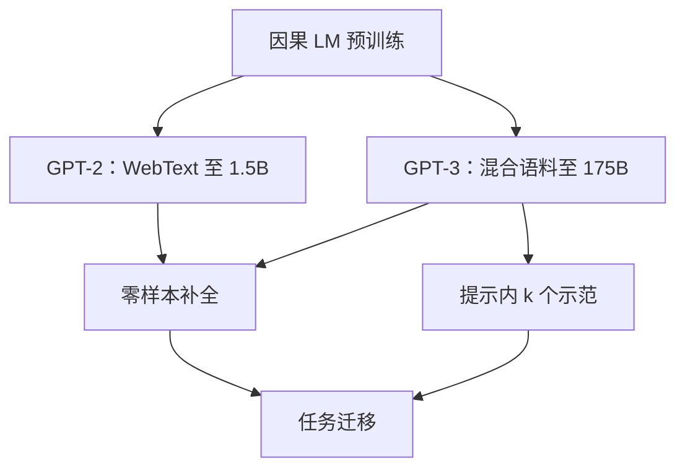

# GPT-2 / GPT-3 训练报告

语言模型在足够大的无监督语料上训练后，可以在没有任务特定训练的情况下执行多种任务；再放大，同一模型能在上下文里从示范中学习，而不改权重。

<footer>—— 综合 Radford et al., Language Models are Unsupervised Multitask Learners, 2019；Brown et al., Language Models are Few-Shot Learners, 2020</footer>

GPT-2 与 GPT-3 是同一条自回归语言模型线上的两份训练报告，主张却不在同一层。Radford 等人 2019 年用 WebText 训到 1.5B，展示零样本任务迁移：不改权重、不给示范，只靠自然语言指令或题面补全。Brown 等人 2020 年把参数推到 175B、把数据推到约 3000 亿 token，把「在提示里放几个输入-输出例子」写成一种与微调并列的学习方式——上下文学习（in-context learning）。两篇都不是新架构论文：解码器 Transformer、字节对编码、因果语言建模，沿自 GPT。本篇写这两份报告实际训了什么、测了什么、以及「无监督多任务」和「少样本上下文学习」各自成立的条件。

## 问题

2018 年前后的 NLP 默认工序是：预训练一个编码器或语言模型，再为每个下游任务准备标注集、换头、微调。Radford 等人要问的是：若语料足够大、模型足够强，任务描述能否直接写进文本，让模型以补全的方式完成阅读理解、翻译、摘要、问答，而不碰任务参数。这要求预训练分布里已经大量出现「题面后接答案」的模式，也要求评测时的提示与那种模式足够近。

GPT-3 把问题再推一步。零样本仍然脆：同一任务换一种措辞，成绩可以掉一截。若允许在提示里放 $k$ 个完整示范，模型能否在不更新 $\theta$ 的情况下完成内层适应？这把学习拆成外层（预训练改权重）和内层（前向里读示范）。需要测量的是这条内层能力如何随 $N$ 增长，以及它何时能逼近经过微调的专用模型。

### WebText 对 Common Crawl 的不信任

GPT-2 不用当时已有的 Common Crawl 快照当主库。作者认为爬虫噪声太高，改为从 Reddit 出站链接收集，过滤掉低赞页面，得到约 800 万文档、约 40GB 文本，称为 WebText。这是一份训练报告里的数据主张：质量过滤先于堆字节。GPT-3 重新纳入过滤后的 Common Crawl，并与 WebText2、书籍、维基做配比；Common Crawl 占训练 token 的大部分，但采样时被降权，以免模型只见爬虫。两篇报告的共同点是：原始网页不能直接当 $D$，必须先有过滤与混合。

GPT-2 的 40GB 和 GPT-3 的 300B token 不能换算成「放大了多少倍数据」而不看重复与混合。GPT-3 明确写了各来源的采样比例，同一文档在一个 epoch 里的出现次数因来源而异。报告的是有效混合，不是磁盘上的原始体积。

## 方法

两份模型都是解码器-only Transformer，目标为

$$
L(\theta)=-\mathbb{E}_{x\sim\mathcal{D}}\sum_t\log\pi_\theta(x_t\mid x_{<t}).
$$

GPT-2 相对 GPT-1 的结构改动很小：层归一化挪到每个子层输入，并在最后一块自注意力后再加一层 LN；词表用字节级 BPE，减少未登录词。规模扫 117M、345M、762M、1.5B。上下文 1024。GPT-3 把同一骨架拉到 175B：96 层、隐宽 12288、96 头，上下文 2048；中间若干层使用交替的稠密与局部带状稀疏注意力，以控制长序列代价。优化器为 Adam 一类自适应方法，学习率余弦退火，批大小随规模加大，175B 档约 320 万 token 一批，共看约 3000 亿 token。

评测协议是两篇真正分道的地方。GPT-2 以零样本为主：把任务改写成补全，例如翻译写成 `英文句 => 法文句` 的模式，阅读理解写成文章后接问题再接答案槽。GPT-3 系统比较零样本、单样本、少样本（通常 $k=10$ 到 $50$，受上下文长度限制）。少样本条件下，示范与当前题打包进同一前缀，权重不变。报告同时给出部分任务上与微调 SOTA 的对照，用来标定「不改权重」到底丢掉多少。

### 上下文学习不是微调的免费替代

Brown 等人把少样本提示写成内层学习，但没有给出与 SGD 微调等价的保证。示范占用上下文窗口，能放的 $k$ 随题面长度下降；示范的排序、格式、分隔符都会改变成绩，报告里已有敏感性。更关键的是：内层学习依赖外层已经在数据里见过类似的「题-答」模板。它放大的是预训练里已经存在的模式匹配，不是在提示里从零习得一种新算法。把 GPT-3 的少样本成绩读成「175B 可以代替所有微调」，超出了报告自己的对照表——许多任务上微调仍然更高，报告展示的是差距在缩小，以及某些任务上少样本已经可用。

## 机制

GPT-2 的机制主张是分布覆盖。WebText 里混有问答帖、教程、字幕、代码片段，最大似然会迫使模型在同一套参数里学会多种格式。零样本迁移成功，意味着评测任务的输入分布与这些格式有重叠；失败则往往是格式没对齐，而不是「模型没有那种知识」。1.5B 在 WebText 上仍欠拟合，报告据此推测继续放大仍有空间——这是对 Kaplan 式扩展的一次早期公开验证，但还没有把 $N$ 与 $D$ 的最优分割写清楚。

GPT-3 的机制主张是规模把内层适应从噪声里抬出来。小模型在提示里看到示范，成绩提升有限甚至波动；175B 上少样本相对零样本的增益系统性变大。一种读法是：更大的模型有更多注意力头和更深的残差，能够把示范里的输入-输出对应写成一次性的算法（模式匹配、格式模仿、简单的归纳）。报告没有解剖这一内层算法，只提供规模曲线。数据污染是配套机制问题：预训练若已包含评测题，少样本会看起来像记忆。Brown 等人做了 n-gram 重叠检查，并承认无法彻底排除；后来的污染文献把这一警告变成了标准评测工序。

两篇报告都几乎不谈指令微调。GPT-2 的「指令」是评测时写的前缀，不是带人类示范的 SFT。GPT-3 的 few-shot 示范也是评测协议，不是训练数据。Ouyang 等人的 InstructGPT 要再过两年，才把「按用户意图作答」写成训练目标。

### 扩展律在报告里的位置

GPT-2 用四档规模展示下游与损失同向变好。GPT-3 用从 1.25 亿到 1750 亿的更密扫描，把交叉熵和许多下游指标画成对数参数的平滑曲线。这与 Kaplan 2020 的训练计算扩展互相印证，但 GPT-3 本身没有拟合 Chinchilla 那种等计算面：175B 看 300B token，按后来 Hoffmann 的比例属于偏大、偏少数据。报告的主张是「更大仍然更强」，不是「这一 $N,D$ 分割是计算最优」。读训练报告时要把「规模曲线存在」和「预算该怎么切」分开。

## 边界与工程取舍

GPT-2 的零样本对提示措辞敏感，且在真正需要绑定实体、多步推理的任务上弱。发布时伴随的「太强而不放最大模型」的争议，与技术报告不是同一件事；技术上 1.5B 仍然会编造引用、混淆时间。GPT-3 把流畅度推到可以冒充专业写作的程度，幻觉、偏见、以及提示注入的前身（示范被用户内容覆盖）都随之放大。少样本能力也不能迁移到上下文放不下的长文档或工具调用——那些要等检索与后训练。

数据方面，WebText 的 Reddit 出站链接偏向英语、偏互联网文化；GPT-3 的混合改善了覆盖，仍是英语为主。训练计算与 2048 上下文决定了报告无法回答长上下文或计算最优配置。对齐、拒答、按指令结束回合，都不在这两份报告的损失函数里。它们标定的是基座：一个只会续写网页的模型，在足够规模时能表现出任务行为。把助手产品的能力清单回溯到 GPT-3，需要经过 InstructGPT 及其后的后训练，不能把 few-shot 提示当成产品接口。

复现这两份报告时，最容易抄错的是评测协议而不是层数。零样本、少样本、微调是三种不同的适应预算。只报 175B 的最好少样本数字、不报 $k$ 与提示模板，等于没有复现。

## 小结

- GPT-2 用过滤后的 WebText 训到 1.5B，展示无监督预训练后的零样本任务补全。
- GPT-3 用混合语料训到 175B、约 300B token，把提示内示范写成上下文学习，并给出密集规模曲线。
- 两篇都是解码器因果 LM 的训练报告，不是新注意力结构。
- 上下文学习放大预训练里已有的题-答模式，不替代微调，也不更新权重。
- 数据过滤与混合是报告的一等主张；原始爬虫不能直接当训练分布。
- 175B/300B token 按后来的计算最优比例偏欠训；对齐与指令遵循不在这两份损失里。
- 出处：Radford et al., *Language Models are Unsupervised Multitask Learners*, 2019；Brown et al., *Language Models are Few-Shot Learners*, NeurIPS 2020。
