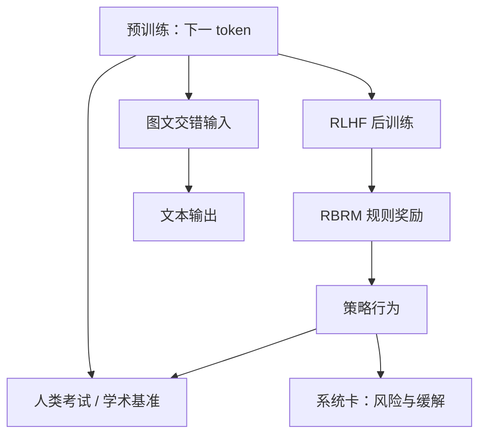

# GPT-4 Technical Report

    
本报告不包含架构、模型规模、硬件、训练计算、数据构造或训练方法的进一步细节。

    <footer>—— OpenAI，GPT-4 Technical Report，arXiv:2303.08774，2023</footer>

GPT-4 技术报告（2023 年 3 月）是一份**能力与安全报告**，不是可复现的训练配方。它把 GPT-4 写成大规模多模态模型：接受图像与文本、输出文本；预训练目标仍是文档上的下一 token 预测；后训练用 [RLHF](/llm/rlhf-pipeline) 提高事实性与行为约束。模拟律师资格考试约落在应试者前 10%；GPT-3.5 同卷约在后 10%。报告同时强调：模型仍会幻觉、窗口有限、不会从经验中持续学习。附录后的系统卡覆盖偏见、虚假信息、过度依赖、隐私、网络安全、扩散等。本篇只写报告公开写出的主张——可预测扩展、考试与基准、视觉输入、规则奖励模型——**不补参数量、层数或训练 FLOPs**。

## 问题

前沿模型的训练运行贵到无法为 GPT-4 本身做网格搜索。报告把工程问题写成：如何让优化器、并行与超参在跨三个数量级的计算上行为可预测，从而用不超过 GPT-4 计算量千分之一（文中亦写 $1000\times$–$10{,}000\times$ 更小）的实验，外推部分损失与能力。这是对「大模型不可预测」叙事的反驳，但外推的是选定指标，不是全部下游，更不是安全属性。

第二个问题是评测协议。若用为人类设计的考试当能力尺，必须声明：是否为这些考试专门训练、污染怎么处理、视觉是否参与。报告用 RLHF 后的模型考，声称未针对这些考试做专项训练；少数题目可能在预训练中见过，附录 C 给出去污染后的较低分并取二者较差者。把「前 10%」当成律师执业资格，超出报告自己的模拟卷设定。

### 透明度边界是报告的方法，不是疏忽

第二节写明：出于竞争格局与安全，不再公开架构（含规模）、硬件、训练计算、数据构造、训练方法。读者不能从报告还原检查点。后续媒体与泄漏数字不属于 2303.08774，写本篇时一律不引用。能写的是：它是 Transformer 风格、公开网页与第三方授权数据、RLHF 微调。知识截止日期等产品说明出现在博客与系统卡，报告正文强调的是能力与局限清单。

考试表里「GPT-4」与「GPT-4 (no vision)」多数分数接近，说明这些笔试主要吃文本预训练。GRE 定量等项上视觉列与否有差，对照时要看表，不要假设多模态对所有考试无贡献。

## 方法

预训练：因果语言建模。后训练：RLHF。安全管道在 RLHF 之后仍然脆——不安全输入可能给出违规建议，安全输入可能过度拒答。报告因此加入**模型辅助安全**：规则奖励模型（RBRM）是一组零样本 GPT-4 分类器，输入为提示（可选）、策略输出、以及人类写的量规（多选题式规则），输出如「理想拒答 / 糟糕拒答 / 含违规内容 / 安全非拒答」。在安全相关训练提示上奖励正确拒答，在无害提示上惩罚乱拒。这是用模型当奖励部件，不是新的预训练目标。

评测分三块。一是人类考试：Uniform Bar、LSAT、SAT、GRE、部分 AP 与专业测验等；Codeforces 评分仍很低（表中约 392，低于第 5 百分位），用来防止「考试高分 = 一切专家技能」。二是传统 NLP 与学术基准，报告称多数超过当时公开 LLM，且常超过带任务微调的旧 SOTA。三是内部对抗事实性：相对当时最新 GPT-3.5 高 19 个百分点。TruthfulQA 上，基座相对 GPT-3.5 只略好，RLHF 后拉开——说明「说真话」很大一块是对齐而不是预训练。

视觉：提示可图文交错，输出仍是文本。少样本、思维链等测试时技术对图文同样有效。详细视觉基准当时指向博客与后续工作，技术报告本身给的是示例与初步学术集，不是完整视觉论文。

### 可预测扩展测的是栈，不是某一层公式

报告展示用小模型预测大模型损失的曲线，主张基础设施在尺度上可外推。它没有公开拟合用的具体 $N$、$D$、批大小。能得出的工程结论是：他们把「为 GPT-4 调参」改成「为整条尺度调栈」。不能得出的是：读者可以用 Chinchilla 公式反推 GPT-4 的参数与 token。任何这样的反推都超出报告。

多语言：能力提升通常用英语测，报告指出许多其他语言上同样可见。这是存在性声明，具体语言表以报告图表为准，不要把某一语言的第三方榜倒填成原文数字。

## 机制

GPT-4 的机制主张有两条，且互相限制。第一条：规模加可预测优化，使专业考试与许多基准随计算上升。第二条：同一套生成模型在事实性、拒答、越狱上仍然不可靠，必须靠 RLHF、RBRM、对抗测试与产品层监控。系统卡把早期检查点（GPT-4-early）与上线检查点（GPT-4-launch）分开写：缓解改变行为，但在对抗下仍脆。能力与风险同源——更会写说服性文本，也就更会写错得像真的。

幻觉降低是相对 GPT-3.5 的内部对抗集，不是「已解决」。报告要求高风险场景用人审、检索接地或直接不用。窗口有限：当时产品从较短上下文起步，后来的 32K / Turbo 128K 是后续部署，不是这份报告的架构章节。模型不在线从用户对话里更新权重，「不从经验学习」是字面限制。

RBRM 的量规是人类写的。它能收窄拒答风格，也会把量规里的漏洞写成奖励。越狱成功往往是找到量规没覆盖的改写。系统卡把缓解写成有限且脆，不是营销性的「已对齐完成」。

### 污染与「未针对考试训练」

去污染降低分数后仍报较差者，这是报告的诚实处。RLHF 数据与 TruthfulQA 的重叠则明确未查。读表时：多项选择考试上基座与 RLHF 平均接近，作者据此认为考试能力主要来自预训练；TruthfulQA 则主要来自后训练。两种「对齐改了多少」不要混用一张图。

## 边界与工程取舍

这份 PDF 不能当复现手册。没有层表、没有并行策略、没有数据配比。系统卡里的红队、武器化、网络、自主行为是定性与内部协议，外部无法按同样提示复现。把 GPT-4 写成「多模态从第一天就完整」也不准确：视觉输入在报告里有，语音到语音是两年后的 GPT-4o。API 与 ChatGPT 上的快照（8K、32K、Turbo、日期戳）会改分数，引用考试表必须钉死 2303.08774 用的检查点叙事。

与 [GPT-2 / GPT-3](/llm/gpt2-gpt3) 的对比是透明度而不是公式：Brown 等人公开了 175B 的层宽与数据混合；GPT-4 报告公开的是考试、事实性差、以及「我们能预测部分指标」。科学价值在评测与安全工序，不在可抄的超参。后续 o 系列把测试时计算写成产品，也不在本报告里。

出处：OpenAI，*GPT-4 Technical Report*，arXiv:2303.08774，2023；同发布的 GPT-4 System Card。参数量、训练计算、数据配比以报告自陈为「不公开」为准，第三方估计不写入正文。

## 小结

- GPT-4 报告定义多模态 Transformer、下一 token 预训练与 RLHF，并拒绝公开规模与计算。
- 可预测扩展允许用小三个数量级的运行外推部分性能；不是全能力、也不是安全属性的外推。
- 模拟律师考约前 10%；内部事实性相对 GPT-3.5 高 19 个百分点；Codeforces 仍弱。
- RBRM 与系统卡构成部署安全叙事：缓解有效但脆。
- 出处：OpenAI，arXiv:2303.08774。
