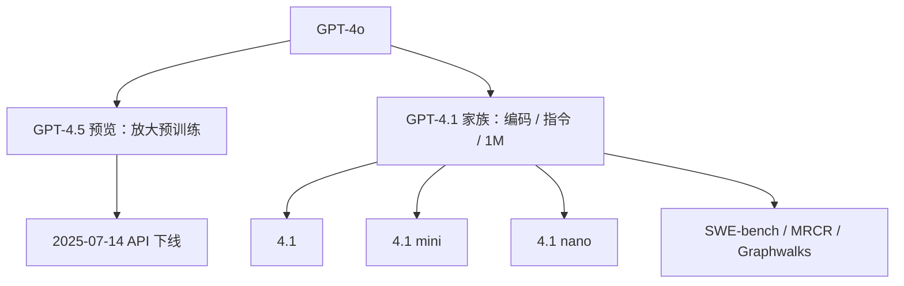

# GPT-4.1 / GPT-4.5 公开信息

    
GPT-4.5 是研究预览：我们最大、知识最广的模型；GPT-4.1 则把编码、指令遵循与最长一百万 token 的上下文做成 API 主力。

    <footer>—— 综合 OpenAI GPT-4.5 System Card（2025-02-27）与 Introducing GPT-4.1 in the API（2025-04-14）</footer>

2025 年上半年 OpenAI 在 GPT-4o 之后公开了两条产品线，且很快交叉。2 月 27 日的 GPT-4.5 系统卡把它写成研究预览：在 4o 之上继续放大预训练，通用性高于当时偏 STEM 的推理模型；后训练用新的监督技术加上 SFT 与 RLHF。4 月 14 日 API 上线 GPT-4.1、4.1 mini、4.1 nano：上下文到 **100 万 token**，知识截止刷新到 2024 年 6 月；编码、指令、长上下文理解相对 4o 大幅上升。同一篇博文宣布 4.5 Preview 将于 2025 年 7 月 14 日在 API 下线，理由是 4.1 在多数关键能力上更好或相当，且更便宜、更低延迟。ChatGPT 侧当时不提供 4.1，相关改进逐步并入 4o。本篇只引用这两份公开材料，**不写参数量**。

## 问题

4.5 要回答的产品问题是：推理模型（o 系列）变强之后，还要不要一个「更博学、更像聊天、幻觉更少」的通用大模型。卡片说早期测试更自然、情商与意图对齐更好，适合写作、编程与实际问题。准备度记分卡：CBRN **medium**、网络安全 **low**、说服 **medium**、模型自主 **low**；部署规则仍是缓解后不得超过 medium。它没有给出百万上下文，也没有把自己定位成 SWE-bench 第一。

4.1 要回答的是开发者清单：仓库级编码、少改无关行、diff 格式稳定、工具调用一致、长文档里找得到针并且能多跳。4o 的 128K 对「八份 React 仓库」不够；针测过关也不等于多针消歧与图上 BFS。OpenAI 为此开源 OpenAI-MRCR 与 Graphwalks，把长上下文从营销窗口变成可打分任务。

### 预览模型的生命周期写进下线通知

4.5 从发布起就叫 research preview。4.1 博文把它的创意、文笔、幽默与细腻写成「将带入后续 API 模型」，同时回收 GPU。引用 4.5 分数时必须标明预览与下线日期，不能当成长期基线。4.1 只走 API、ChatGPT 继续叠 4o，说明同一公司内部「助手默认模型」和「开发者编码模型」可以分叉，评测时不要混用界面。

4.1 的 SWE-bench Verified 54.6% 相对 4o（2024-11-20）的 33.2% 高 21.4 个百分点，相对 4.5 高 26.6 个百分点。官方注明 500 题中 23 题基础设施跑不起来，若记 0 分则 54.6% 变成 52.1%。脚手架与提示见他们公布的设置，换脚手架不能直接比。

## 方法

4.5 方法层公开信息薄：更大预训练、新监督技术、SFT、RLHF（「类似 4o」）。安全评估声称相对已有模型无显著风险上升。没有架构图，没有 token 数。4.1 同样不公开结构，但把**训练目标**写进产品语言：前端编码、更少无关编辑（内部评测从 4o 的 9% 降到 2%）、格式与顺序、稳定工具使用。输出上限提到 32,768（4o 为 16,384）。知识截止 2024 年 6 月。三档都支持 1M 上下文；nano 是「第一个 nano」，公开榜：MMLU 80.1%、GPQA 50.3%、Aider polyglot 9.8%，并称高于 4o mini。mini 相对 4o：智能评测持平或更好，延迟近半、成本降 83%。

长上下文：针测声称 1M 全位置可取回。MRCR 在多轮合成对话里插入 2/4/8 次相似写作请求，要求取回「第 $k$ 首关于貘的诗」这类易混淆针；4.1 在 128K 内优于 4o，1M 仍可用但分数下降（表中 2-needle 128k 为 57.2%，1M 为 46.3%）。Graphwalks 把有向图（十六进制哈希节点）填满上下文，要求从随机节点做 BFS 返回某深度全部节点；4.1 在 &lt;128k 上 61.7%，与 o1 相当、明显好于 4o；&gt;128k 掉到 19.0%。官方同时给出 Video-MME 长视频无字幕 72.0%，相对 4o 高 6.7 个百分点。指令：Scale MultiChallenge 38.3%，相对 4o 高 10.5 个百分点。

### 服务数字属于推理栈

博文写 128K 输入时 4.1 首 token 约十五秒，1M 约一分钟；nano 在 128K 上多数情况下五秒内首 token。这是当时推理与缓存栈的测量，不是模型「变浅」。提示缓存折扣提高、长上下文不再另收档位费，是定价策略。Predicted Outputs 用于整文件重写降延迟，与权重无关。

## 机制

4.5 的机制主张是规模与通用知识：同一套聊天后训练，预训练更大，写作与幻觉（卡片口径）改善，但不把测试时「想很久」当成卖点。4.1 的机制主张是**任务分布**：开发者在乎的 diff、工具、长仓库，被直接写进后训练与评测。1M 窗口若只拉位置编码而不训「跨距离注意与忽略干扰」，针测可能过、Graphwalks 仍会崩；博文明确说针对全长度可靠注意做了训练。MRCR 测的是近邻干扰下的指代，Graphwalks 测的是必须多跳、不能一遍顺序读完的结构，二者不能互相替代。

SWE-bench 增益来自「会在仓库里探索、提交能跑过测试的补丁」，依赖工具环。Aider polyglot diff 分数翻倍以上，被解释成专门训了 search/replace 块，从而不必每次重写整文件。这是产品机制，不是新注意力论文。

Graphwalks &gt;128k 的 19% 说明：窗口广告与「长上下文推理」不是同一能力。针测接近满分时，多跳图搜索可以已经掉到不可用。引用 1M 必须同时报 MRCR/Graphwalks 的分段。

### 不要把 4.1 写成 4.5 的蒸馏

官方叙事是 4.1 在编码等项上超过 4.5，同时更便宜。这与「大模型总是全面更强」相反，符合两份材料各自的目标函数：4.5 偏通用知识预览，4.1 偏 API 工作负载。没有公开说 4.1 从 4.5 蒸馏而来，不要编谱系。

## 边界与工程取舍

两份文档都无参数、无层表、无数据配比。4.1 的 SWE-bench 剔除 23 题；换 500 题满分或换智能体脚手架，54.6% 不可比。1M 的首 token 延迟使交互式聊天不一定能用满窗口；代理场景才能消化分钟级预填。4.5 的 medium 项（CBRN、说服）是准备度框架下的部署许可，不是用户可见的「更危险聊天」。ChatGPT 没有 4.1，用助手产品分数去打 4.1 API 榜会错位。

后续 GPT-5 等旗舰若取代 4.1 为默认，属于产品迭代，不改变 2025 年 4 月博文里的表。本篇截止于这两份公开材料。

出处：OpenAI，*GPT-4.5 System Card*，2025-02-27；OpenAI，*Introducing GPT-4.1 in the API*，2025-04-14。参数量未公开。

## 小结

- GPT-4.5：研究预览，放大预训练 + SFT/RLHF；准备度最高项为 medium；2025-07-14 API 下线。
- GPT-4.1/mini/nano：API 三档，1M 上下文，知识截止 2024-06；SWE-bench Verified 54.6%（另有 52.1% 保守算法）。
- 长上下文要用 MRCR 与 Graphwalks 分段看，针测不等于多跳推理。
- 4.1 不上 ChatGPT；助手侧改进并入 4o。
- 出处：上述系统卡与 API 博文。不编参数量。
