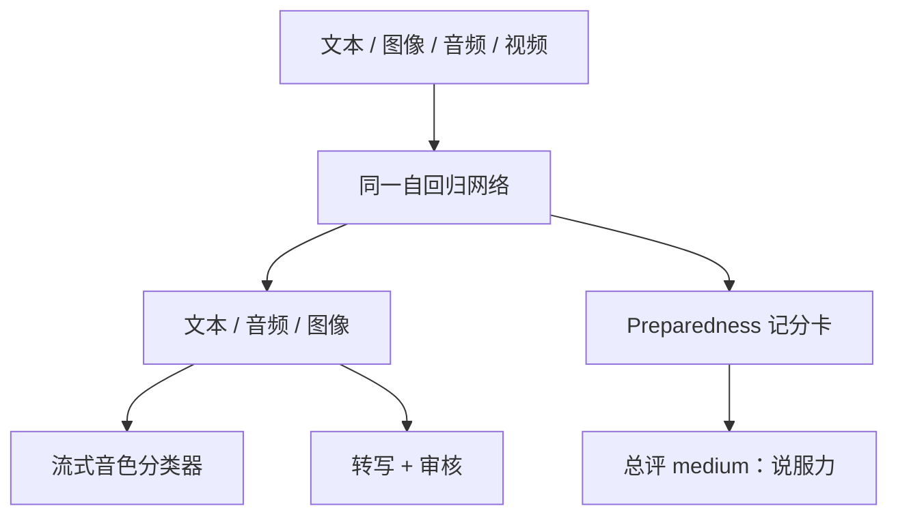

# GPT-4o 系统卡

    
GPT-4o 是端到端训练的自回归 omni 模型：任意组合的文本、音频、图像与视频输入，任意组合的文本、音频与图像输出，由同一网络处理。

    <footer>—— OpenAI，GPT-4o System Card，arXiv:2410.21276，2024</footer>

GPT-4o 于 2024 年 5 月进入 ChatGPT，系统卡（同年 8 月前后公开，arXiv 10 月）把评测重点放在**语音到语音**，并补测文本与视觉。相对 [GPT-4 技术报告](/llm/gpt4-report) 与 GPT-4V 系统卡，新风险来自：模型能听见用户、以接近人类对话延迟说话、在同一网络里同时看图。公开延迟数字：音频输入最短约 232 毫秒、平均约 320 毫秒。英语文本与代码对标当时 GPT-4 Turbo，非英语、视觉、音频理解明显更好；API 更快且约便宜 50%。Preparedness 总评 **medium**，由说服力一项把低推到中，其余跟踪项为低。本篇只写系统卡与发布说明里的模态、缓解与分数卡，**不编参数量**。

## 问题

此前安全框架按「文本进、文本出」搭：拒答、审核、红队都在 token 串上。语音通路一旦端到端，攻击面变成声学。系统卡列举的新问题包括：未经授权的声音克隆、色情或暴力音频、复制受版权保护的音频片段、在噪声与低质量录音里审核失效、以及情感上过度拟人带来的依赖。把语音先转成字再走旧文本安全栈，会丢掉韵律、同时引入 ASR 误差；完全不转写又无法复用已有审核模型。

第二个问题是评测迁移。多数危险能力基准是文本的。系统卡用 Voice Engine 一类 TTS 把文本题读成音频，再测语音通路上的拒答是否迁移。这能回答「会不会用嘴说出文本里拒绝的内容」，不能回答「真实嘈杂环境、重叠人声、对抗噪声」——卡片自己把音频稳健性写成未解。

### Omni 不是三个专家模型的管道

发布叙事强调同一网络吃所有模态，而不是 ASR → LLM → TTS 级联。级联可以沿用 GPT-4 的文本对齐，但延迟叠三段，韵律也无法条件于语义中间状态。端到端换来 300 毫秒量级的对话，也换来「输出音频直接绕过文本审核」的可能。因此卡片把**流式语音输出分类器**写成一等缓解：在波形上检测是否偏离预定的、由配音演员录制的系统音色，而不是只审逐字稿。

上线初期语音输出被限制在预设音色。这是产品策略，不是模型「不会」模仿；分类器与后训练拒答共同约束。把预设音色写成架构能力，会低估对抗下的克隆风险。

## 方法

系统卡结构：能力与局限（语音为主），缓解（模型层 + 产品层），Preparedness 记分卡，第三方自主性等评估，文本/视觉的社会影响。数据叙述停留在高层次：网页、合作数据、以及图像/音频/视频的多模态数据，用来学习视觉、动作序列、语言与语音细微差别。没有语料配比、没有小时数、没有参数。

缓解针对卡片列出的观察项。音色：预设演员声 + 流式分类器。说话人识别与「从声音推断敏感属性」：后训练拒答。违规内容：对转写跑审核模型，并承认音频质量差时会漏。文本与视觉：声明相对 GPT-4 / GPT-4V 系统卡没有发现增量风险，更新已有缓解即可——这是卡片口径，不是证明视觉攻击面为零。

Preparedness 四类：网络安全、生物威胁、说服、模型自主。前三项与自主多为低；说服在十二个政治意见场景里有三例略过低/中边界，总体仍不认为超过专业人类文案的说服力。总评取最高项，故为 medium。第三方评估覆盖一般自主能力。选举年部署被卡片与媒体同时讨论：误信息与滥用是文本+语音的叠加，不单是 omni 公式。

### 延迟数字是语音产品指标

232 / 320 毫秒对的是语音对话，不是长提示的预填。文本 API 的「更快、便宜 50%」是相对 GPT-4 Turbo 的服务声明，不含架构公式。把毫秒数当成「模型深度变浅」没有依据。视觉能力「尤其更好」写在发布材料与卡片里，细表分散在博客；系统卡重点仍是语音风险是否可部署。

## 机制

端到端多模态的机制含义是：中间表示不必经过可读文本。安全分类若只接在文本上，音频支路是旁路。流式分类器直接看波形，试图堵住「说出来但没写成字」的违规；它失败的模式是分布外声学（噪声、叠加、转换器）。拒答迁移实验表明文本安全在干净 TTS 上大体能转到音频，这是分布内迁移，不是新的对齐算法。

说服力评为 medium，说明文本通道仍然主导危险能力叙事：政治意见场景用的是写作样本。语音增加的是送达效率与情感线索，卡片没有把「声音更可信」单独抬成高于 medium 的项，但也没有声称情感拟人无害。自主性保持低：能对话不等于能在无监督下长期行动。

系统卡写明：多数 Preparedness、第三方与部分社会影响评估针对的是文本和视觉，视风险而定。读「medium」时要看是哪一模态的哪一项，不要把语音红队的结论套到生物阈值上。

### 与 GPT-4 系统卡的继承关系

GPT-4 卡片的幻觉、网络安全、过度依赖仍然在。4o 增量是模态。模型辅助安全、RLHF 类后训练被假定延续，但 2410.21276 不是训练报告，没有公开奖励模型配方。API 与 ChatGPT 功能分阶段开放（先文本/图，后语音），系统卡描述的是评估过的能力包，不等于每一用户表面都已打开全部输出模态。

## 边界与工程取舍

不要用系统卡给 4o 画层图或估参数。不要把 Realtime API 的后续产品细节倒填进 2024 年 8 月卡片。音频在嘈杂环境、低比特率、对抗扰动下的稳健性，卡片自己标为挑战。版权音频、声音权、儿童相关语音，属于政策与分类器，不是基准榜能覆盖的。相对 GPT-4 Turbo 的「英语持平」是当时声明，后续 4o 快照会改代码与考试分数，引用需带日期。

与 [GPT-4.1 / GPT-4.5](/llm/gpt41-45) 的分工：4o 卡片回答「omni 能否安全上线」；4.1 博客回答「API 侧编码、指令、百万上下文」；4.5 卡片回答「更大知识模型的预览与准备度」。三者都没有公开参数。把 4o 写成「GPT-4 加了麦克风」低估了端到端训练；写成「已经解决语音安全」高估了分类器。

出处：OpenAI，*GPT-4o System Card*，arXiv:2410.21276；OpenAI 发布博文中的延迟与价格声明。参数量、训练计算、数据小时数未公开。

## 小结

- GPT-4o 是端到端 omni 自回归模型；系统卡重点评语音到语音，并继承文本/视觉安全工作。
- 公开延迟约 232–320 毫秒；英语文本对标 GPT-4 Turbo；API 更快约便宜一半。
- 音色限制 + 流式音频分类器 + 转写审核是主要音频缓解。
- Preparedness 总评 medium，由说服力驱动；网安、生物、自主为低。
- 出处：OpenAI，arXiv:2410.21276。不编参数量。
