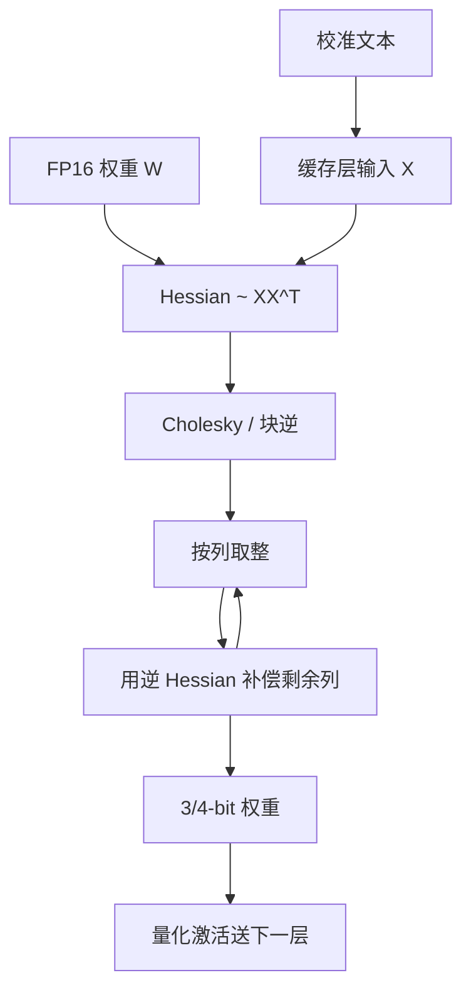

# GPTQ

按层把权重量化写成最小二乘，用 Hessian 把已经引入的舍入误差补偿到尚未量化的列上；这样 4-bit 权重建模可以在数小时内打到百亿参数，而不必再做一轮量化感知训练。

<footer>—— Frantar et al., GPTQ: Accurate Post-Training Quantization for Generative Pre-trained Transformers, ICLR 2023</footer>

大模型推理的第一道墙经常是权重体积。175B 级 FP16 要三百多 GB，连单节点 HBM 也不够；decode 每步还要把这些字节扫一遍，见 [Decode 的显存墙](/llm/decode-memory-wall)。训练后再量化（PTQ）比量化感知训练便宜：不回传全网，只用一小校准集。朴素逐元素 round-to-nearest 在 8-bit 往往还能用，到 4-bit 或 3-bit，层输出的重建误差会沿残差流累积，困惑度塌掉。Frantar 等人 2022 年提出的 GPTQ 把 Optimal Brain Quantization 的二阶补偿做成能在千亿参数上跑完的算法：一层一层地解 $\min\|\hat{W}X-WX\|_F^2$，按列量化，并用 Hessian 逆把误差 squirt 到剩余权重上。结果是 OPT-175B / BLOOM-176B 一类模型可以在大约数个 GPU 小时内压到每参数 3–4 bit，生成质量接近原精度，从而把 175B 塞进单卡做生成。它是权重量化，激活仍用较高精度，和同时打激活的 [SmoothQuant](/llm/smoothquant) 不是同一档。

## 问题

一层线性写成 $Y=WX$，量化后 $\hat{W}$ 的网格很粗。若各权重独立取整，误差在 $X$ 的相关方向上会相干叠加；校准输入若落在那些方向，层输出偏差最大。OBQ / Optimal Brain Surgeon 一类方法知道：量化某个权重后，应该用二阶信息去改尚未量化的权重，使二次型误差增量最小。原始 OBQ 每步要在所有剩余权重里搜「伤害最小的那个」，复杂度对宽层不可接受，GPT 规模上根本跑不完。

LLM 的第二点是必须逐层、必须快。校准通常是一百来条短文本的激活，在 GPU 上缓存 $X$，对每一层做一次量化就丢掉高精度 $W$。若算法要几天、或要回传，就退回 QAT，失去 PTQ 的意义。GPTQ 要同时满足：误差目标是层输出而不是权重 MSE；补偿用得起 Hessian；实现上能按列块走完 175B。

### 权重量化与激活量化必须先分开

Decode 带宽墙里，权重大、激活行数等于 batch。小 batch 时，把 $W$ 打到 4-bit 直接减加载字节，激活保持 FP16 仍然划算——这是 W4A16。SmoothQuant 面对的是激活通道异常值，目标是 W8A8 好走 INT8 Tensor Core。GPTQ 论文主线是前者。把 GPTQ 的 4-bit 权重和 INT8 激活随手绑在一起，没有论文里的误差补偿保证，需要另做校准。训练期把基座存成 4-bit 再训 LoRA，那是 [QLoRA](/llm/qlora)，存储码本和 GPTQ 的 Hessian 补偿不是同一件事。

GPTQ 名字来自 OPT 家族与 PTQ 的拼写，不是 OpenAI GPT 的官方量化格式。实现后来被 Hugging Face、AutoGPTQ、vLLM、TGI 广泛接住，文件布局与论文伪代码并不总一致，要对齐分组大小与对称/非对称约定。

## 方法

对每一层，用校准激活组成矩阵 $X$，目标

$$
\min_{\hat{W}} \|W X - \hat{W} X\|_F^2.
$$

在权重上这是二次型，Hessian 与 $XX^\top$ 成正比。GPTQ 不在全部权重上做组合搜索，而是按列（输出通道固定、沿输入通道）顺序量化：对当前列做网格取整，然后用 Hessian 逆的对应列，把残差补偿到**尚未量化**的列上。补偿的直觉是：被量化掉的那一列少贡献的那截输出，让后面还自由的列去补。块量化（论文常用约 128 列一块）加上 Cholesky 分解，避免反复显式求逆，并把数值限制在块内，使 175B 的一层可以在 GPU 上几分钟内结束。

网格本身是均匀的逐组仿射量化：一组（如 128 个权重）共享尺度，可选零点。GPTQ 改的是**取哪一个网格点、以及如何改邻居**，不是另学一套码本。量化完一层，用 $\hat{W}$ 继续往下一层送校准激活，避免用高精度激活去校准已经量化的网络——误差要按真实推理路径走。

推理时 GEMM 是「低比特权重 × 较高精度激活」，反量化发生在寄存器或 Tensor Core 允许的尺度乘法里，不应先把全模型还原成 FP16 再乘。服务栈里 GPTQ 是一种权重格式，和 KV 的 INT8 不是同一旋钮。

### 与 OBQ 的差别在搜索，不在目标

OBQ 每步挑选量化后误差增量最小的权重，GPTQ 按固定列序走，牺牲选择最优的那一步，换 $O(d^2)$ 量级可承受的更新。列序可以用激活大小重排（后续实现里对部分模型必要），但目标函数仍是层输出 MSE。不要把 GPTQ 理解成「一种新的 4-bit 数据类型」；NF4 那种码本是 QLoRA 的，GPTQ 默认是均匀格子加二阶补偿。

## 机制

二次型 $\mathrm{tr}((W-\hat{W}) H (W-\hat{W})^\top)$ 里，$H$ 的大特征值方向是校准激活能量集中的方向。独立取整在这些方向上的投影误差会被 $X$ 放大。补偿步骤相当于约束「刚被离散的自由度」，在剩余自由度上做一次牛顿步去减小同一二次型。只要 $H$ 在校准集上估得稳，补偿就主要修复校准分布里的误差；这既是 GPTQ 准的原因，也是它可能**过拟合校准域**的原因——[AWQ](/llm/awq) 后文会拿这一点对比。

数值上，Cholesky 与阻尼（对角加一点 $\lambda$）防止 $H$ 病态。校准太少或太偏，阻尼会主导，方法退化成略聪明的 RTN。校准太多，PTQ 的时间优势还在，但「十分钟打完 7B」会变成「要凑一批领域数据」，那是产品选择不是算法失败。

困惑度对权重量化很敏感，所以论文用 PPL 当苛刻指标。下游选择题有时看起来更稳，因为 argmax 还能认对；生成任务与长尾实体更容易先坏。签字要用生成与领域集，不要只用 C4 PPL 过关。

3-bit 与 2-bit 在论文里作为极端档：4-bit 是实用甜点，再往下补偿仍在工作，但网格本身太粗，层输出的不可补偿分量变大。把 2-bit GPTQ 和专门为 KV 设计的轴量化混为一谈，会搞错张量对象。

## 边界与工程取舍

GPTQ 不量化激活，小 batch decode 吃权重带宽红利；大 batch prefill 可能仍是计算墙，W4A16 对 Tensor Core 利用率不一定优于 W8A8。核必须真的按 4-bit 加载；先解成 FP16 再乘，只省显存不省带宽。分组大小、是否对称、是否对部分层（如 lm_head）留 8-bit，都是实现细节，换一种会改变质量，不能把某一版 AutoGPTQ 默认当成论文数字。

校准过拟合：指令模型、多模态投影、代码权重，若校准只有通用网页文本，GPTQ 可能把对领域重要、对校准不重要的方向补偿掉。AWQ 用激活幅度保护显著通道，不显式做这套最小二乘，对「换任务」往往更稳，代价是没有 GPTQ 那种逐列误差清零。两者可以级联或二选一，不要默认「都是 4-bit 所以可互换」。

GPTQ 检查点不能当 QLoRA 的 NF4 基座直接接着训，除非反量化约定一致。部署格式与训练存储格式混用，是「能加载但损失不降」的常见原因。

服务上，GPTQ 与 AWQ 都是离线一次性量化。换基座权重就要重跑。多 LoRA 服务若先量化基座再加适配器，适配器要在量化后的数值空间里训或合并后再量化，见 QLoRA 文末的提醒。极端低比特还要看内核是否存在；没有核的 3-bit 只是压缩包。

### 分组大小与列序是实现契约

论文里的块列更新与实现里的 `group_size=128`、对称/非对称、是否 `desc_act` 重排，共同决定格子怎么切。服务引擎按自己的打包方式存尺度，换引擎必须重量化或做格式转换，不能只改文件扩展名。列序重排若在量化时用了、推理核不知情，等于权重与激活通道对错位，表现是随机噪声而不是「略掉点」。把 GPTQ 当成一种与布局无关的算法名，会在 vLLM / TGI / AutoGPTQ 之间来回踩坑。

## 小结

- GPTQ 是层输出最小二乘意义下的权重量化 PTQ，用 Hessian 把舍入误差补偿到未量化列。
- 目标是 W4A16 一类权重量化，不是激活 INT8；175B 可在数小时内打完。
- 相对 OBQ，它放弃最优顺序，换可扩展的按列块更新。
- 校准域决定补偿方向，换任务可能过拟合；签字要用生成质量。
- 与 AWQ、SmoothQuant、QLoRA 的对象分别是显著通道缩放、激活迁移、训练期存储，不要混格式。
- 真正加速需要 4-bit 加载核，而不是解回 FP16。
- 出处：Frantar et al., *GPTQ: Accurate Post-Training Quantization for Generative Pre-trained Transformers*, ICLR 2023（arXiv:2210.17323）。
