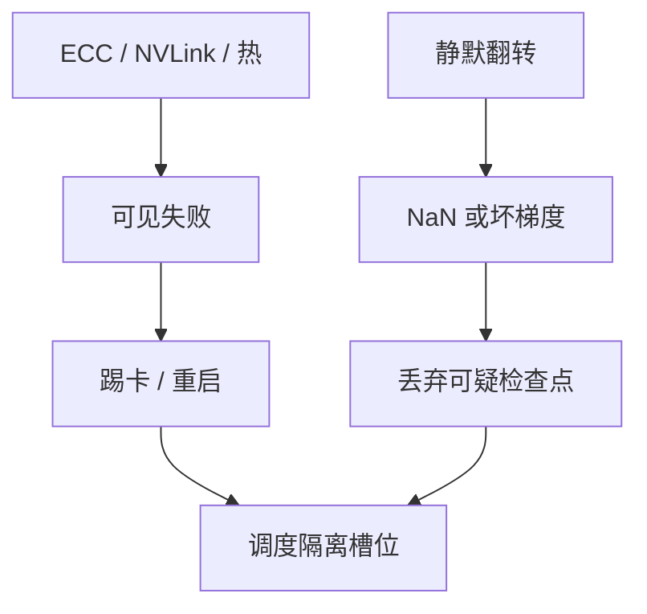

# GPU 故障模式

训练作业看见的是 NCCL 超时或 loss 变 NaN。下面可能是掉卡、降频、链路错，或更坏的：算对了校验、结果是错的。

<footer>—— 对照 NVIDIA Xid 一类错误日志；静默数据损坏见数据中心级别的 SDC 讨论</footer>

[液冷](/llm/liquid-cooling-thermal) 与功率密度把硬件推进高应力区。本课写 GPU 如何坏，以及坏如何穿过 NCCL 屏障变成作业失败。缺口不是罗列所有 Xid 编号，而是 **故障的爆炸半径与检测延迟**：掉卡能立刻看见，静默损坏可能已经写进[检查点](/llm/checkpoint-io-bandwidth)。后课调度要在这种故障率下做公平与抢占。

## 问题

可见故障：ECC 不可纠正、NVLink 训练错、PCIe 掉端点、功耗/热关机、驱动重置。作业表现为 CUDA error、NCCL remote abort、watchdog。爆炸半径：单卡故障在 DP 下可踢出（有弹性）；在 TP / [NVLink](/llm/nvlink) 域内，一卡坏往往整组死，超节点上可能是整柜。

静默故障：计算单元或存储路径翻转，ECC 未抓住，前向继续，梯度污染，loss 异常或表面上仍降。数据中心文献里对 CPU/DRAM 的 SDC 已有测量；加速器侧同样不能假设「GPU 算术永真」。问题是训练需要何种冗余：仅作业级重跑，还是周期性校验、确定性复算、或校验和。

Xid 是驱动报告的症状码，不是根因。同一 Xid 可能来自热、电源、板级、或软件非法访问。排障要叠时间轴：水侧、功耗、NVLink 计数、与邻卡是否同时报错。

## 方法

分层检测。硬件：ECC、NVLink CRC、SM 异常 trap。运行时：NCCL 超时阈值、loss / grad scale 监控、NaN skip（已有训练课）。作业：弹性重启从最近检查点拉起；检查点必须校验，避免把 SDC 固化。集群：坏卡隔离、重复失败的物理槽位退役，而不是无限重调度到同一张卡。

确定性：同一数据、同一网格复算并比对关键张量，成本高，适合抽检或怀疑 SDC 时。完全每步双模冗余对 LLM 预训练通常太贵。更常见的是「异常 loss 回滚一步 + 换卡」。

与通信：集体把单卡慢变成全组慢。部分故障是降频而不是掉卡，症状像拥塞。区分手段：单卡时钟与功耗是否掉档，而 pause 计数是否安静。热与网都要看，不能只调 DCQCN。

## 机制

TP 组内一张卡复位，其余卡停在未完成的 All-Reduce 上，直到超时。超时设太短，网络抖动会被当成故障；设太长，真故障浪费整柜时间。超节点的合理超时与 8 卡节点不同，因为域更大、尾延迟分布不同。

SDC 与量化、FP8 训练叠加时更难发现：数值本就不稳，坏比特被当成「正常噪声」。需要与历史 step 的 loss 曲线、以及偶尔的 FP32 参考比，而不是只看有没有 NaN。坏检查点一旦被当成黄金，后续弹性恢复会稳定地训练错误函数。

有意的 NaN skip 是优化器策略，见训练数值课。本课的 NaN 是硬件或通信损坏。两者日志要分开，否则会把坏卡当成「难 batch」跳过。

## 边界与工程取舍

不要把所有 NCCL 超时当 GPU 坏——先排拓扑与拥塞。不要在没有隔离的情况下把同一张卡交给下一个作业。不要假设云上的「自动迁移」理解 TP 域：迁一张不够，往往要迁整组。下一课公平调度必须把故障重启的资源浪费算进队列，否则短作业永远被训练作业的反复重启堵住。

## 小结

- 可见故障通过集体屏障放大到进程组或整柜。
- 静默损坏需要校验与可疑检查点回退，不能只靠 ECC。
- 降频伪装成通信墙，要对齐时钟 / 热 / 网络计数。
- 超时阈值随域大小而变；坏槽位要退役。
- 出处：GPU 驱动 Xid 与 ECC / 链路错误；数据中心 SDC 讨论。
