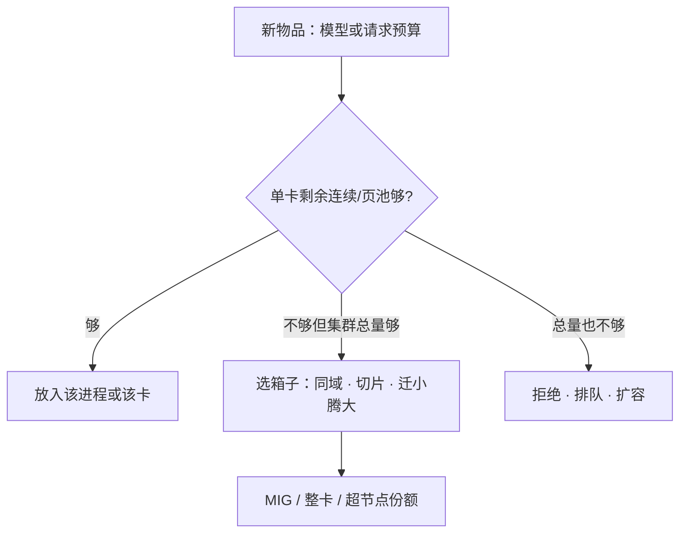

# 显存碎片与装箱

    
空闲字节加总够，却放不进下一条请求或下一个模型，这就是碎片；装箱要在请求、适配器与切片之间做一次近似的背包，而不是再申请一张卡。

    <footer>—— 对照 PagedAttention 消灭连续预留碎片的思路，以及集群侧把多工作负载打进有限 GPU 的放置问题</footer>

GPU/NPU 的容量账有两层。层内：一条服务进程的 HBM 被权重、KV 页、激活、通信缓冲切成块，块对不齐就出现内部空洞。层间：集群里有许多模型、许多副本、许多 MIG 切片，卡的空闲是「还剩 20 GB」的整数，但 20 GB 可能散在三张半满的卡上，哪一张都放不下下一个 18 GB 的引擎。操作系统把前者叫碎片，把后者叫装箱（bin packing）。推理把两者叠在一起：分页解决的是进程内 KV 的外部碎片；调度器还要把进程本身当作大小不一的箱子推进有限的卡。本篇写这两种尺度，以及为什么「显存还有空」和「调度器拒绝」可以同时为真。

## 问题

连续 KV 预留按 $n_{\max}$ 开缓冲，平均长度远低于上限，外部碎片让新请求进不来，这是 [PagedAttention](/llm/paged-attention) 的动机。分页之后外部碎片基本消失，内部碎片仍在：最后一页半满，页越大浪费越大。权重侧也有碎片：为对齐 Cube/Tensor Core 把维度 pad 到 16/32/64，通信缓冲按最坏 EP 度预留，静态图为最大 batch 占坑。于是「nvidia-smi 显示 40 GB / 80 GB」并不等于还能再进 40 GB 的新模型——那 40 GB 可能是碎在页池、对齐 pad 和未归还的临时工作区里。

集群侧的问题是二维的。每张卡是一个箱子，容量是 HBM（有时还有 SM/AIC 时间片）。每个工作负载是一个物品：基座权重、KV 预算、可能的 LoRA 集、是否独占整卡。First-fit 把小模型撒在许多卡上，每张卡剩一截不够大的空洞，大模型永远 pending。这与磁盘装箱、虚拟机放置是同一 NP-hard 问题，只是物品会随 KV 胀缩，箱子的「有效容量」在变。

### 内部碎片、外部碎片、时间碎片

内部：已分配块内部没用满（半页、对齐 pad）。外部：空闲总量够但不相邻（连续分配器）或不在同一张卡（集群）。时间：MPS 或分时让两进程交替跑，HBM 加得下，但一步 decode 的墙钟被切成两半，SLO 碎了。装箱若只看字节，会制造时间碎片；只看独占卡，会浪费字节。

分页消灭的是单进程 KV 的外部碎片，不消灭「三张卡各剩 15 GB、下一个模型要 40 GB」的集群外部碎片。两层要用两套分配器，不要以为上了 vLLM 就不会出现 pending Pod。

## 方法

进程内：KV 用固定页，请求按页表增长；权重一次加载、常驻；工作区按静态图的上限预留并复用，禁止每步 `malloc` 出新的空洞。页大小在核效率与内部碎片之间取点，见分页篇。多 LoRA 把适配器也放进可换页的池，避免每个租户一份满秩拷贝，见 [多 LoRA](/llm/multi-lora-serving)。能共享的前缀页共享，减少「语义相同却物理复制」的假占用。

集群内：把工作负载按**不可切分的放置单元**装箱。一个 TP8 组是一个物品，体积是 8 卡且必须同域；不能拆成 8 个 1 卡物品。一个单卡 7B 是小物品，应填进已被大物品剩下的洞，或显式切片（MIG）后把切片当更小的箱子。放置算法用 worst-fit 留出大洞给未来的大物品，或用定期整理（把小模型迁到一起）对抗外部碎片。整理要付 [缩容迁移](/llm/scale-down-kv) 的税，不能当每分钟的维护。

### 请求级装箱发生在引擎里

连续批每步问：再准入一条提示，页够不够？这是一维背包：物品体积是该请求当前块数，箱子是本副本页池。策略可以是首次适应、按剩余长度估计、按优先级留保护块给交互租户。估错体积（输出比想象长）会在中途触发抢占，等于装箱失败后的回滚。因此请求装箱必须与 [抢占](/llm/preemption-fairness) 接好：宁可少准入，也不要让页池在一步之内爆掉再随机踢人。

保护块是故意留下的内部「浪费」：交互 SLO 的保险。把页池填到 99% 再谈公平，系统会在每一个长尾 token 上抖动。

## 机制

碎片来自分配粒度与释放不同步。页分配器按 $B$ 个 token 对齐，释放按请求结束或引用计数归零。长请求结束会一次归还许多页，短请求穿插其中，池的空闲列表在时间上抖动。分页让这些页可被任意新请求使用，所以进程内外部碎片弱；若核要求物理连续，空洞就回来了。

集群装箱的机制是调度器的过滤器与打分：先滤掉拓扑不合、切片不合的节点，再按剩余容量打分。GPU 时间片（MPS）把「箱子」从空间改成空间×时间，物品之间会争 SM，HBM 账仍要相加——两进程各要 30 GB，80 GB 的卡空间上放得下，但 decode 同时跑会让两条 TPOT 都坏。正确的模型是：HBM 硬约束相加，算力按权重共享或按 MIG 硬切。硬切降碎片的可预测性，增内部浪费（切片内用不满）。

### 整理与防碎片放置

整理：把几个小副本挪到同一张卡或同一切片组，拼出整卡给大模型。防碎片：大物品先放、小物品填缝；或为某类大模型预留整柜。超节点上的份额切分过细，会产生「Die 级外部碎片」：每组剩 2 个 Die，宽 EP 要 320 个连续逻辑 Die 配不成。调度应在超节点内保留大段连续份额给 MoE decode，小模型走边上的切片。

## 边界与工程取舍

装箱是近似的。物品体积随 KV 变，精确最优解不存在，也来不及求。目标应是可解释：为何拒绝、剩多少保护块、哪次整理迁了谁。不要把 MIG 切片切到比权重还小，那是把外部碎片变成不可启动。不要为了填满把两个延迟敏感的 decode 塞进同一 MPS 上下文。评测「利用率」要同时报 HBM 占用与 SLO 达成率：100% 显存占用常常是碎片策略失败后的填满，而不是成功。

异构卡（80 GB 与 141 GB、910C 与 GPU 混部）让箱子大小不同，物品要带「能住哪类箱子」的约束，否则装箱器会做出无法运行的放置。

经典装箱算法（first-fit decreasing 等）可以当放置启发式，不是 LLM 的新公式。出处：分页来自 Kwon 等；集群放置来自数据中心调度的常识。本篇把两者接到同一条显存账上。

## 小结

- 进程内用分页消灭 KV 外部碎片，内部碎片由页大小与对齐 pad 决定。
- 集群侧把副本当物品、卡/域/切片当箱子；TP/EP 组不可拆。
- 时间碎片（分时）与空间碎片不同：字节够仍可能打爆 TPOT。
- 请求准入是页池上的一维背包，必须留保护块并与抢占衔接。
- 整理能拼出大洞，但要付迁移税；超节点上还要防 Die 级碎片。
- 出处：Kwon et al., SOSP 2023；放置问题对照经典 bin packing。
