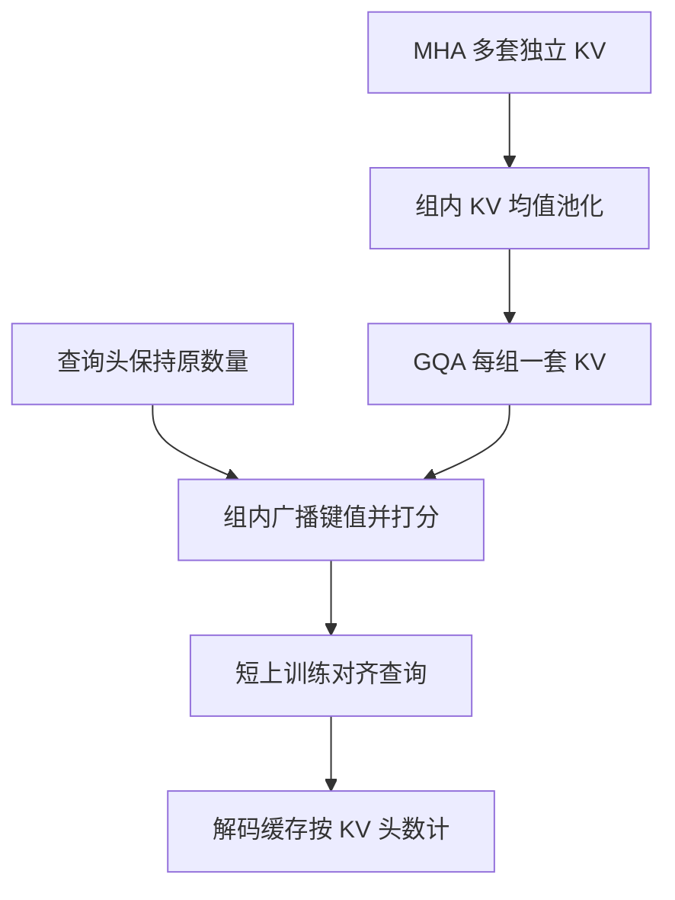

# Grouped-Query Attention

分组查询注意力把查询头分成若干组，每组共享一头键和一头值；它落在多头与多查询之间，用较短的上训练即可从多头检查点转化而来。

<footer>—— Ainslie et al., GQA: Training Generalized Multi-Query Transformer Models from Multi-Head Checkpoints, 2023</footer>

MQA 把 KV 头压到 1，解码带宽最低，质量也掉得最明显。MHA 每头独立 KV，质量上限高，缓存随头数膨胀。Ainslie 等人 2023 年的 Grouped-Query Attention（GQA）在两端之间插一档：查询头仍是 $h_q$ 个，键值头是 $h_{kv}$ 个，$h_q$ 能被 $h_{kv}$ 整除，每 $g=h_q/h_{kv}$ 个查询头共用一组 KV。Llama 2 70B 一类模型采用 8 个 KV 头，使大模型在可服务的缓存体积下保持接近 MHA 的质量。本篇只讨论这一分组结构及其从 MHA 转化的工序，不把 MQA 或潜空间压缩再展开成并列综述。

## 问题

服务约束给出的是 KV 字节预算：并发 $\times$ 层数 $\times$ 长度 $\times$ $h_{kv}$ $\times$ $d_k$ $\times$ 2 $\times$ 元素宽度。$h_{kv}=h_q$ 时预算先被头数吃完；$h_{kv}=1$ 时预算最省，但共享记忆过狠。需要一个整数旋钮，在质量和字节之间连续可调，且最好能从已经花巨资训好的 MHA 检查点出发，而不是从零再训。

Ainslie 等人同时面对转化稳定性：若把 MHA 的 KV 头硬平均成 MQA 的一头，瞬时分布偏移大，需要较长上训练才回到可用区。若平均发生在较小的组内——只把相邻 $g$ 个头合成一组——偏移局部化，上训练可以很短。GQA 因此既是推理结构，也是一条检查点迁移路径。

### 组数作为唯一的架构旋钮

在 $d_k$ 与 $h_q$ 锁定时，自由变量就是 $h_{kv}$。$h_{kv}=h_q$ 退化为 MHA；$h_{kv}=1$ 退化为 MQA。中间取值如 $8$、$16$ 是工程上最常见的甜点：缓存降到原来的 $h_{kv}/h_q$，例如 64 查询头配 8 KV 头，缓存为 MHA 的 $1/8$，仍保留 8 套不同的内容库。旋钮是离散的，因为核实现按头整除分组，不按分数混合。

分组是共享，不是低秩。每组的 $K,V$ 仍是满宽 $d_k$ 的向量，只是若干查询头读同一份。MLA 把向量本身压进更窄的潜变量，机制不同。评估「KV 小了多少」时，GQA 看头数比，MLA 看潜变量维数比，不能直接拿 $h_{kv}$ 去比 DeepSeek 的 $c_{KV}$。

## 方法

将 $h_q$ 个查询头按编号分成 $h_{kv}$ 组，组大小

$$
g = h_q / h_{kv},
$$

第 $g$ 组包含查询头 $\{gi,\ldots,gi+g-1\}$，共享 $K_g,V_g$。组内第 $i$ 个查询头计算

$$
\mathrm{head}_i=\mathrm{softmax}\left(\frac{Q_i K_g^\top}{\sqrt{d_k}}\right)V_g.
$$

前向与 MHA 相同，只是键值投影的输出通道从 $h_q d_k$ 变成 $h_{kv} d_k$。注意力核把 $K_g$ 广播给组内查询，或使用原生的 grouped 接口。缩放仍是 $1/\sqrt{d_k}$，因果掩码不变，$W^O$ 仍按 $h_q$ 个头拼接。

从 MHA 转化的标准做法是：对即将合并的那些 KV 头的投影矩阵做均值池化，得到 GQA 的 $W^K,W^V$；查询投影与 $W^O$ 原样保留；然后在原训练分布上做较短的上训练，让查询头学会组内共享的键几何。Ainslie 等人表明，这一短训远短于从随机 GQA 训到同等水平，也短于把 MHA 直接压成 MQA 后再恢复的时间。

### 上训练要对齐的是键几何而非头数

均值池化假设组内 KV 头已经大致指向同一区域。若某组里两头正交，平均会得到范数偏小、方向含糊的键，softmax 暂时变平。上训练的主要工作是把 $W^Q$ 转到新 $K$ 上，并让被平均后的 $W^K,W^V$ 重新拉开组间差异。组内不再允许差异，这是结构约束，短训无法恢复组内独立 KV。若必须保留某两头的独立记忆，应把它们分到不同组，而不是指望学习率。

## 机制

组内行为像 MQA：多个 $Q$ 竞争同一份 $K,V$，靠分数差异读出不同混合。组间行为像 MHA：不同组有不同内容库，值子空间可以分化。质量-带宽曲线因此通常是凸的——从 MHA 减掉一半 KV 头，损失很小；再减到 1 头，最后一段掉得陡。选 $h_{kv}=8$ 这类值，是故意停在陡降之前。

解码读取量与 $h_{kv}$ 成正比，与 $h_q$ 无关。查询头再多，只要不增加 KV 头，缓存字节不变；多出来的只是现场算 $Q$ 和多套点积。点积在解码步往往不是瓶颈，因此「多查询、少 KV」正好把容量花在更有用的路由上。这与训练期不同：训练前填仍要写全部位置的 KV，GQA 只减少写出宽度，对训练吞吐的帮助中等，远小于对生成服务的帮助。

分组方式默认按相邻头编号切块，这只是实现惯例。训练时头编号没有语义，相邻头未必最该合并。从 MHA 转化时，更合理的是按 KV 头相似度聚类再合并，但工程上几乎都用连续切块，依赖上训练去修补。新训 GQA 则无所谓初始编号。

### 与 MQA 在张量并行上的差别

MQA 仅一头 KV，无法按 KV 头切卡。GQA 只要 $h_{kv}$ 能被张量并行度整除，就可以沿 KV 头切开，查询头按同样的组边界切开。这使 GQA 比 MQA 更容易落入现有 Megatron 式切分。$h_{kv}=8$、张量并行 8 时每卡恰好一头 KV，是常见配比。$h_{kv}$ 选得过小会重新碰到 MQA 的切分尴尬。

## 边界与工程取舍

GQA 不能表达组内值子空间的差异。若任务依赖「同一层里很多互不相关的记忆通道」，应增大 $h_{kv}$ 或回到 MHA，而不是只加查询头。长上下文下缓存仍随长度线性增长，GQA 只改斜率。百万 token 级仍要靠窗口、压缩或外置记忆，$h_{kv}$ 再小也只是常数。

上训练超参影响最终是否贴近原 MHA。过短会留下池化创伤：某些组键范数偏小、该层注意力过平。过长且学习率过大，可能把已经学好的查询头冲掉。Ainslie 等人的经验是：质量平台来得比从零训练快得多，但不等于零成本。从随机初始化直接训 GQA 完全可行，对尚未有 MHA 检查点的新模型更干净，此时没有池化步骤，组结构从一开始就是真的。

评估 GQA 时应用解码负载说话：同等并发下的吞吐、同等显存下的最长上下文，以及与 MHA 对照的下游分。只用前填困惑度会低估收益——前填对 $h_{kv}$ 不敏感——也会低估 MQA 端点的质量坑，因为短序列上坑还不深。

## 小结

- GQA 让 $h_q$ 个查询头共享 $h_{kv}$ 组键值，$h_{kv}=h_q$ 即 MHA，$h_{kv}=1$ 即 MQA。
- 解码 KV 字节与 $h_{kv}$ 成正比；查询头可以保持很多，以维持路由多样性。
- 质量-带宽曲线通常在中等 $h_{kv}$ 处出现甜点，这是大模型选用约 8 个 KV 头的原因。
- 从 MHA 出发可用组内均值池化加短上训练转化，比压成 MQA 再恢复更稳。
- 组内是硬共享，短训不能恢复被合并头之间的独立记忆。
- 张量并行要求 $h_{kv}$ 可被切分，这是相对 MQA 的工程优势。
- 出处：Ainslie et al., *GQA: Training Generalized Multi-Query Transformer Models from Multi-Head Checkpoints*, 2023；端点结构见 Shazeer, *Fast Transformer Decoding*, 2019。
