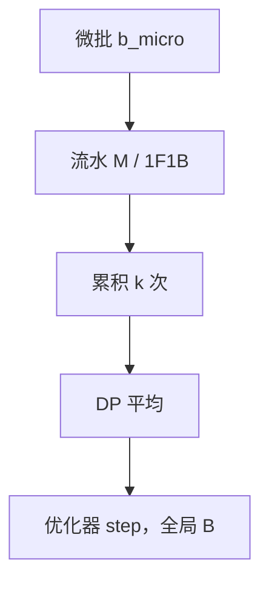

# 梯度累积与微批

优化器看见的 batch 是微批体积乘累积步数乘数据并行度；显存放不下时，用多次前反向的梯度加总来模拟大 batch，而不把学习率公式里的 $B$ 偷偷改掉。

<footer>—— 对照 Goyal 等大 batch SGD；GPipe 的微批；预训练配方中的 global batch</footer>

[上一课](/llm/ulysses-sp)按序列切分之后，单次前向的激活仍可能撑满卡：长 $s$、厚层、MoE 容量。不能再加大每卡微批，有时还要减小。本课不重讲 SP 布局。缺口是把「微批 / 累积 / 全局 batch / 学习率」收成一张会计，避免流水的 $M$、DP 的 $n$、累积的 $k$ 被三个配置文件各写各的。MoE 的 All-to-All 会按微批触发；本课先把稠密情形的 $B$ 钉住。

## 问题

记每卡微批 token 数为 $b_{\mathrm{micro}}$（或样本数 × 长度），数据并行度 $n_{\mathrm{dp}}$，累积步 $k$，则全局 batch $B=b_{\mathrm{micro}}\cdot n_{\mathrm{dp}}\cdot k$（再乘流水里同时注入的微批语义——必须与框架定义一致）。GPipe 的 $M$ 往往就是这里的「一次优化步里流水线上飞过的微批数」，与 $k$ 可能重合或相乘，取决于实现是否在流水 flush 之后才累积。配错则真实 $B$ 与日志不一致，Chinchilla 会计、学习率标度全部错。

Goyal 等人指出大 batch 要线性放大学习率并做 warmup。预训练若靠累积把 $B$ 做大，应沿用同一逻辑；若累积只是为了显存、意图保持小 $B$，就不要再乘学习率。意图必须声明。

### 流水与累积的两种接法

一种：一次 1F1B flush 消耗 $M$ 个微批，立刻 step，则 $k=1$，$M$ 参与 $B$。另一种：多次 flush 才 step，梯度在优化器里加总，则 $k\gt 1$。ZB 与 DualPipe 的全局 batch 边界必须落在 step 上，不能落在半截双流上。

Norm 层与 Dropout 的统计应对「逻辑微批」还是「累积后」？训练里通常按微批算 BN 类统计；Transformer 多用 LN，问题较轻，但仍不要在累积之间更新 LN 的可学习参数以外的状态。

## 方法

在一张表里写：$s$、$b_{\mathrm{micro}}$、$M$、$k$、$n_{\mathrm{dp}}$、$n_{\mathrm{tp}}$、$n_{\mathrm{pp}}$、$n_{\mathrm{sp}}$，以及推导出的 $B$ 与每步 token。加载器按 $b_{\mathrm{micro}}$ 吐数据；SP 对齐 padding 在这一层做完。改变任一并行度时重算 $B$，决定是改 $k$ 保 $B$ 还是改学习率跟新 $B$。

显存不够：先降 $b_{\mathrm{micro}}$、开重计算，再加 $k$ 保 $B$。$b_{\mathrm{micro}}$ 过小会伤害 GEMM 与拉低重叠率，这是计算通信课的约束。长 $s$ 时优先降 $b_{\mathrm{micro}}$ 而不是降 $s$，以免违背长文档上采样。

### 与退火、课程

退火若改变平均 $s$，同样 $b_{\mathrm{micro}}$ 的激活跳动，可能要动态 $k$。动态 $k$ 等于动态 $B$，学习率要跟。课程课说顺序与 LR 同表；本课要求 $B$ 也在那张表上。

日志打印的 `tokens/sec` 必须声明是不是含 padding、是不是全局。SP padding 会让有效 token 小于 $B$。

## 机制

梯度累积是线性的：$\sum_{i=1}^{k}g_i$ 在全精度加总时等价于大 batch 的梯度（忽略 BN 与 Dropout 的噪声差异）。半精度累积要用 FP32 master 梯度，否则尾数被吃掉。流水的 $M$ 个微批在一次 flush 内已经是一种「空间上的累积」，再在时间上累积 $k$ 次，数值上都是求和，但同步点不同：flush 内有阶段间依赖，flush 间是完整的前反向。

## 边界

累积不减少 SP/TP 通信次数，只减少 step 次数，优化器与检查点更稀。过稀的 step 让学习率日程的「步」与墙钟脱节。下一课 MoE 的 All-to-All 每个微批都打一次，降 $b_{\mathrm{micro}}$、加 $k$ 会让通信次数线性涨，稠密模型上「用累积换显存」的经验不能照搬。

## 小结

- 本课不重讲 Ulysses；只补 $B$ 的会计：微批、累积、DP、流水 $M$。
- 显存不够时降微批、加重计算、加 $k$ 保 $B$；声明学习率跟不跟 $B$。
- 半精度要用 FP32 累积梯度。
- MoE 下累积会放大 All-to-All 次数，下一课处理。
- 出处：Goyal et al., *Accurate, Large Minibatch SGD*；Huang et al., GPipe；Megatron-LM 配方中的 global batch 定义。
