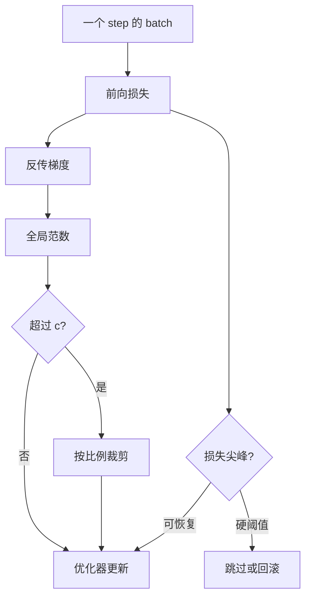

# 梯度裁剪与损失尖峰

范数裁剪把一次过大的更新按比例缩回球内；它挡住爆炸，但不解释损失为何突然竖起一条尖刺。

<footer>—— 裁剪的 RNN 前史见 Pascanu 等；大模型训练中的尖峰见 PaLM 等报告</footer>

预训练曲线很少是光滑的指数下降。每隔一段 token，训练损失会突然跳高一截，再在随后若干步里掉回来，或者掉不回来、变成一条更高的平台。伴随而来的是梯度全局范数的尖刺。几乎所有大模型配方都做全局梯度裁剪：若 $\|\mathbf{g}\|_2>c$，就把梯度乘 $c/\|\mathbf{g}\|_2$。$c=1.0$ 是常见默认值。裁剪是保险，不是诊断。本篇把裁剪的几何说清楚，再把损失尖峰的常见来源与工程应对分开：哪些是坏 batch，哪些是优化器与精度，哪些是结构上的饱和。不把某一篇博客里的「跳过一个 batch 就好了」写成普遍定理。

## 问题

深层网络的梯度可以沿层连乘。即令 Pre-LN 给了残差一条公路，注意力 softmax、FFN 的激活、嵌入表的巨大学习率，仍能在个别 token 上制造极大的局部梯度。数据侧更直接：一段有毒、重复、编码损坏、或极长的特殊序列，损失本身可以比均值高一个数量级。若不限制更新幅度，Adam 的一步会把权重打到不可恢复的区域：LayerNorm 的方差崩掉、logits 溢出、此后每步都在 NaN 边缘。

尖峰与爆炸相邻但不是同一件事。爆炸是范数失控、下一步就 NaN；尖峰是损失突然变差，范数可能仍被裁剪钉在 $c$ 上。你在日志里看到的是「grad norm 贴着 clip 阈值、loss 竖起来」。问题于是有两层：如何避免单步更新毁掉权重；如何判断这次尖峰是可恢复的噪声，还是优化已经离开了可工作的盆地。

### 全局范数裁剪在做什么

记全体可训练参数的梯度拼成向量 $\mathbf{g}$。全局 $\ell_2$ 裁剪是

$$
\mathbf{g}\leftarrow \mathbf{g}\cdot \min\bigl(1,\, c/\|\mathbf{g}\|_2\bigr).
$$

它保方向，改幅度。被裁剪时，有效学习率变成 $\eta\cdot c/\|\mathbf{g}\|$，对这一步的所有参数一视同仁。这和 Adam 的每坐标缩放正交：先按 Adam 做出预条件后的方向（实现上裁剪通常加在反传之后、Adam 之前，顺序以代码为准），再把整包梯度推进半径 $c$ 的球。顺序若颠倒——先 Adam 再按更新向量裁——统计对象变了，复现别人的 $c$ 会失败。

「梯度范数」必须定义在哪一组参数上。有的实现不含嵌入，有的把流水线各段的局部范数平方后再开方。ZeRO-3 下参数分片，必须跨 rank 做一次范数 All-Reduce 才能得到全局 $c$。配置里写 clip=1.0 却在分片上各自裁，等于把阈值悄悄放大了 $\sqrt{N}$。

## 方法

标准配方：反传得到梯度，跨数据并行组 All-Reduce（或 ZeRO 的 Reduce-Scatter），算全局范数，裁剪，再进优化器。日志同时记下未裁剪范数、裁剪触发比例、以及这一 step 的损失。触发比例长期接近 100%，说明 $c$ 相对当前学习率过紧，模型几乎每步都在用缩小的有效 $\eta$ 训练，日程表上的峰值是假的。触发比例接近 0，裁剪形同关闭。健康区间没有统一数字，但「从几乎不触发突然变成步步触发」是尖峰的伴随症状。

应对尖峰的工程菜单通常叠几层，而不是只靠 $c$：

1. **裁剪**：限制单步幅度，默认始终开。
2. **跳过 / 回滚**：若未裁剪范数或损失超过硬阈值，丢弃这一 step 的更新，或从上一个检查点恢复。PaLM 等报告描述过不稳定步。是否回滚、回滚多远，各家不同。
3. **结构侧**：注意力 logits 的 z-loss（PaLM）、QK 归一化、嵌入与输出头更小的学习率，降低尖峰的发生率，而不是尖峰出现之后再挡。
4. **数据侧**：过滤极端文档、截断异常长度、检查重复。尖峰若能和某一数据分片对齐，先查数据。

### 损失尖峰的几种来源

数据尖峰：个别序列损失极高，梯度被这些 token 主导。换一个 batch 就恢复，权重往往没被打坏——前提是裁剪已经把步长挡住。优化尖峰：学习率相对宽度或相对当前损失过高，Adam 的 $v$ 在某些层滞后，连续若干 step 同方向累加。精度尖峰：FP16 下未缩放的小梯度变零、大 logits 溢出，BF16 少见但仍可能在 softmax 前的分数上溢出。结构尖峰：某层注意力极度尖锐，或残差流范数在 Pre-LN 下单调涨，最终在某一层爆发。

这几类在日志上的差别：数据尖峰与 batch 对齐、换 seed 或换 shard 会挪位置；优化尖峰随学习率与步数移动；精度尖峰伴随 Inf/NaN 计数；结构尖峰在特定层的激活统计上先有征兆。只盯 loss 曲线，四类看起来一样。

## 机制

裁剪改变的是这一步的有效 $\eta$，不改变损失函数。若尖峰来自真实的大梯度方向（「这个 batch 确实难」），裁剪等于自动减小学习率，下一步仍在附近，损失常常回落——曲线上就是尖刺。若尖峰来自已经损坏的权重（某层 $\gamma$ 变成极端值、嵌入某一行飞掉），裁剪只是让损坏来得慢一点，损失会在更高的平台上震荡。区分二者要看尖峰之后是否回到原趋势，以及层统计是否复位。

不要把「裁剪触发了所以模型在学习难样本」当成正面叙事。长期 100% 触发意味着你写下的学习率从未真正用上。应下调峰值，或查为何范数系统性偏大，而不是把 $c$ 从 1 改成 0.1 来掩盖。

### 裁剪救场与跳过 batch

跳过一个 step 等于把那个 batch 的梯度当 0。若尖峰是坏数据，这是对的。若尖峰是模型对正常数据的真实高损失，跳过等于从训练集里删掉目前最难的部分，短期曲线变好看，长期可能伤尾部能力。因此硬阈值应极宽，只拦 Inf 和明显损坏；常规波动交给裁剪。回滚更重：它假设最近 $k$ 步的更新是错的，需要可靠检查点。频繁回滚说明配方不稳，不是说明回滚策略成功。

z-loss 一类辅助项把 logits 的平方和压住，降低「某一位置 logit 极大 → softmax 饱和 → 梯度尖」的链。它减少结构性尖峰，对坏数据无效。QK-norm 同样作用于注意力分数的尺度。这些是改模型，和改 $c$ 不在一层。

## 边界与工程取舍

逐层裁剪、按参数组裁剪、自适应梯度裁剪（按权重范数比例裁）改变的是谁与谁比。全局 $\ell_2$ 是大模型默认，因为它实现简单、跨并行策略好定义。逐层裁剪可以避免「某一层爆炸导致所有层都被缩小」，也可能让本该一起缩小的更新变得不协调。没有普遍赢家。嵌入表单独用更小的 $c$ 或更小的学习率，是常见的分组，因为词表梯度稀疏、偶发极大。

混合精度与 ZeRO 会让「看到的范数」和「真正的 FP32 范数」不一致。BF16 梯度通信后再在 FP32 主权重上更新时，应在哪一种精度里算 $\|\mathbf{g}\|$，要在实现里写死。FP8 还多一层缩放因子，范数比较的是缩放后还是缩放前，搞错会让 $c$ 失去意义。

损失尖峰之后若验证损失也台阶式变差，不要只看训练平滑曲线的「已经回来了」。训练损失回来可能是碰到了更容易的后续 shard。下游探针、或固定验证集上的间隔评测，才能判断权重是否被打到另一盆地。

裁剪不能替代合理的学习率日程。WSD 稳定段若峰值过高，裁剪会变成隐性的另一条日程：有效 $\eta$ 长期低于你以为的常数。分析 token 效率时，应同时画出未裁剪范数与触发比例，否则在比较优化器或并行策略。

## 小结

- 全局 $\ell_2$ 裁剪保梯度方向、把幅度钉进半径 $c$ 的球，防止单步毁掉权重。
- 损失尖峰有数据、优化、精度、结构四类来源；裁剪是保险，不是分类器。
- 长期步步触发说明峰值学习率没用上；跳过 batch 只适合极端损坏，不适合当常规训练。
- 范数必须在全局、在约定精度与参数组上计算；ZeRO 分片上的本地裁剪会改写 $c$。
- z-loss、QK-norm、嵌入分组学习率降低结构性尖峰，与加大裁剪不是同一操作。
- 出处：Pascanu 等关于梯度爆炸与裁剪；Chowdhery 等 PaLM 报告中的训练稳定性与 z-loss；后续开源配方中的跳过 / 回滚是工程实践，阈值不可当定理。
