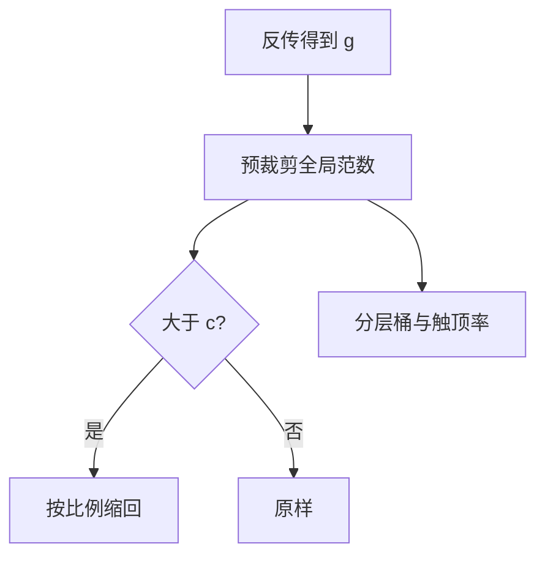

# 梯度范数监控

全局 $\ell_2$ 范数把一次反传收成单个标量；它能告诉你这一脚有多重，但不能告诉你重量来自哪一层、哪一种饱和。

<footer>—— 裁剪前史见 Pascanu, Mikolov & Bengio, ICML 2013；大模型配方中的全局裁剪见 PaLM / Llama 一类报告</footer>

[上一课](/llm/output-logit-divergence)把输出 LSE 当成传感器。缺口是：有些爆炸先出现在梯度上，logits 还没 Inf——坏 batch、某层 Jacobian 瞬间放大、或流水线某段的局部范数没做 All-Reduce。主干 [梯度裁剪](/llm/grad-clip-loss-spike) 已写 $\min(1,c/\|g\|_2)$ 的几何，本课不重推。要补的是**监控怎么布**：记什么、在裁剪前后各看一次、如何与分片并行对齐。后课的激活漂移默认你会这条时间序列。

## 问题

Pascanu 等人在 RNN 里把爆炸写成沿时间的连乘；Transformer 有残差公路，爆炸改成「个别 token / 个别层的局部极大」。全局范数把所有参数的梯度拼成一条向量再取 $\ell_2$。它被裁剪之后，日志若只打裁剪后的值，会永远等于 $c$，信息量为零。必须打**裁剪前**范数：分布、对 $c$ 的触顶率、以及是否伴随 CE 尖峰。

分片使问题变脏。ZeRO-3 下每个 rank 只有一部分参数，局部 $\|g_{\mathrm{shard}}\|_2$ 不是全局范数；正确做法是 All-Reduce $\sum\|g_{\mathrm{shard}}\|^2$ 再开方。各自按 $c$ 裁，等于把阈值放大约 $\sqrt{N_{\mathrm{shard}}}$。流水线各段同理。配置写 `clip=1.0` 却在分片上裁，复现别人的曲线会失败。

「梯度范数」还要声明含不含嵌入、含不含 lm_head。嵌入表大、梯度稀疏，常常主导全局 $\ell_2$。只看一个数，会把嵌入的一次热 token 误判成「整网爆炸」。

## 方法

每步（或每 $k$ 步）记录：

1. 全局预裁剪 $\|g\|_2$（跨 rank 归约后）。
2. 触顶率：$\|g\|_2>c$ 的 step 比例，滑动窗口。
3. 分层范数：嵌入、每层 attn/FFN、输出头，至少这三桶。
4. 与 CE、LSE、注意力 row-max 对齐的同一 step id。

分层范数用各桶自己的 $\ell_2$，不要把桶平均后再比——维度不同。若嵌入桶单独高、其余正常，对策是嵌入学习率或坏 token，而不是把全局 $c$ 从 1 改到 0.1 把整网更新掐死。

与 [自动微分](/llm/autograd-graph) 的接口：`detach` 会让某桶范数恒为 0，这是图断了，不是训练稳了。新增损失项（z-loss、MoE 均衡）会改变全局范数的基线，换配方后 $c$ 要重看触顶率，不要沿用旧阈值当神圣。

## 机制

裁剪保方向、改幅度。触顶时有效学习率变成 $\eta\cdot c/\|g\|$，对全体参数一视同仁。于是：经常触顶 ≈ 你写的 $\eta$ 从未真正用上，μP 扫到的学习率作废；从不触顶 ≈ $c$ 太松，挡不住下一步的 Inf。健康的预训练允许**偶发**触顶（坏 batch、长尾），不允许**持续**贴顶。持续贴顶时，应先查分层：注意力层范数先飞，回到 logit 增长；输出头先飞，回到 LSE；全体一起飞，才是 $\eta$ 或精度问题。

Adam 在裁剪之前还是之后，必须与要对齐的论文一致。先 Adam 再按更新向量裁，统计对象变了，本课的「梯度范数」就不再是 $g$ 而是 $\Delta\theta$。日志名不要都叫 `grad_norm`。

## 边界

本课不把监控做成自动 skip 规则；skip 在主干。也不用梯度范数去估计 Hessian 或临界 batch——那是缩放单元的梯度噪声尺度，需要方差而不是 $\ell_2$ 范数。下一课看激活（前向）尺度漂移：它可以在梯度范数仍正常时发生，因为 LN 把进 $F$ 的分支钉住，主干仍在涨。

## 小结

- 打裁剪前的全局范数与触顶率；裁剪后贴 $c$ 的数没有诊断价值。
- 分片必须先归约平方和；分层桶区分嵌入、层、输出头。
- 持续贴顶使名义 $\eta$ 作废；偶发触顶可接受。
- 范数 0 可能是图断开；换损失项后 $c$ 要重校准。
- 出处：Pascanu et al., ICML 2013；PaLM / Llama 配方中的全局裁剪实践。
