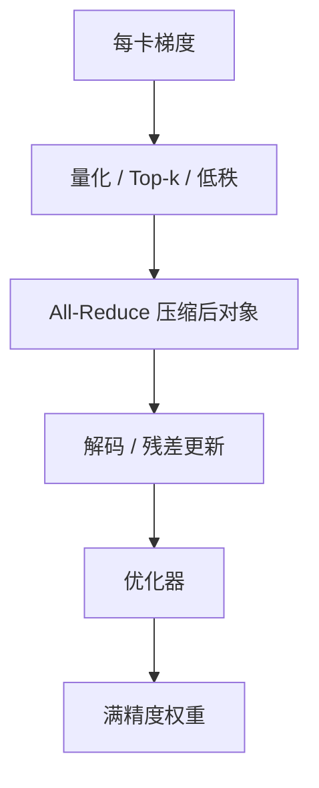

# 梯度压缩

DP 的 All-Reduce 体积等于参数量。压梯度是压 $n$，不是压模型；误差进优化器，不进部署权重。

<footer>—— 对照 QSGD、Deep Gradient Compression、PowerSGD；集体体积见带宽模型课</footer>

[上一课](/llm/training-network-congestion) 在链路上排队。本课从应用层减字节：对数据并行的梯度做有损压缩，再 All-Reduce。缺口不是再讲环算法，而是 **何时 $n$ 大到必须伤数值**。[预训练通信](/llm/pretrain-comm) 提过 BF16 / FP8 通信 dtype，那是精度换带宽；本课再往下：稀疏化、量化梯度、低秩分解梯度。它与后课参数服务器有交接——PS 时代大量工作是压缩上行；All-Reduce 集群同样能用，只是对称地每卡都要编解码。

## 问题

DDP 每步 All-Reduce 的 $n$ 与模型参数量同阶，与 batch、序列无关。模型涨、网卡不按比例涨时，DP 组跨节点段成为墙，重叠也盖不住。降低 DP 度会伤吞吐或逼你加大 TP——TP 又要求 [NVLink](/llm/nvlink)。压缩梯度给出第三条：保持 DP 度，减小 $n$。

代价在优化轨迹。压缩是有损的：QSGD 一类随机量化保留无偏但增方差；Top-k 稀疏化丢小坐标，要误差反馈才不让方向漂；PowerSGD 把梯度矩阵收成低秩因子，带宽随秩走，表达力也随秩走。问题是：**压缩误差是否被 Adam 与大 batch 吞掉，还是在损失平台上留下一层永远到不了的缝**。

这不是 [GPTQ](/llm/gptq) 那种权重量化。权重压缩改推理函数；梯度压缩只改训练通信，训练结束仍可存满精度权重。两套格子不要混用同一套校准叙事。

## 方法

三类常用手法，可以叠，但验收必须在最终优化器轨迹上。

量化通信：梯度用 FP16 / BF16 / FP8，或整数网格加尺度。实现简单，和集体库的 dtype 开关一致。无偏随机舍入（QSGD）在理论上好分析，工程上确定性格子加足够大 batch 往往也够。

稀疏 / 误差反馈：每卡只发 Top-k 或随机 $k$ 个坐标，其余留在本地残差里下次再试（Lin 等人 DGC 的主线）。All-Reduce 变成不规则稀疏集体，NCCL 的密张量路径不直接适用，常要自管或先聚成块稀疏。

低秩：PowerSGD 对分层梯度做一次幂迭代式分解，All-Reduce 只同步因子。秩很小则 $n$ 降一个数量级；注意力与 MLP 的梯度是否真低秩，是经验问题，不是定理。

与层次化兼容：先节点内密 All-Reduce 或 reduce-scatter，再对每节点一份做压缩跨节点。节点内 [NVLink](/llm/nvlink) 很胖，不必压；跨节点再压，编解码次数也少。这比每卡独立 Top-k 再对齐索引更省事。

## 机制

无偏量化增加梯度噪声，效果近似略减学习率或略增 batch。Adam 的二阶矩会吸收一部分尺度变化，但 FP8 通信若与丢失缩放不对齐，会出现整层梯度下溢——那是数值协议，不是压缩比。稀疏化无误差反馈时，小而持续的方向（词表里的稀有实体）会被系统抹掉，表现为长尾能力先死。低秩假设在训练后期梯度变噪、秩升高时可能失效，需要升秩或关掉。

压缩与数据并行的「各卡比特级一致」冲突：编解码顺序、随机舍入种子必须全组相同，否则权重分叉，集体下一次对不齐。这比密 BF16 All-Reduce 更脆。

MoE 的梯度仍按专家切片；压缩要按片做，避免把路由相关的小梯度当噪声删掉。EP 的墙是 All-to-All 激活置换，不是梯度 $n$，压梯度救不了 EP。

## 边界与工程取舍

小模型、NVLink 域内 DP，压缩常常得不偿失：编解码吃 GPU，NVLink $\beta$ 已经够。大模型跨柜 DP、以太网 $\beta$ 不够时才值得。不要把论文里「压缩 100×、精度不掉」的 CNN 数字抄到 LLM 上而不做消融。不要与检查点、激活检查点搞混——那些减的是存储与激活显存，不是 DP 通信 $n$。

下一课参数服务器是另一种通信形状：不对称、推拉、天然适合稀疏更新。若你的压缩已经是极度稀疏的 embedding 梯度，PS 可能比对称 All-Reduce 更合适。稠密 Transformer 主体仍是 All-Reduce 世界。

## 小结

- 梯度压缩减 DP 的 $n$，不改部署权重；与 PTQ 权重量化不是一事。
- 量化通信最便宜；Top-k 要误差反馈；PowerSGD 赌梯度低秩。
- 先节点内密归约，再跨节点压，匹配 NVLink / 网卡两档 $\beta$。
- 编解码必须全组一致，否则副本分叉。
- 出处：Alistarh 等 QSGD；Lin 等 Deep Gradient Compression；Vogels 等 PowerSGD。
