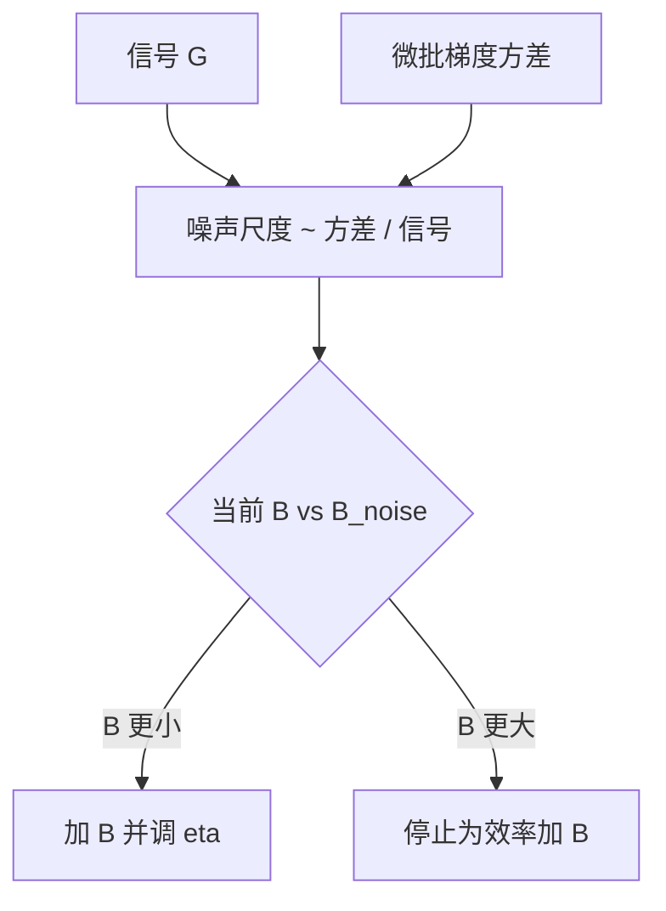

# 梯度噪声尺度与临界批次

临界 batch 是梯度噪声幅度与曲率的比：低于它，加大 batch 几乎线性减少所需步数；高于它，数据效率饱和。

<footer>—— McCandlish, Kaplan, Amodei et al., An Empirical Model of Large-Batch Training, 2018</footer>

[上一课](/llm/lr-batch-scaling-law)把线性 / $\sqrt{B}$ 当成相对 $B_{\mathrm{crit}}$ 的分层，但没说 $B_{\mathrm{crit}}$ 怎么测。缺口是 McCandlish 等人的**梯度噪声尺度**（gradient noise scale）：用小 batch 上梯度的方差与真实梯度的范数估计「还值不值得再加大 $B$」。本课把它收成可计算的传感器，接在范数监控之后——范数是幅度，噪声尺度是方差对信号的比。后课改序列长度时，$B$ 变了，这个传感器要重打。

## 问题

令 $G$ 为全数据（或超大 batch）梯度，$g$ 为 size $B$ 的随机梯度。噪声尺度粗写为

$$
B_{\mathrm{noise}}\sim\frac{\mathbb{E}\|g-G\|^2}{\|G\|^2}\cdot B,
$$

使 $B_{\mathrm{crit}}$ 与 $B_{\mathrm{noise}}$ 同量级（论文给出更完整的与 Hessian 相关的形式，实践常用噪声尺度当代理）。$B\ll B_{\mathrm{noise}}$ 时，噪声主导，加 $B$ 几乎线性降方差、所需 step 近线性降。$B\gg B_{\mathrm{noise}}$ 时，你已经在看近似真梯度，再加 $B$ 不降所需 token。

$B_{\mathrm{noise}}$ 随训练阶段变：后期损失低、曲率与梯度结构变，$B_{\mathrm{crit}}$ 往往下降。把前期扫到的大 $B$ 沿用到后期，正是「后期更爱尖峰」的来源之一，与 $\beta_2$ 滞后叠加。

估计 $G$ 需要偶尔做一次大 batch 或跨微批平均的梯度，贵。应用滑动窗口在若干微批上估方差，而不是每步。精度用 FP32 累加，否则 BF16 噪声估计本身被舍入支配。

## 方法

周期性地：

1. 在同一参数点上抽若干不相交微批，算梯度均值作 $\hat G$，算微批间方差。
2. 得到 $B_{\mathrm{noise}}$，与当前全局 $B$ 比较。
3. 若 $B$ 已大于数倍 $B_{\mathrm{noise}}$，停止为效率而加 $B$，只为利用率加；$\eta$ 不再按线性规则放大。
4. 若 $B$ 远小于，加 $B$ 并按上一课规则改 $\eta$。

分层参数的噪声尺度可以不同：嵌入稀疏，局部 $B_{\mathrm{noise}}$ 更小（更早饱和）。全局一个数会被嵌入主导或被隐藏层主导，取决于是否含嵌入桶——与梯度范数课同一分组逻辑。

不要用 grad norm 的触顶率单独当 $B_{\mathrm{crit}}$：触顶说明更新太大，可能是 $\eta$ 错，不一定是噪声已经小。噪声尺度明确比的是方差 vs 信号。

## 机制

SGD 一步的期望损失下降与 $G$ 同向的部分来自信号，正交部分来自噪声。$B$ 增大把正交部分缩小。饱和后继续加 $B$，只是把已经很小的噪声再缩小，对下降率无贡献，却让每 step 更贵（或同样 FLOPs 更少 step，若总计算固定则看更少噪声带来的探索）。Adam 预条件改变有效度量，严格公式应对 $\hat m/(\sqrt{\hat v}+\varepsilon)$ 的噪声，实践仍常用原始 $g$ 的噪声尺度当粗传感器，承认偏差。

## 边界

本课不给出 Hessian 的精确估计，也不把 $B_{\mathrm{noise}}$ 写成 μP 的一列——宽度改变 $G$ 与噪声，关系要测不是猜。数据配比切换会跳变噪声尺度，应在事件点重估。下一课改变序列长度：那会同时改 $B$ 的定义与每条序列内部的梯度相关结构，$B_{\mathrm{noise}}$ 不能沿用短上下文上的读数。

## 小结

- $B_{\mathrm{crit}}$ 可用梯度噪声尺度代理：方差对 $\|G\|^2$ 的比。
- 低于它加 $B$ 换近线性的步数下降；高于它只换墙钟。
- 噪声尺度随阶段下降；后期沿用前期大 $B$ 会不稳。
- 估计要分组、要高精度、不要每步做。
- 出处：McCandlish, Kaplan, Amodei et al., 2018。
