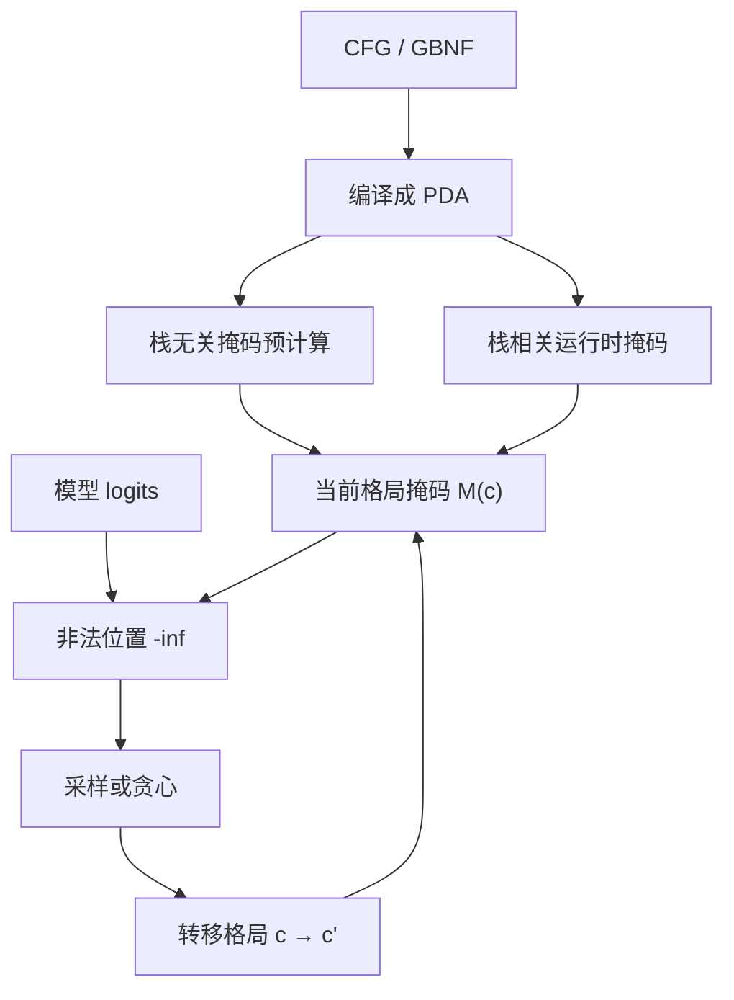

# Grammar-constrained decoding

    
把合法续写写成自动机上的转移，再对词表建索引：每一步掩码可以是查表，而不必扫描整个词表去跑一遍文法。

    <footer>—— Willard 与 Louf，Efficient Guided Generation for Large Language Models；Dong 等 XGrammar 把同一思路推到 CFG</footer>

产品要的往往不是自由散文，而是能进解析器的程序片段、能匹配括号的表达式、或一份带递归结构的配置。事后用提示「请按某某文法输出」再靠重试抢救，失败率随嵌套变深而上升。文法约束解码（grammar-constrained decoding）把上下文无关文法（CFG）嵌进采样：每一步只允许下推自动机认为合法的 token。相对 [结构化输出总述](/llm/constrained-decoding)，本篇只谈 **CFG 这一档**：它比正则多了无限嵌套与互递归，也比「JSON Schema 的某一子集」更通用。llama.cpp 的 GBNF、Guidance 的文法、XGrammar 的 PDA 与自适应掩码缓存，都是这条线上的工程落点。结构保证不等于语义正确，词表与终结符不对齐还会造出可表示性空洞。

## 问题

自回归每步给出 $p_\theta(x_t \mid x_{<t})$，支撑是整个词表 $\mathcal{V}$。CFG 在某一步可能只允许若干终结符的若干子词切分。无约束采样会在括号、关键字、分隔符上随时出轨，下游解析失败。把「先生成再 parse、失败就重试」当成产品策略，延迟与失败率会随文法复杂度一起涨，且重试并不能把分布限制在语言 $L(G)$ 里——它只是拒绝了已经写完的非法串。

正则对应的有限状态机（FSM）记不住无限嵌套深度：它无法用有限状态表达「当前未闭合的左括号有多少」。JSON 值、Lisp 列表、带块结构的 DSL、简单算术表达式，都属于需要栈的语言。CFG 用产生式 $A \to \alpha$ 描述递归；识别器是下推自动机（PDA）。于是「下一步合法 token」依赖的不只是一个整数状态，还有栈顶乃至栈上的一段符号。掩码不能全部离线预计算成一张对所有输入都够用的表，必须在编译期与运行时之间切一刀。这是文法约束相对 [正则约束](/llm/regex-constrained-decode) 的问题设定。

### 子词字母表不是文法字母表

LLM 的 token 不是 CFG 教科书里的终结符。一个关键字 `return` 可能被切成多片，一个 token 也可能跨越多个终结符（例如 `),` 同时结束参数列表并带上逗号）。只在字符面上谈「这条产生式还没写完」会误判。约束的正确性必须相对于 **token 字母表** 定义：每个 $v \in \mathcal{V}$ 对应一段字节，这段字节在当前 PDA 格局下要么能完整消费，要么非法。Outlines 早期路径以正则 FSM 为主，并指出跨 lexer token 的处理是后续引擎要补的；XGrammar 把 CFG 与 token 跨越一起放进服务热路径。不要假装模型按字符生成。

掩码改的是下一步的支持集，不改模型权重。被禁 token 的 logit 置 $-\infty$ 再 softmax。得到的是条件于「前缀已是 $L(G)$ 的活前缀」的截断分布，不是另训了一个结构化模型。长约束下质量好不好，仍取决于 $p_\theta$ 在合法集合上的质量。

## 方法

先写文法 $G$，再编译，再接到采样钩子。GBNF（llama.cpp）把扩展 BNF 写成一份可读文本：终结符是字符串或字符类，非终结符可递归。JSON Schema、Pydantic 模型、SQL 方言也可以先降到 CFG 再走同一编译器，但降的过程会丢掉 Schema 里「值的取值范围」这类语义，只留下结构。编译产物是 PDA 或等价的解析器状态机：每个格局 $c=(\,q, \gamma\,)$（控制态加栈）对应合法 token 集合 $\mathcal{M}(c)\subseteq\mathcal{V}$。

Willard 与 Louf 的 Outlines 把「对每个状态扫描词表」从热路径挪到编译期，使正则情形的逐步开销接近查表；CFG 被他们当作同一框架的延伸，但运行时成本显著更高。XGrammar 的切分是：与栈无关、可预计算掩码的 token 走离线索引；依赖栈的 token 在运行时处理，并用自适应掩码缓存记住见过的格局。掩码计算与 GPU 前向重叠，使结构化生成的额外延迟在服务场景里可被掩盖。SGLang 的压缩 FSM 在无分支路段上直接写出确定字符串，文法里的关键字与固定标点尤其受益。

### 与引擎的接合点是 logits 处理器

vLLM、SGLang、TensorRT-LLM、llama.cpp 都在采样前提供钩子：给定已生成的 `input_ids`，返回布尔掩码或 logit 偏置。文法引擎是钩子的实现，不是另一套 Transformer。连续批下每条序列处于不同格局，掩码必须 **按序列** 而不是按整个 batch 一份。页表与 radix 树不替你做文法；它们只保证 KV 对。系统提示前缀仍能命中缓存，正文一旦进入递归非终结符通常很快分叉。

### 活前缀、归约与错误恢复

PDA 每消费一个 token 可能触发多次归约。实现上要决定：token 的字节是一次吃完，还是允许「吃了一半、停在终结符内部」。后者更接近真实 BPE，也更难缓存。若当前格局的 $\mathcal{M}(c)$ 为空，说明要么文法与词表联合起来不可行，要么已经走进死路——约束解码没有「语法错误恢复」这一说，它从一开始就不让非法前缀出现。调试时把空掩码当成断言失败，而不是用某个兜底 token 糊过去；糊过去会破坏「输出属于 $L(G)$」的保证。

## 机制

正确性：若编译忠实于 $G$，且每个 token 的消费规则与分词器一致，则生成串的字节属于 $L(G)$（或属于其 token 化像）。这比「高温度再 parse」可靠。完备性：合法字符串只要能被该分词器切成某条 token 路径，且路径上每步都在 $\mathcal{M}(c)$ 里，就仍能被采到。若分词器把文法需要的字符序列切成「必须先走一个非法中间 token」的死路，会出现 **可表示性空洞**——$G$ 允许、词表路径不允许。这是分词器与文法联合设计的问题，不是 softmax 的问题。

效率：预处理与状态（格局）数量、词表大小成正比的那部分，换的是逐步近似 $O(1)$ 或 $O(|\mathcal{M}|)$ 的查表。CFG 用栈换状态数，把正则那种状态爆炸转到运行时栈深与缓存命中。左递归、过宽的 `*` 与「任意标识符」会让格局集合在编译期或缓存里膨胀。压缩无分支路径减少「模型必须说话」的步数，直接降 decode 迭代；有多个合法后继时，仍要一次前向加掩码。

文法不能修复幻觉内容。输出是合法的 AST，节点上的标识符与字面量仍然可能是瞎编。结构层保证的是括号与产生式，不是类型检查器或数据库里的真值。要把事实钉住，需要检索、工具或校验器在文法之外再跑一遍。

### 掩码过紧时的分布扭曲

截断把 $p_\theta(\cdot\mid x_{<t})$ 限制在 $\mathcal{M}(c)$ 上再归一化。若模型在合法集合上的质量本来就高，掩码几乎不 intervening，序列与无约束时相近。若模型很差，质量会堆在少数「勉强合法」的 token 上，表现为重复标点、最短合法骨架、或在递归非终结符里迅速收束。把温度调高只能在合法子集里搅动，不能把质量从非法区「借」回来。过紧的文法（只剩一条路）等于忽略模型分数、贪心走最短合法路径。

## 边界与工程取舍

不要用 CFG 约束代替微调后的格式习惯。两者可叠加：模型在 $L(G)$ 上概率质量更集中时，掩码几乎不干活，质量与速度都好。流式输出时，未完成的递归结构对客户端不可解析，需要按格局展示草稿，或等接受态再发。GBNF、Outlines、XGrammar、引擎内置 JSON mode 的表达力与 token 跨越处理不同；移植文法时要测嵌套深度、unicode、数字的多种切分，以及左递归是否被改写。

CFG 不是万能语义层。类型系统、取值范围、跨字段约束（「`end` 不早于 `start`」）往往写不成上下文无关规则，或写成后体积巨大。这些应放在生成后的校验器，或拆成「结构用文法、值用工具调用」。禁止伪造「某库对应某篇不存在的 arXiv」；索引式引导的出处是 Willard & Louf（arXiv:2307.09702），CFG 服务引擎见 Dong 等 XGrammar（arXiv:2411.15100），压缩 FSM 见 Zheng 等 SGLang（arXiv:2312.07104）。

调试「约束后变笨」时，先看掩码是否过紧（只剩一条路），再看分词器是否把关键字切碎导致合法路径极窄，最后看温度是否还在合法子集上。不要一上来就怪模型「不理解文法」——它从未被要求理解，只被要求在掩码里采样。

### 与 JSON、正则约束的分工

只需固定字段的扁平对象，用 [JSON Schema 约束](/llm/json-constrained-decode) 更省事，Schema 工具链比手写 GBNF 好维护。只需行级模式、枚举或简单分隔格式，用 [正则约束](/llm/regex-constrained-decode) 编译更快、状态可全离线。需要互递归、括号匹配、或多种语句形态的 DSL，才值得上 CFG。三者可以套：外层 CFG 管块结构，内层正则管标识符与数字。套得越深，空洞与缓存失效越要单独测。

## 小结

- 文法约束解码在每步把 logit 截到 CFG 允许的 token，保证输出属于编译后的语言。
- 正则 FSM 记不住无限嵌套；CFG 需要 PDA，掩码必须在预计算与运行时之间切分。
- Token 化与终结符不对齐会造成错误掩码或可表示性空洞。
- Outlines 用索引避免逐步扫词表；XGrammar 用 PDA 与自适应缓存服务 CFG；SGLang 压缩无分支路径。
- 结构合法不等于内容为真；过紧文法会把多样本压成同一骨架。
- 热路径掩码必须按序列，可与连续批共存。
- 出处：Willard & Louf, *Efficient Guided Generation for Large Language Models*, arXiv:2307.09702；Dong et al., *XGrammar*, arXiv:2411.15100；Zheng et al., SGLang, NeurIPS 2024。
