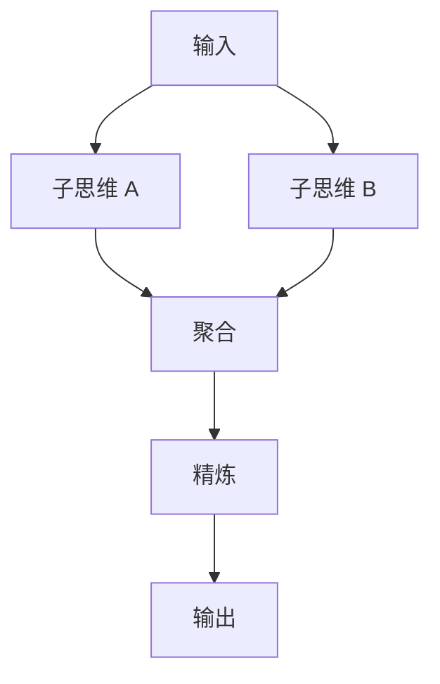

# Graph of Thoughts

把语言模型生成的信息建成任意图：思维是顶点，依赖是边；求解过程可以对子图做聚合与精炼，而不只是沿树往下长。

<footer>—— Besta et al., Graph of Thoughts: Solving Elaborate Problems with Large Language Models, AAAI 2024</footer>

[思维树](/llm/tree-of-thoughts)允许分支与回溯，但节点之间的关系仍是树：一条部分解不能把两条兄弟路径的结果合起来，也不能把已经精炼过的节点再指回更早的中间量。Besta 等人把工作记忆升级成图：顶点是思维，边是依赖或变换；除了生成后继，还定义聚合（把多个顶点的内容合成一个新顶点）、精炼（改写某一顶点）等操作。这就是思维图（Graph of Thoughts, GoT）。它针对的是「子问题结果需要合并」的任务，而不是再给谜题换一个名字。

## 问题

排序、集合运算、关键词统计一类问题，自然结构不是单链，也不是纯树。例如归并排序：两半各自排好之后必须 *合并*，合并结果才是下一步的输入。树上只能选一条分支配到叶，要把两半的结果都用上，必须把它们写成同一个节点的长字符串，评估与复用都会变脏。图允许两个已完成顶点指向同一个聚合顶点，工作记忆的拓扑与算法的数据流对齐。

GoT 要回答的不是「图比树高级」，而是：哪些操作要写成图上的原语，宿主如何调度这些原语，以及模型在每一步只负责局部生成，不负责维护邻接表。若把「请用图思考」写进提示却仍单次解码，没有顶点表、没有聚合调用，那就还是 CoT。

### 树不能表达合并

树的每个节点只有一个父。两条成功的部分解若都正确，BFS 的保留宽度可能只留下其中一条，另一条被剪掉，合并永远不会发生。即便两条都被保留，它们也只是前沿上的两个叶，没有「把两者当输入」的边。GoT 把这种边做成一等操作：聚合提示的输入是指定顶点集合，输出是新顶点。调度器必须先知道依赖已经就绪，才能发聚合——这是数据流图，不是聊天记录。

思维图的「图」是宿主侧的数据结构。模型看到的仍是序列化后的顶点文本。不要假设模型在一次前向里维护了邻接矩阵；边的合法性由调度器保证。

## 方法

宿主维护顶点表与有向边。每个顶点存思维文本、分数、状态（待生成 / 已评估 / 已聚合）。控制器按预定义的图模板或按策略动态加边。原语至少包括：生成（从已有顶点扩展新顶点）、聚合（多输入一输出）、精炼（一输入一输出的改写）、评分（与 ToT 类似的评估）。Besta 等人用这些原语去拼具体任务的图，例如把大列表拆成块、分别处理、再两两合并。模型调用的提示只看到当前操作所需的顶点内容，看不到整个图的无关部分，以免窗口被撑爆。

图模板可以静态：任务一开始就定好拆分与合并的拓扑，适合长度已知的排序、分块统计。也可以动态：模型提议下一步操作类型，控制器校验后再执行。静态更稳，动态更像智能体，也更容易画出非法边（聚合尚未完成的顶点、自环空转）。生产上应默认静态模板，只在模板无法表达的任务上开放动态加边，并设操作次数上限。

### 聚合与精炼是图相对树的增量

生成后继与 ToT 相同。聚合把 $\{v_1,\ldots,v_m\}$ 的文本填进一个「请合并」提示，要求输出单一、无重复、满足任务不变量的新文本（有序列表、去重集合、计数表）。精炼针对评分低的顶点：指出缺陷，要求改写，边从旧顶点指向新顶点，旧顶点可以保留当备份。这两类操作让信息 *横向流动* 和 *原地改进*，树只有向下扩展。实现时聚合必须幂等于输入集合的顺序（或显式规定顺序），否则同一图跑两次结果不同，无法调试。

评分仍优先规则与执行：合并后的列表是否真的有序、计数是否与原文一致。模型评分只用于难以执行的定性步骤。失败的聚合应把错误标在新顶点上并触发精炼或回溯到拆分粒度，而不是假装图已经完成。

## 机制

GoT 把测试时计算花在 *数据流* 上。每个原语是一次（或少数几次）模型调用，图的深度对应算法阶段，宽度对应分块。正确性来自两层：局部生成的质量，以及拓扑是否表达了任务的不变量（合并必须覆盖所有块，精炼不能丢元素）。拓扑错了，再强的模型也在解另一道题。这与「让模型在散文里写完整归并过程」不同：散文不保证两半都被处理，图的调度器可以检查入度与覆盖。

相对 ToT：树搜索的优势是在不确定的决策点上探索；图的优势是在已知组合结构上复用与合并。把 Game of 24 硬画成 GoT 通常没有好处，因为中间量不需要多父聚合。把长文档关键词统计只做 ToT，则会在分支里丢掉一半段落。选结构应对齐问题，而不是对齐论文发表顺序。

动态 GoT 很容易退化成昂贵的 ToT：模型不断生成新顶点却很少聚合。控制器应统计聚合次数与生成次数的比；长期只有生成，说明图模板没被用上。

### 调度器拥有拓扑，模型拥有局部文本

职责分离是机制的核心。模型不负责「下一步该聚合还是扩展」时，非法图不会出现，但灵活性下降。模型负责选操作时，必须用 schema 卡住操作类型与顶点编号，见[约束解码](/llm/constrained-decoding)，否则会引用不存在的 id。顶点编号应在提示里以稳定 id 出现，不要用「上面那个列表」这种指示语——窗口一切，指示语就漂。

费用上，图的调用次数由顶点数决定，聚合顶点尤其贵，因为输入拼接了多个子结果。分块过细，聚合层数变多；分块过粗，单次生成又退回长 CoT。需要按输入长度做分块超参，而不是固定画一张展示用的漂亮图。

## 边界与工程取舍

GoT 适合可分治、需要合并、不变量可用程序检查的任务。开放问答、单次分类、没有可合并中间量的短推理，图是空载。它也不自动提供检索或工具：若子思维需要外部事实，应在顶点上接观察，职责仍在宿主。相对 [PAL](/llm/pal-pot)，能完整写成程序并执行的分治，优先走解释器——图上的「排序」不如 `sorted()` 可靠。GoT 更适合「合并步骤本身仍是自然语言或半结构文本、无法整段交给解释器」的情况。

实现复杂度明显高于 ToT：要有顶点存储、依赖等待、失败重试、提示裁剪。论文数字来自特定图模板与模型，不能外推成「凡任务加图都涨点」。评测应报顶点数、聚合次数、以及不变量校验失败率，而不是只报终局准确率。

不要把神经网络里的图神经网络或 RAG 的实体图叫做 Graph of Thoughts。GoT 特指对 LLM 思维对象做图调度的那套原语；实体关系图是另一层记忆。

## 小结

- 思维图用顶点存中间思维，用边表达依赖，并显式支持聚合与精炼。
- 图在宿主里；模型只见当前操作所需的顶点文本。
- 相对树，它能合并多条部分解，适合分治后必须合流的任务。
- 拓扑与不变量由调度器检查；能执行核对则不要用模型自评冒充合并正确。
- 动态加边要防只生成不聚合；能写成程序执行时优先 PAL。
- 出处：Besta et al., *Graph of Thoughts: Solving Elaborate Problems with Large Language Models*, AAAI 2024。
