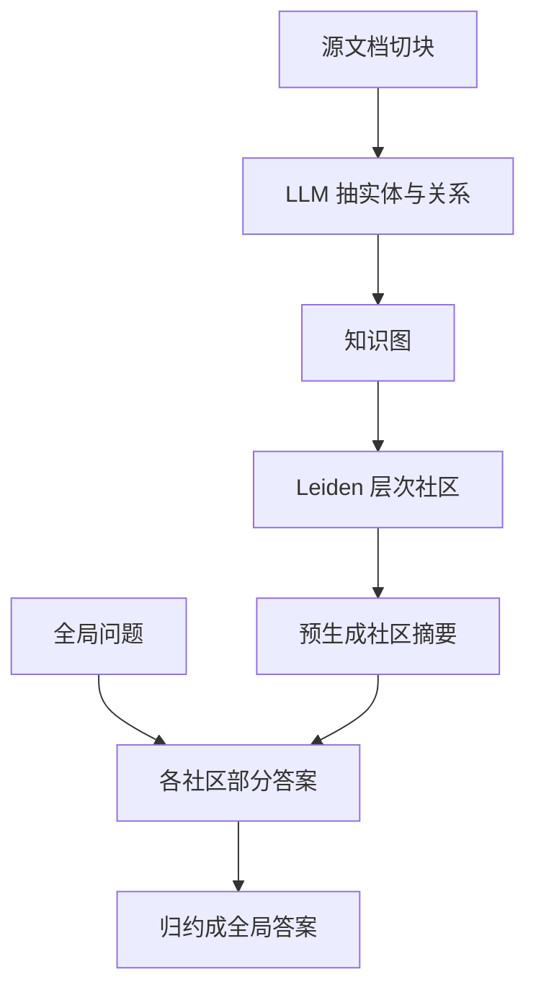

# GraphRAG

    
朴素 RAG 回答不了「这批语料的主题是什么」：那是面向查询的摘要，不是近邻检索。先抽实体图，再按社区预写摘要，查询时对摘要做 map-reduce。

    <footer>—— Edge 等，From Local to Global: A Graph RAG Approach to Query-Focused Summarization，arXiv:2404.16130</footer>

Microsoft Research 的 Darren Edge、Ha Trinh、Newman Cheng、Joshua Bradley、Alex Chao、Apurva Mody、Steven Truitt、Dasha Metropolitansky、Robert Osazuwa Ness、Jonathan Larson 提出 **GraphRAG**：针对私有语料上的**全局理解**问题。向量 RAG 擅长「哪一段提到 X」；「数据集的主线是什么、各派观点如何冲突」需要覆盖整库，属于 query-focused summarization（QFS），传统 QFS 又扩不到 RAG 那种库规模。方法分索引期与查询期：LLM 从切块抽实体与关系建成知识图，用 Leiden 社区检测得到层次模块，自底向上预生成社区摘要；全局问题对社区摘要并行出部分答案再归约。评测在约百万 token 的播客转录与新闻集上，用 LLM-as-judge 比全面性与多样性。开源见 `microsoft/graphrag`。本篇写图索引与全局/局部查询，不把任意「知识图谱 + RAG」都叫做 GraphRAG。

## 问题

Lewis 等人的 RAG 假设答案局部存在于少数记录。全局问题违反该假设：没有单块是「主题」的充分统计。把 $k$ 加大或把窗口拉到 128k，仍受中间丢失与检索偏差绑定——论文附录甚至发现 8k 上下文在他们的全面性比较里优于更大窗口。另一极端是对所有源文本做层次摘要（无图），token 随库线性涨，反复全局问时重复烧钱。GraphRAG 赌图的**模块性**：社区是主题簇的代理，社区摘要是可缓存的全局记忆。

评测不能用 HotpotQA 式事实多跳当唯一证据：那些题仍偏局部检索。作者用自适应基准：先让 LLM 根据语料设想用户人设与用例，再生成全局问题，然后用另一 LLM 在全面性、多样性、赋能、直接性上两两比较。直接性作为对照——向量 RAG 往往更短更直，若全面性与直接性同时被同一系统全赢，则评委可能失效。他们还用可验证「主张」计数与聚类作主张级全面性/多样性，与评委多数票对齐率约 78% / 69–70%。

### 全局搜索不是局部跳数

开源实现后来区分：Global Search 用社区摘要做 QFS；Local Search 从实体邻居扇出；DRIFT 在局部上混社区上下文；Basic Search 退回向量 Top-k。论文主贡献是全局 map-reduce。把 Neo4j 里随便跑一圈最短路叫做 GraphRAG，是名字挪用。实体抽取提示必须领域化：播客里的「政策」与新闻里的「政策」不是同一套类型。

播客集：Kevin Scott *Behind the Tech* 公开转录，1669×600 token 块（100 token 重叠），约 1M token，图 8564 节点 / 20691 边。新闻集：约 1.7M token，15754 节点 / 19520 边。社区层数与每层摘要数见论文表 2。

## 方法

切块：块太长则抽取召回差（前部信息丢失），太短则 LLM 调用次数与费用涨。论文用约 600 token。抽取：每块出实体、关系、短描述，并可含协变量（主张）。聚合重复实体，边累积。Leiden（Traag 等，2019）层次聚类。摘要自底向上：底层社区用成员实体关系生成，高层再摘要下层。查询：筛与问题相关的社区摘要，并行生成带证据的部分答案，再归约为全局答案。根社区摘要极省 token（论文称相对源文本汇总可少 97% 量级），适合反复问同一库；中间层在全面性上往往更好。

主实验：GPT-4-turbo，查询期上下文 8k。相对向量 RAG（SS），全局条件在播客全面性上赢面约 72–83%（$p<.001$），多样性 75–82%；新闻全面性 72–80%，多样性 62–71%。赋能项不稳；直接性常被向量 RAG 拿走。社区摘要相对无图源文本 map-reduce（TS）有小幅全面性/多样性优势，且低层社区比 TS 少 26–33% 上下文 token。根层（C0）用主张多样性在新闻上仍显著优于 SS。索引时间：播客约 281 分钟量级（论文给定虚拟机与当时 API 限额）——这是方法成本的一部分，不是可忽略预处理。

### LLM-as-judge 的题是生成的，不是库内黄金答案

问题由人设生成，避免直接从待测库抄答案造成泄漏；也意味着换语料必须重生成题集，不能把播客上的赢面抄到代码仓库。主张抽取（Ni 等对 factual claim 的定义）用来验证「全面性」不是评委口味：全局条件每答抽出的主张数显著高于 SS。多样性用主张嵌入聚类数。GraphRAG 并不在事实金标上保证无幻觉——图是 LLM 抽的，错实体会进社区。需要局部事实时应用 Local / Basic，或与向量 RAG 并行，而不是只用全局。

## 机制

模块性把「整库摘要」变成「对 $C$ 个社区摘要做 $C$ 次有界生成 + 1 次归约」，复杂度跟社区数走，不跟原始块数走（块数已在索引期被图吸收）。层次让用户选粒度：根像目录，叶像专题备忘。Map-reduce 与「把检索块塞进上下文」的差别是材料已经是主题级散文，模型不必从原始对话里自己发现主题。

失败模式：抽取漏实体导致社区碎或黏；关系方向错误造成假链接；社区过大摘要再次中间丢失；全局答案文风冗长（直接性输给 SS）。费用上，索引是一次性高成本，适合「私有叙事库上反复全局问」；一次性 ad-hoc 问可能不如向量 RAG。开源仓库后来进入维护模式（修 CVE、少接新特征），产品集成以当时文档为准，论文方法不随仓库停更而失效。

「全面性赢面 80%」是 LLM 两两比较，不是准确率 80%。向量 RAG 在直接性上常赢。引用必须带数据集（播客 / 新闻）、条件（C0–C3 / TS / SS）与判据名称。

## 边界与工程取舍

### 图索引有隐私与错误传播

实体描述可能把敏感人名聚到同一社区摘要里，权限应在切块期做，而不是指望生成器忘记。抽取调用次数与块数线性，API 费用是一等约束。领域提示要调：法律与代码库的「实体」不是播客嘉宾。社区检测超参（Leiden 分辨率）改变层数，从而改变全局延迟。

与 A-Mem：后者演化个人对话笔记链，不做语料级社区摘要。与普通知识图谱 RAG：许多工作把子图塞进提示当事实；GraphRAG 强调社区模块上的 QFS。与 [长上下文是否取代 RAG](/llm/long-context-vs-rag)：更长窗口不自动给出全局主题统计。本地检索栈仍可用 [BGE-M3](/llm/bge-m3) 做 Basic Search。仓库 README 警告前沿模型变强后项目侧重点转移——比较新模型时要重跑，不能把 2024 年 GPT-4-turbo 的赢面写到任意 2026 模型上。

出处：Edge, Trinh, Cheng, Bradley, Chao, Mody, Truitt, Metropolitansky, Ness, Larson，*From Local to Global: A Graph RAG Approach to Query-Focused Summarization*，arXiv:2404.16130。社区检测 Leiden：Traag, Waltman, van Eck，2019。向量 RAG 对照 Lewis et al. 2020。实现：github.com/microsoft/graphrag。

## 小结

- GraphRAG 用 LLM 抽实体图、Leiden 社区、预摘要，再对全局问题做 map-reduce。
- 主场景是百万 token 级私有叙事上的主题/趋势问题，不是替代局部事实 RAG。
- 播客与新闻上，全局条件相对向量 RAG 在全面性、多样性上显著更常被评委选中；直接性往往相反。
- 索引贵、抽取会错；根摘要便宜适合反复问，中间层更细。
- 出处：Edge et al.，arXiv:2404.16130。
