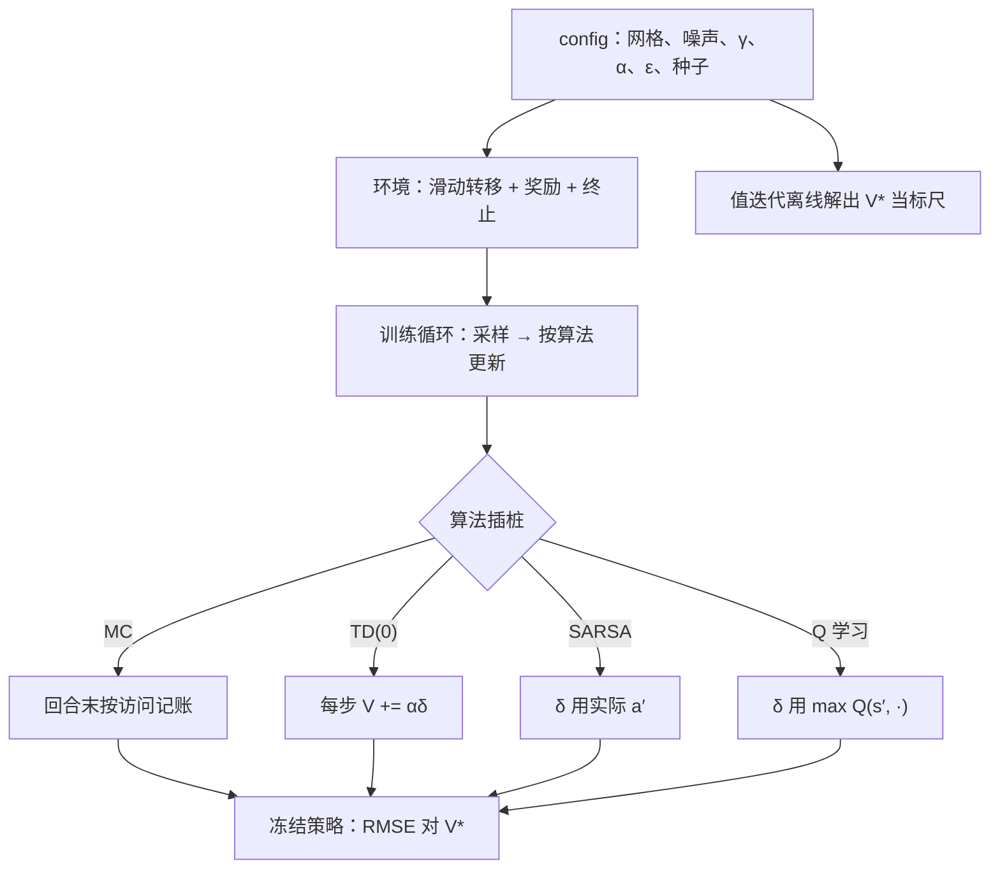
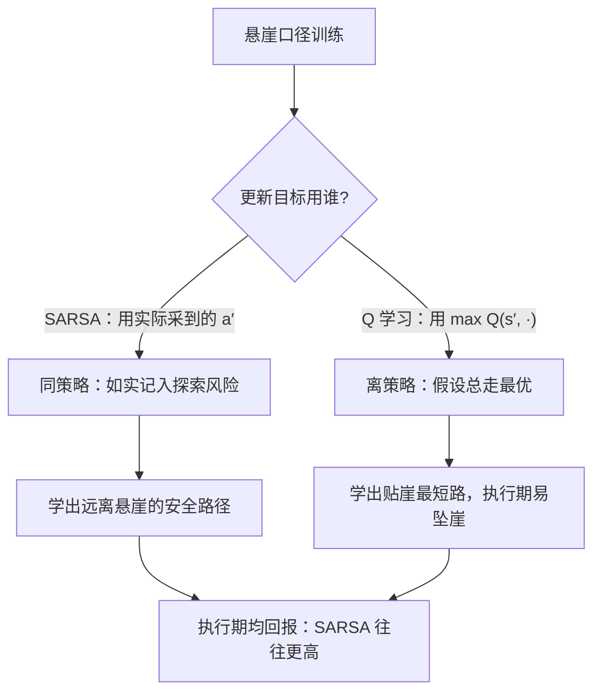

# 网格世界实验课

读十遍收敛定理，不如亲眼看一条振荡的曲线；网格世界小到每格可查，大到足以复现本单元的全部病症。

<footer>—— 据 Sutton &amp; Barto, 2018, 第 5–6 章例题（Gridworld、Cliff Walking）整理</footer>

[上一课](/llm/deadly-triad)指出函数逼近、自举与离策略合取时保证消失；理论给的是「会发生什么」，实验课回答「在哪、何时、看见什么」。本课把本单元的蒙特卡洛、TD(0)、SARSA 与 Q 学习装进同一个 tabular 网格世界，给出伪代码级实现要点与一份可复现实验清单，这也是「预测与控制」课序的收束：评估由 MC/TD 完成，改进由 ε-贪婪完成。但值方法的改进始终要扫动作、要值表——动作换成几万词表的 token 就扫不动；绕开值表、直接对策略参数求导的路线，是下一单元「策略梯度」的起点。本课之后默认你跑过这套实验。

## 问题

前四课的断言都是可观察现象：MC 无偏但慢、TD 偏差换方差、max 过估计、步长敏感、探索决定访问。断言要对照才能立住，对照要同一环境。网格世界的好处：状态可枚举、真值可以先算——用[值迭代](/llm/value-policy-iteration)离线解出 $V^*$ 当标尺，每个格子的误差逐格可查；这在小世界之外做不到。

## 方法

环境口径：$5\times5$ 或 $10\times10$ 网格，4 个动作；终止格 +1，陷阱 −1，每步 −0.04；转移以 0.8 概率走目标方向、各 0.1 滑向两侧——确定性转移会让 TD 目标只剩初值误差，太干净，噪声必须保留；$\gamma=0.9$；全部进 config。算法侧四选一插桩：MC 在回合末按访问记账；TD(0) 每步 $V(s_t)\leftarrow V(s_t)+\alpha\delta_t$；SARSA 的 $\delta_t$ 用实际采出的 $a_{t+1}$；Q 学习的 $\delta_t$ 用 $\max_{a'}Q$。探索用带保底的 $\varepsilon$ 衰减：$\varepsilon_n=\max(0.05,\,1/n(s,a))$（严格的 GLIE 要求 $\varepsilon\to0$，这里刻意留 5% 保底）。评估协议：冻结策略、关掉探索跑 rollout，或直接逐格算 $\mathrm{RMSE}(V,V^*)$。

术语翻译：带保底的 ε 衰减就是「访问得越多，探索率越低」的口径——比严格的 GLIE 宽松——某对状态-动作没去过就多试，去多了就少试，并留 5% 保底防止彻底停止探索。目的只有一个：训练后期既探索得够，又能收敛到一条确定策略。

横轴一律用环境步数而不是回合数：MC 的回合更长，按回合数画会显得学得快。0.8/0.1/0.1 的滑动噪声加 $\gamma=0.9$，有效视界约 $1/(1-\gamma)=10$ 步；噪声与视界一起写进 config。

## 机制

应该看到的现象，对应前四课的断言。其一，MC 曲线抖、起步慢、长时间贴标尺；TD 先陡后平、落点被初值与步长拖拽——偏差换方差有了肉眼形状。其二，α 热图上两族算法的容忍带不同；奖励尺度一改，最优 α 跟着移。其三，给奖励加噪声后，Q 学习的高估随 σ 与 α 增大——max 挑误差；Double Q 对照把高估压回去。其四，悬崖口径（每步 −1、坠崖 −100 回起点）下，Q 学习学出贴崖最短路而执行期回报差，SARSA 学安全路——同策略如实记探索代价。其五，ε=0 时误差停在没访问过的格子：访问直方图要和误差图并排看。

直觉类比：SARSA 是谨慎的登山者，把「我可能手滑」记进价值，宁可绕远路；Q 学习是纸上谈兵的最优者，假设每步都完美执行，于是把悬崖边的最短路当成最好——可真滑一步就掉下去。同一环境、不同更新目标，走出两种性格。

实验清单（复现口径）：E1 MC 对 TD(0)，同种子集，RMSE 对环境步数；E2 α 扫描 $\alpha\in\{0.05,0.1,0.2,0.4,0.8\}$，两算法各一条热图；E3 SARSA 对 Q 学习，悬崖口径，交学习曲线、路径图与执行期均回报；E4 奖励噪声 $\sigma\in\{0,0.5,1,2\}$ 下 Q 学习对 Double Q，报 $\max_a Q$ 的系统性高估；E5 探索消融，ε-贪婪对乐观初始化对 ε=0，交访问直方图与 RMSE。底线：每组不少于 50 个种子，报均值与标准差；环境、算法、超参、种子同仓同 config。

数字实例：$5\times5$ 网格共 25 格、每格 4 个动作，值表只有 100 个数，一台笔记本几秒就能扫完。换成词表 5 万、上下文 1024 的语言任务，「状态」是天文数字级的 token 序列——这就是为什么表格法只能当教学标尺，进不了真实 LLM。

## 边界

网格世界太小：表格可行，三要素里缺「函数逼近」，发散在这里不可见——tabular 的安心带不进深度值头。$5\times5$ 上调出的最优 α 不外推，实验课练的是「看什么、与谁对照」。确定性网格会低估 TD 与 MC 的差距，噪声不可删。改进端的边界最要紧：ε-贪婪在 4 个动作上够用，在词表尺度不可行，值方法的「评估-改进」循环在这里到达适用边界——改进能不能不扫动作、直接对策略本身求导，是下一单元要回答的问题。

## 小结

- 一个环境、四算法、一套值迭代标尺：本单元全部断言逐格可查。
- 伪代码要点：环境带滑动噪声、带保底的 ε 衰减、RMSE 对真值、横轴用环境步数。
- 五组实验分别钉住：MC/TD 形状差、α 敏感性、max 过估计、同/离策略的探索代价、探索消融。
- 表格里看不到致命三要素的发散——缺函数逼近；安心要带条件。
- ε-贪婪扫动作的改进在词表尺度失效，绕开值表对策略求导是下一单元的路线。
- 出处：Sutton & Barto 2018 第 5–6 章例题口径（Gridworld、Cliff Walking）；实验协议据本课程整理。
