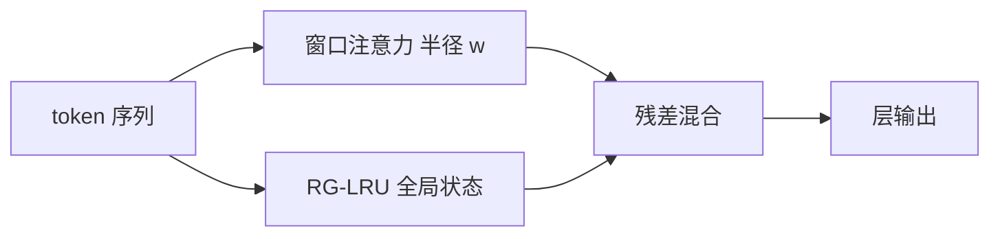

# Griffin / Recurrent Hybrids

用门控线性循环压缩全局历史，用局部注意力保留精确的短程检索。

<footer>De 等，Griffin / RecurrentGemma，Google DeepMind，2024</footer>

把每一层都做成全序列注意力，短程模式会付两次钱：一次质量，一次 KV。DeepMind 的 Griffin 把全局通道换成门控线性循环，把精确匹配限制在滑动窗口里，并用 RecurrentGemma 把这条混合落到可训练的开源模型上。它要证明的不是 RNN 全面复辟，而是全局 softmax 可以被常数状态的循环替换，前提是局部注意力还在。

## 问题

纯 SSM 或纯线性 RNN 把整段历史压进固定状态，长程依赖便宜，但 associative recall 差：模型很难从几百步之前原样取出一个罕见 token。纯注意力相反，KV 表保留了一切，短程和长程的精确匹配都在，代价是二次计算和随长度膨胀的缓存。

语言模型实际需要的是两者的混合物。多数依赖是局部的——句法、短语、最近的实体——用窗口注意力足够；少数依赖是全局的——篇章主题、远处的约束——不需要逐 token 的精确地址，需要的是可更新的压缩摘要。Griffin 把这个观察写成一条具体架构：不要全局注意力，也不要纯循环，而是**局部注意力 + 线性 RNN**。

RecurrentGemma 是这条架构的开源实例；Griffin 是论文里的模型族名称。下文用 Griffin 指结构，不把两者写成两篇。

### 全局 softmax 不是唯一的长程通道

在固定计算预算下，把每一层都做成全序列注意力，等于把容量花在已经足够的短程模式上。DeepMind 的实验问题是：若把全局注意力删掉，能否用更便宜的循环层补上长程通道，并在语言建模和下游任务上跟上同计算量的 Transformer。

## 方法

Griffin 的骨干是交错（或按比例混合）的两类残差层：

- **RG-LRU**：Real-Gated Linear Recurrent Unit，实数域的门控线性循环，承担全局压缩。
- **局部滑动窗口注意力**：窗口宽度固定，承担窗口内的精确匹配。

没有全局注意力层。序列长度超出窗口之后，信息只能通过 RG-LRU 的状态继续走。这与「局部–全局混合注意力」（若干层全序列、若干层窗口）不同：Griffin 的全局通道是线性 RNN，不是稀疏或下采样的 softmax。

### RG-LRU

经典 GRU 在隐状态上做非线性，难以并行扫描。线性 RNN 把更新写成 $h_t = a_t \odot h_{t-1} + b_t \odot x_t$，可以扫描，但 $a_t$ 必须落在稳定区域。RG-LRU 的关键是给递推系数单独的门，并限制其模：

$$
r_t = \sigma(W_r x_t + b_r),\qquad a_t = \exp\bigl(-\exp(\Lambda) \odot r_t\bigr),
$$

其中 $\Lambda$ 是可学习的、保证衰减为正的参数。$a_t \in (0,1)$，扫描稳定；门 $r_t$ 随输入变，于是时间尺度是选择性的——与 Mamba 的 $\Delta$ 同类，但对象是实数对角 RNN，而不是连续时间 SSM 的离散化。输入写入另有一门，控制当前 $x_t$ 进入 $h_t$ 的量。

线性是为了扫描；门是为了选择。两者缺一，要么无法高效训练，要么退回时不变的指数衰减。

### 局部注意力补什么

窗口注意力在半径 $w$ 内做完整的 softmax 匹配。拷贝最近的专名、闭合括号、对齐刚刚出现的格式，都发生在这里。窗口外的 token 对当前查询不可见，必须已经写进 RG-LRU 状态。于是分工被写进计算图：精确、高带宽的检索只发生在 $w$ 内；跨窗口的信息必须经过有损压缩。

## 机制

### 为什么循环要线性

训练要对长度并行。非线性 RNN 的 $h_t = \tanh(W h_{t-1} + \cdots)$ 无法扫描，序列维是串行的。线性加对角门之后，前缀积可并行，算法复杂度与 Mamba 的 scan 同阶。Griffin 没有采用 SSM 的连续时间形式，而是直接在离散线性 RNN 上开门：更少的离散化代数，同样的「选择 + 扫描」结构。

### 混合比例是超参

一层 Griffin 块里，RG-LRU 与局部注意力的层数比是设计选择。更多注意力层提高短程质量、提高 KV 缓存；更多 RG-LRU 降低缓存、加强长程压缩。RecurrentGemma 把这个比例落到可训练的具体宽度上，并证明在中小规模上，关掉全局注意力仍能跟上同 FLOP 的 Transformer。规模外推不是这篇结构的已证结论，只是实验范围内的事实。

局部窗口的 KV 只保留 $w$ 步，与序列总长无关；全局记忆的大小等于 RG-LRU 状态宽，同样与总长无关。

## 边界与工程取舍

Griffin 明确放弃全局精确检索。需要「在十万 token 里找到唯一一次出现的数字并原样拷贝」时，压缩状态可能已经丢了该数字；窗口内若也不含它，模型只能靠状态里的残留。这是线性循环共同的上限，不是实现 bug。把针堆评测当成 Griffin 的主战场，打的是它已经写在结构里的短板，而不是实现没调好。

窗口宽度 $w$ 是另一条杠杆。$w$ 太大，局部注意力重新变成主导成本；$w$ 太小，句法都进不了窗口，循环层被强迫去记本不该压缩的短程结构。工程上 $w$ 应覆盖典型的局部依赖跨度，而不是假装自己是长上下文解。窗口 KV 只保留 $w$ 步，这一点必须在部署预算里单独列出来，不能和「无全局注意力」混成一句「没有 KV」。

与 Mamba 相比，Griffin 的循环更「RNN」而更少「连续 SSM」：没有 $\Delta$ 离散化，门直接乘在对角递推上。与 Jamba 相比，Griffin **不用**全局 Transformer 层，混合发生在局部注意力与 RNN 之间，而不是全序列注意力与 SSM 之间。三条线不要并成一句「都是混合」。

论文评测的是语言建模与标准下游，不是无限长的针堆检索。用针堆去打纯循环混合，打的是它已经公开的短板。

## 小结

Griffin（De 等，Google DeepMind，2024）以及随后放出的 RecurrentGemma，把语言模型写成局部 softmax 与门控线性 RNN（RG-LRU）的混合：窗口负责精确短程匹配，RG-LRU 负责常数状态的全局压缩，全程没有全局注意力。它说明循环混合是一条可训练的主路，也说明精确的长程随机访问并不包含在这条路里。和 Mamba、Jamba 并列时，应记住 Griffin 删掉的是全局注意力，留下的是窗口。窗口宽度与循环状态宽是两条独立预算，不能并成一个「无 KV」。
