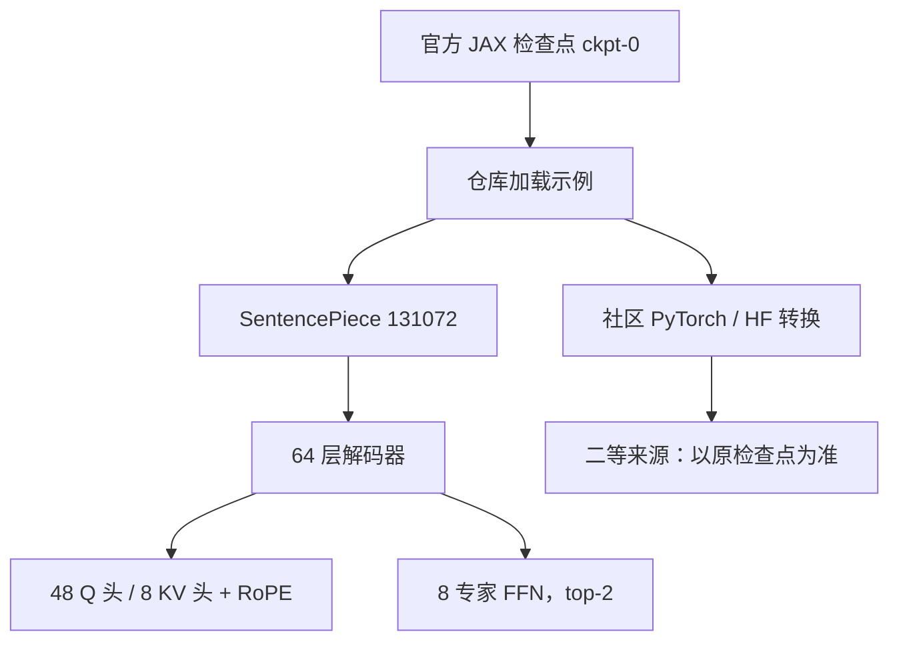

# Grok-1 开源 MoE

    
我们发布 Grok-1 的权重与网络结构：这是一个 3140 亿参数的混合专家模型，给定 token 上约 25% 的权重被激活。

    <footer>—— xAI，Open Release of Grok-1，2024 年 3 月 17 日</footer>

Grok-1 是 xAI 第一次把检查点放到公开许可证下：Apache 2.0、预训练结束于 2023 年 10 月的**基座**、JAX 参考加载代码。稀疏图案（8 专家、每 token 2 个、约 25% 激活）在 [Grok MoE 公开信息](/llm/grok-moe) 里按路由口径写过；本篇把对象换成**这份开源文物本身**——仓库声明了什么、检查点不是什么、词表与注意力如何从 README 直接算出来、社区转换相对官方 JAX 权重处在哪一层。专家内部维、训练 token、负载损失是否存在，公告没写的一律标**公开信息有限**。

## 问题

2024 年春天，开源侧已有 Mixtral 一类「少专家 top-2」，但总参数停在几十亿到百亿量级。xAI 要公开的是当时最大的 MoE 权重之一，同时明确：**这不是 X 上那个会聊天的 Grok**。若把产品人格、实时检索和这份 314B 基座当成同一个分布，所有评测都会错。问题因此分成两半：结构表里哪些数字可以当一等来源；参考实现故意不追求效率，意味着「能加载」不等于「能当生产推理」。

第二个问题是许可证与栈。Apache 2.0 覆盖源码与 Grok-1 权重，允许商用与再分发，但训练数据、对齐配方、自定义 JAX/Rust 工具链并不随仓库出现。能复现的是前向形状，不是预训练。

### 一等来源止于公告、README 与官方权重

可核对材料主要是：2024-03-17 的开源公告、GitHub `xai-org/grok-1`、Hugging Face `xai-org/grok-1` 的 JAX 检查点。公告写明：从零训练的 314B MoE；给定 token 约 25% 权重激活；基座未做对话微调；训练栈建立在 JAX 与 Rust 之上。仓库补充结构常数，并警告 MoE 层**不为效率而写**，只为在不依赖自定义核的前提下校验正确性。第三方 PyTorch 转换、量化包、评测榜是二等来源：层名一改，分数就不能自动算作官方数字。

314B 是总参数。25% 与「8 选 2」在算术上一致，但公告给的是激活比例，仓库给的是专家个数。对齐着读即可，不要再发明第三套 $k$。路由机制见 [Grok MoE](/llm/grok-moe)。

## 方法

官方规格可收成一张短表，全部来自仓库当时的说明：总参数 314B；**8 专家 MoE，每 token 用 2 个**；**64 层**；注意力 **48 个查询头、8 个键值头**（[GQA](/llm/gqa)）；嵌入宽度 **6144**；词表 **131,072** 的 SentencePiece；位置编码 RoPE；支持激活切分与 8-bit 量化。最大序列长度常见转述为 8,192，若与某次镜像冲突，仍以官方 README 为准。头维可以直接算：$d_k=6144/48=128$。KV 缓存体积相对完整多头是 $8/48=1/6$。这些是公开数字的推论，不必另找论文——xAI 没有为 Grok-1 单独发技术报告，也**不要编造 arXiv 编号**。

### 参考实现是校验器，不是推理引擎

仓库用 Haiku / JAX 搭 Transformer 与 MoE，路由做 token-choice 的 top-2，专家计算走 `shard_map` 一类切分。作者自己说这份 MoE 慢，目的是避免为了速度写自定义核而把数值弄错。因此不能拿仓库吞吐去外推 Colossus 或产品 Grok 的服务栈。要真正跑 314B，需要专家并行、分组 GEMM 或现成框架，那已经是实现选择。8-bit 列在附加特性里，更像推理可按 8-bit 加载，不是一份量化感知训练配方；校准集与是否逐专家标定，公开信息有限。

检查点是预训练结束快照。用它直接聊天，行为与 grok.x.ai 不可比；要对话必须自己做 SFT / 偏好学习，那部分数据与超参不在开源包里。许可是 Apache 2.0，这一点与后来许多「研究向、非商用」权重不同，也是这份发布在生态里被反复引用的原因之一。

Hugging Face 上的官方仓库是权重托管，不是第二份架构声明。转换脚本若合并专家、改层名或重写成别的 MoE 接口，应视为衍生工件。数值争议时回到 JAX 原检查点。

## 机制

在已公开设定下，前向并不神秘：注意力是带 GQA 与 RoPE 的标准解码器块，FFN 换成 8 路专家。稀疏发生在 FFN，不发生在 KV——把「314B MoE」读成「注意力也稀疏」没有根据。组合数 $\binom{8}{2}=28$，容量主要来自每个专家的宽度与 64 层堆叠，而不是组合爆炸。与 Mixtral 相同的是少专家 top-2，不同的是层宽、层数与总参数差出一个数量级；与 DeepSeek 式细粒度 MoE 只共享「FFN 稀疏」这一句。对照口径见 [Grok MoE](/llm/grok-moe)。

词表 131k 的 SentencePiece 决定切词与嵌入矩阵形状。没有公开 BPE 与 tiktoken 的并排压缩率，不能把「大词表一定更省长度」写成 Grok-1 的实验结果。8k 窗口是这份基座的训练/推理上限（以 README 为准），后续产品拉到 128k 不能回写到 2023 年 10 月的检查点上。

### 激活量只说明前向 FLOP 量级

和稠密 314B 比，一次前向大约只跑四分之一专家权重，外加全部注意力与嵌入。和「激活约 80B 量级」的心算可以做，但精确激活参数若仓库没写，就不要当成官方规格。Decode 仍受 64 层 KV 带宽约束；GQA 只把 KV 头降到 8，长度一长仍然贵。参考实现的激活切分是为了把大激活放进多设备，不是算法创新。

## 边界与工程取舍

材料边界是硬的。没有官方技术报告，任何「Grok-1 为何有效」的因果叙事都超出公开文本。语料构成、学习率、专家容量因子、是否用辅助负载损失，公开信息有限。产品线 Grok-1.5 / 2 / 3 的上下文、工具与思考模式，见 [Grok-2 / Grok-3 公开信息](/llm/grok-2-3)，不得用 8×top-2 去填后续代际。

工程上，314B 即使用 25% 激活，也不是单卡或端侧模型。开源的价值主要是：可审计的结构常数、可下载的基座、宽松许可。把它当聊天机器人，缺的是后训练；把它当 MoE 系统论文，缺的是消融。社区量化与蒸馏是下游工作，误差与数据都不由 xAI 背书。

「当时最大的开源 MoE」是发布时点的历史描述，随后会被别的权重超过。写文章应钉 2024-03-17，而不是把头衔当成永久属性。

## 小结

- xAI 于 2024 年 3 月 17 日开源 Grok-1：314B MoE 基座、Apache 2.0、预训练结束于 2023 年 10 月，未做对话微调。
- 可核对结构：64 层，嵌入 6144，48/8 GQA，RoPE，131k SentencePiece，8 专家 top-2；上下文以官方 README 的 8k 量级为准。
- 参考实现只为正确性；训练栈 JAX+Rust 的细节、数据与优化器公开信息有限。
- 产品 Grok ≠ 开源 Grok-1；MoE 路由对照见 [Grok MoE](/llm/grok-moe)；后续代际见 [Grok-2 / 3](/llm/grok-2-3)。
- 出处：xAI，*Open Release of Grok-1*（2024-03-17）；GitHub `xai-org/grok-1`。不编造技术报告或 arXiv 编号。
