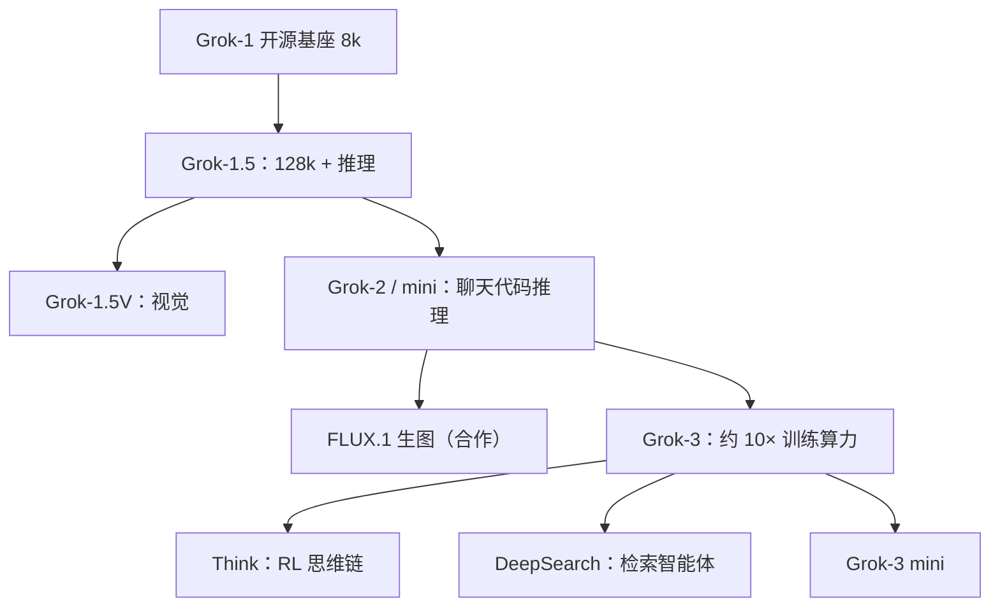

# Grok-2 / Grok-3 公开信息

    
Grok-3（Think）用大规模强化学习打磨思维链：它学会在解题时回溯纠错、简化步骤，并把预训练里的知识用到推理过程里。

    <footer>—— xAI，Grok 3 Beta — The Age of Reasoning Agents，2025 年 2 月</footer>

Grok-1 的结构表是开源检查点给的；从 Grok-1.5 起，xAI 改走产品博客与演示。**专家个数、层数、是否仍为 8 选 2，公开文本里没有与 Grok-1 同等级的表**，正确句子是「公开信息有限」，不要用 [Grok-1](/llm/grok-1) 的规格去填空。本篇只整理 1.5、2、3 三代里能核对的能力声明：长上下文、视觉、Arena 化名、Flux 生图、Think / DeepSearch、训练算力量级。评测分随快照与采样协议变，引用必须写清是否 consensus@64 一类重复采样。

## 问题

开源 Grok-1 停在 2023 年 10 月的基座，窗口按 README 为 8k 量级，且不会对话。产品要追上同期闭源助手，必须补三块：更长上下文、多模态、以及后来整个行业都在做的测试时推理。xAI 的公开策略是发博客和榜，不发架构论文。读者的任务因此变成：**把「能做什么」与「内部长什么样」分开**。能做什么有日期和产品名；内部长什么样，除算力口号外几乎空白。

另一条轴是平台。Grok 绑在 X / grok.com 的实时信息与订阅档位上，API 后至。把聊天产品、API 模型 ID、开源权重当成同一检查点，会把安全事件、生图过滤和基准分数搅在一起。

### 代际是产品名，不是开源版本号

2024 年 3 月 28 日的 Grok-1.5：强调推理，上下文 **128k**，针检索在该长度上宣称完美取回；相对 Grok-1 的窗口大约 16 倍。随后的 Grok-1.5V 把视觉理解接进同一产品线。2024 年 8 月 13 日的 **Grok-2 / Grok-2 mini**：博客称为相对 1.5 的聊天、代码与推理跃迁；早期版本以 LMSYS 化名 `sus-column-r` 上榜。视觉理解写进产品能力；图像**生成**则是与 Black Forest Labs 的 **FLUX.1** 合作实验，不是「Grok-2 自己是扩散模型」的证据。2025 年 2 月的 **Grok 3 / Grok 3 mini**：叙事中心换成推理智能体——Think 按钮展开思维链，DeepSearch 作为检索—综合智能体。公开算力口径是相对 Grok-2 **约 10 倍**的训练计算，集群为 Colossus（报道中的加速器规模随扩容变化，应以当时官方表述为准，不宜把后续扩容数字写回发布日）。

Grok-2 的层数、是否 MoE、词表是否仍为 131k，公开信息有限。Grok-3 同样没有结构表。文中出现的 128k / 131k 窗口若来自 1.5 博客或后来 API 定价页，要标明来源，不能默认三代共用同一窗口。

## 方法

能写进「方法」的，其实是**产品能力如何被训练与露出**，而不是网络图。

Grok-1.5 的方法声明很短：在 1 的开源快照所代表的进度之后，加强推理，并把上下文拉到 128k；NIAH 作为验收。更细的课程（分几档加长、RoPE 基数、是否 YaRN）没有公开。Grok-2 的方法声明是「核心推理 + 可操纵性 + 工具使用」，并写改进了基于检索内容的推理（识别缺失信息、事件顺序、丢掉无关帖子）。生图走外部 FLUX.1，多模态理解另有预告。这些句子描述的是后训练与工具环，不是新注意力公式。

### Think、DeepSearch 与 Mini

Grok 3 博客把 Think 写成：用大规模 RL 打磨思维链，使模型会回溯、纠错、简化步骤；用户可检查思维过程而不只看最终答案。这与后来行业里的「推理模型」同一类对象，但 RL 算法、奖励是过程监督还是结果监督、思维是否在权重里与直答融合，公开信息有限。DeepSearch 被定位为第一代智能体：在网页与 X 语料上检索、处理冲突事实、输出带轨迹的摘要，对标的是深度研究产品而不是单次搜索框。Grok 3 mini 是速度与质量折中的同胞。部分产品界面还有更高算力档的称呼（媒体所称 Big Brain 一类），官方博客正文以 Think / DeepSearch / mini 为准；未在博客里定义的档位不要写成架构分支。

API 在 2025 年 4 月左右对 Grok 3 开放，公开定价页出现过约 13 万 token 上下文量级与按百万 token 计费；具体价与模型别名会变，集成应钉当时文档。权重是否按「发布后约半年开源」的口头时间表放出，应以实际仓库为准，在未出现与 Grok-1 同等级的结构表之前，不得假设 3 的内部仍是 8 专家。

Arena 化名与正式名的对应是营销与评测协议问题。`sus-column-r` 只能说明「当时那份快照在那张榜上的位置」，不能还原温度、系统提示和是否联网。

## 机制

从机制上能说的只有产品露出的那一层。128k 窗口把可条件化的检索片段与对话历史拉长；没有公开注意力实现，就不能写是稠密全注意力还是稀疏。Think 把部分测试时算力从「采样 64 次再投票」改成「显式思维 token」——二者都可以抬基准，但不是同一件事。xAI 在 Grok 3 数学基准上用过 consensus@64 与直出对比，外部批评指出对照模型的采样协议必须一致；读图时要把协议当作分数的一部分。

DeepSearch 的机制是环境环：查询 → 检索 → 阅读 → 再查询 → 写报告。质量上限首先是检索器与时间预算，其次才是基座是否 MoE。实时 X 信息是产品差异，也是事实性风险：时间线噪声会被一本正经地综合。FLUX.1 生图与语言模型解耦，安全过滤、人像策略属于图像栈，不能用文本拒答表代替。

### 算力口号不是架构

「10 倍于 Grok-2 的训练计算」约束的是 FLOP 预算量级，不揭示稠密还是稀疏、数据是 15T 还是别的。Colossus 解释的是**有足够芯片去花这些 FLOP**，不是一张并行切分图。把 10× 理解成「参数 10 倍」或「专家 10 倍」都没有根据。Grok-1 的 314B 与 25% 激活只描述 2023-10 基座，见 [Grok MoE](/llm/grok-moe)。

## 边界与工程取舍

本篇最重要的边界是：**没有技术报告**。任何层数表、专家表、词表、优化器，若只出现在二手博客，应视为未证实。Grok-2 / 3 的许可是专有产品与 API 条款，与 Grok-1 的 Apache 2.0 不是同一对象。安全与生成内容的争议（包括生图与后来的系统提示改动）属于部署层，不能用来反推网络结构。

工程上，Think 与 DeepSearch 会把一次用户点击变成许多倍的内部 token 与检索往返；产品必须按订阅档限流。把 Grok-3 当本地权重部署，在官方开源之前没有合法检查点。评测应区分：关闭联网的纯模型、打开 DeepSearch 的智能体、打开 Think 的推理档——三张表混成一句「超过 GPT-4o」没有信息量。

口头上的「未来开源 Grok-2 / 3」不是结构披露。开源当天若仍无 README 规格表，读者的状态与今天相同：只有产品能力，没有可复现的架构。

## 小结

- Grok-1.5（2024-03）公开 128k 上下文与针检索；1.5V 加视觉。Grok-2（2024-08）强调推理与工具，生图走 FLUX.1 合作，早期 Arena 化名为 `sus-column-r`。
- Grok-3（2025-02）公开 Think（RL 思维链）、DeepSearch 智能体、mini 档，以及相对 Grok-2 约 10× 的训练算力；架构表公开信息有限。
- 不得用 Grok-1 的 8 专家 top-2 填 2/3；基准分数必须写清采样协议与是否联网。
- 出处：xAI，*Announcing Grok-1.5*（2024-03-28）；*Grok-2 Beta Release*（2024-08-13）；*Grok 3 Beta*（2025-02）。开源结构仅见 [Grok-1](/llm/grok-1) 与 [Grok MoE](/llm/grok-moe)。
