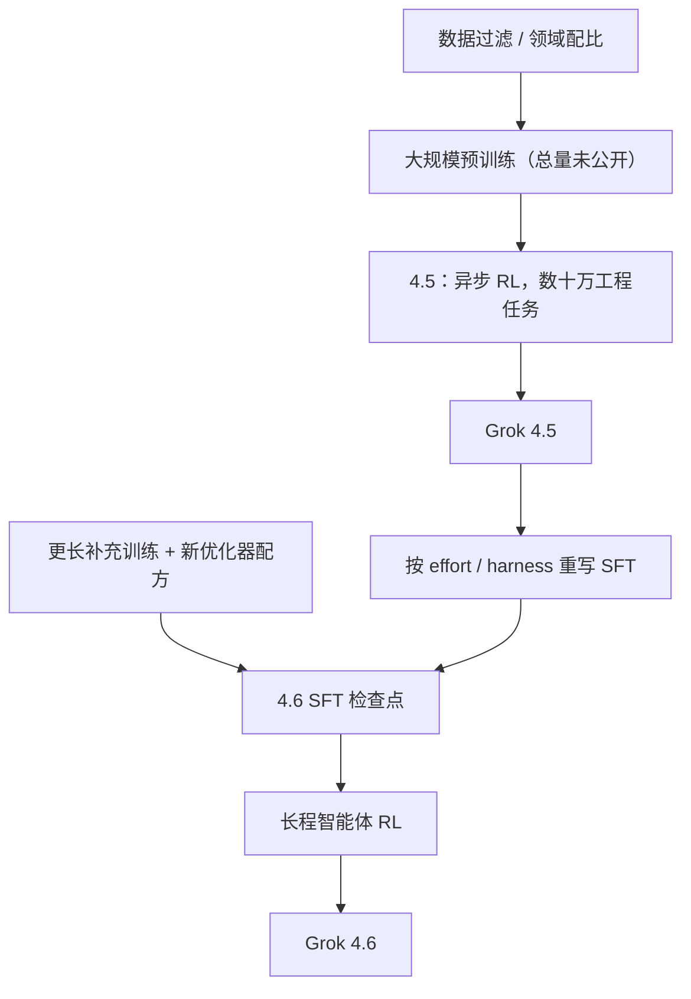

# Grok 4.5 / 4.6

    
Grok 4.5 按编码、智能体任务与知识工作来训，并与 Cursor 一起训练；4.6 在更长的补充训练之后，把重心放到长程智能体和更重的交互、视觉成品。

    <footer>—— xAI / SpaceXAI，Introducing Grok 4.5（2026-07-16）；Introducing Grok 4.6（2026-08-12）</footer>

[Grok-2 / Grok-3](/llm/grok-2-3) 起，xAI 就只发产品博客与榜，不发与 [Grok-1](/llm/grok-1) 同等级的结构表。**Grok 4.5**（2026 年 7 月 16 日）和大约五周后的 **Grok 4.6**（8 月 12 日）延续这条策略：能核对的是窗口、价、推理档、训练叙事和基准表；专家个数、层数、是否仍为 MoE，**公开信息有限**。两者都以编码 / 智能体 / 知识工作为主轴，并成为 Grok Build 与 Cursor 的默认档之一。本篇只整理官方新闻与开发者文档，不用 1 的 8 专家 top-2 去填 4.x。

## 问题

Grok 3 把 Think 与 DeepSearch 做成推理智能体产品；到 2026 年夏天，竞品已经把「修仓库、写办公文档、在 IDE 里跑几十步工具」当成旗舰验收，而不只是 Arena 聊天。4.5 要解决的产品问题是：在**不涨价**的前提下，把智能体编码和知识工作推到可对标同期闭源旗舰的位置，并且服务速度按「快模型」来卖。4.6 则承认 4.5 在**长轨迹**和**第一口视觉成品**上仍不够：研究、跨仓修改、把模糊产品想法做成可迭代应用，需要模型在很多步之后仍盯着同一目标。

另一条约束是平台。模型绑在 xAI API、Grok Build、Cursor 以及 OpenRouter / Vercel / Cloudflare 一类网关上。评测必须写清 harness 与 `reasoning_effort`，否则 DeepSWE 与 Artificial Analysis 复合分会对不上。

### 代际是产品名，不是开源版本号

4.5 博客写「我们最强的模型」，强调与 Cursor 一起训练，服务约 **80 TPS**，并称在同类任务上大约 **2×** 的 token 效率（更少步数、更少输出 token）。4.6 不改价，明确写成 4.5 的后续：更长的补充训练、用 4.5 重写 SFT 轨迹、再做面向长程智能体的 RL。文档给 4.6 的窗口是 **500,000** token，知识截止公开为 2026 年 1 月（概览页）或 2 月 1 日（另一份模型页口径，引用应钉当时文档）。输入支持文本与图像，输出仅文本，无文本输出上限。不要把 Grok-1.5 的 128k 或后来某快照的窗口默认抄到 4.6。

4.5 / 4.6 的层数、词表、是否 MoE，官方新闻未给表。文中出现的 500k 窗口、低价缓存档、fast 变体「贵一倍」，都以开发者文档与 4.6 新闻为准，不能外推成架构分支。

## 方法

能写进方法的是**训练与后训练的公开句子**，不是网络图。

4.5：在数万块 NVIDIA GB300 上训练，强调去重、质量打分与领域筛选，而不是只报 token 总量（总量未公开）。强化学习覆盖数十万任务，中心是多步软件工程与其它技术工作，评分用自动与模型打分；栈被写成高度异步，智能体 rollout 可跑许多小时，同时学习在数万 GPU 上继续。这解释的是「为何能跟 Cursor 一起训」，不是一张并行切分图。

### 4.6：更长的补充跑，再用 4.5 当轨迹老师

4.6 新闻写：补充训练长于 4.5，数据含模型自生成的推理与高阶技术概念、高质量工程数据，以及改进的优化器与配方，从而给后续 SFT / RL 更好的底座。然后用 **Grok 4.5 按不同推理力度、智能体 harness、STEM / 软件工程 / 知识工作域重生成 SFT 轨迹**，再用模型检查滤掉有问题的痕迹。RL 覆盖知识工作、通用编码，以及内核优化、Web、CAD 等专用环境。安全句只有「防护按能力校准、部署前评测套件是迄今最宽」，没有系统卡级别的准备度表。

定价两条新闻一致：每百万输入 **2 美元**、输出 **6 美元**；4.6 另有 fast 变体，价约为两倍。文档还给出缓存输入价，以及提示超过约 20 万 token 时输入 / 缓存 / 输出翻倍的档（以当时定价页为准）。推理力度：4.5 为 low / medium / high（默认 high）；4.6 增加 **xhigh**。工具：函数调用、网页搜索、X 搜索、代码执行。

4.6 新闻表：AA Intelligence Index 61（4.5 High 为 56，与 GPT-5.6 Sol Max 打平，Fable 5 Max 为 62）；CursorBench 3.2 为 69.9%；DeepSWE 1.1 为 65.9%。第三方分数取「自评或公开最好」，对照时必须写 effort 与 harness。

## 机制

从机制上能说的只有产品露出的那一层。500k 窗口把整段仓库、长报告和多步工具观察放进同一条件；没有公开注意力实现，就不能写是稠密、稀疏还是线性核。`reasoning_effort` 把测试时计算从「是否按 Think 按钮」收成 API 档位：low 换延迟，xhigh 换长轨迹质量。4.6 强调更强的自我测试与第一口视觉结构，这是后训练分布变了，不是证明内部换成了扩散头——输出仍是文本，应用与幻灯片是工具环画出来的。

Token 效率被 4.5 写成相对竞品大约一半步数、SWE-Bench Pro 上更少输出 token。这改变账单形状：同样 2 / 6 的标价，真正成本取决于模型会不会把简单题写成万 token 内心独白。强制 `prompt_cache_key`（或 Chat Completions 上的会话头）是为了把多轮打到同一机、让前缀缓存命中；长智能体环还要靠上下文压缩，否则 500k 会被工具 JSON 填满。

### 算力口号不是架构

「数万 GB300」「异步 rollout 许多小时」约束的是能花的 FLOP 与墙钟，不揭示总参与激活。把 4.6 理解成「参数比 4.5 大一号」没有根据；官方只说补充训练更长、配方更好。与 Cursor 合训解释的是数据与 harness 分布，不是 Cursor 内部有一份 Grok 权重。

## 边界与工程取舍

本篇最重要的边界是：**没有技术报告**。任何层宽、专家表、优化器名，若只出现在二手博客，应视为未证实。许可是专有 API 与产品条款，与 Grok-1 的 Apache 2.0 不是同一对象。评测应区分关闭联网的纯模型、打开搜索的智能体、high / xhigh 推理档。4.6 在 Terminal-Bench 3.0 上官方表为 26%，低于若干对照的三十多分——长程编码强、终端基准弱，不能用复合 Index 盖住。

工程上，fast 变体用钱换 TPS；不设缓存键会把输入价打满。图像可进、文本出，生图若走其它栈，安全策略不能混用。后续快照若改窗口或价，属于另一篇。

出处：SpaceXAI / xAI，*Introducing Grok 4.5*（2026-07-16）；*Introducing Grok 4.6*（2026-08-12）；开发者文档 *Grok 4.6* 概览。结构表公开信息有限。

## 小结

- Grok 4.5（2026-07-16）主打编码、智能体与知识工作，与 Cursor 合训，价 2 / 6，约 80 TPS，推理 low–high。
- Grok 4.6（2026-08-12）加长补充训练，用 4.5 再生 SFT，强化长程智能体与视觉交互成品；窗口 500k，effort 含 xhigh，价不变，另有贵一倍的 fast 档。
- 不得用 Grok-1 的专家表填 4.x；基准必须写 effort 与 harness。
- 出处：上述官方新闻与 API 文档。不编参数量。
