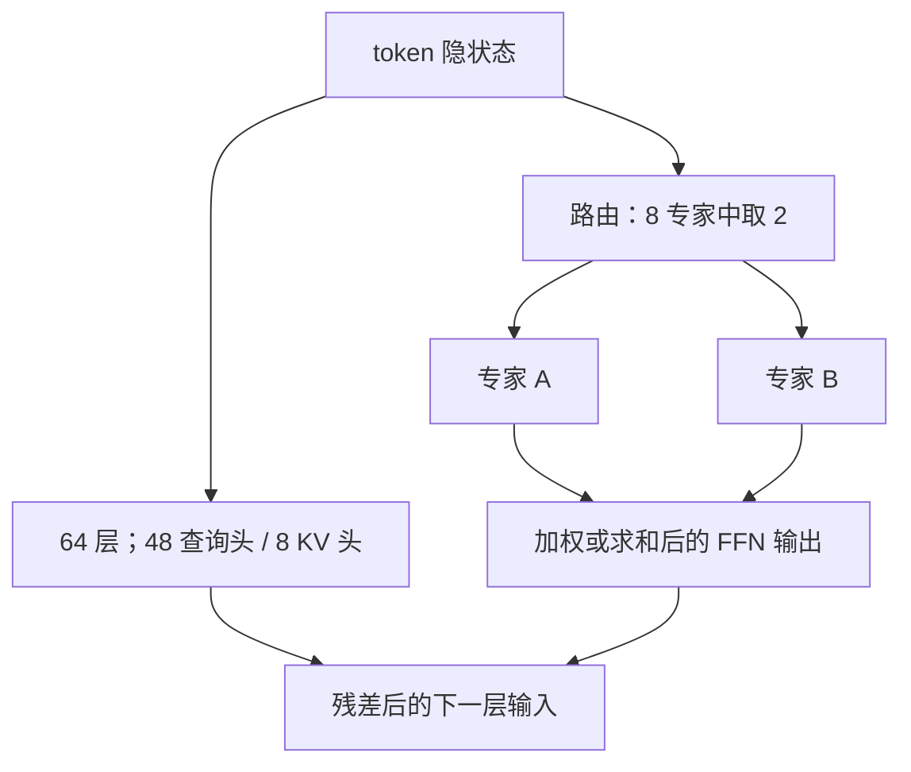

# Grok MoE 公开信息

我们发布 Grok-1 的权重与网络结构：这是一个 3140 亿参数的混合专家模型，给定 token 上约 25% 的权重被激活。

<footer>—— xAI，Open Release of Grok-1，2024 年 3 月 17 日</footer>

讨论「Grok 的 MoE」时，能当作一等材料的，几乎只有 xAI 在 2024 年 3 月开源 Grok-1 时写下的那些句子，以及配套仓库里列出的结构表。后续的 Grok-1.5、Grok-2、Grok-3 等产品有演示与博客，但**专家个数、路由、训练配方在公开文本里远不完整**。本篇只整理已公开、可核对的事实，不确定处标明「公开信息有限」，不把评测榜或二手博客里的层数表写成官方规格。

## 问题

MoE 把容量和激活计算拆开：总参数可以很大，每个 token 只走少数专家。要对齐 Grok，首先要问的不是「它像 Mixtral 还是像 DeepSeek」，而是 xAI 究竟公开了什么。2024 年 3 月 17 日的公告写明：Grok-1 是 xAI 从零训练的 **314B 参数 Mixture-of-Experts**，预训练阶段在 2023 年 10 月结束；发布的是**未做对话微调的基座检查点**，许可为 Apache 2.0。同一段还给出稀疏度：**给定 token 上约 25% 的权重处于激活状态**。

公告没有写训练语料构成、学习率、专家容量因子，也没有把后续聊天产品的架构绑到这份权重上。把产品名「Grok」和开源检查点「Grok-1」当成同一个模型，是最常见的错位：前者是持续迭代的服务，后者是一次冻结的基座快照。

### 公开材料止于何处

可核对的来源主要是三处：xAI 的开源公告、GitHub 仓库 `xai-org/grok-1` 的结构表与加载示例、Hugging Face 上的 `xai-org/grok-1` 权重。仓库明确说，其中的 MoE 实现**不为效率而写**，只为在不依赖自定义核的前提下校验正确性。因此不能拿这份参考代码的吞吐去推断生产栈。训练栈方面，公告写的是建立在 JAX 与 Rust 之上的自定义工具链；更细的并行切分、专家放置、是否用辅助损失，**公开信息有限**。

314B 是总参数，不是每次前向都算完的稠密宽度。25% 激活与「8 专家里用 2 个」在算术上一致（$2/8=25\%$），但公告给的是激活比例，仓库给的是专家个数；二者应对齐着读，不要再发明第三套 $k$。

## 方法

官方仓库列出的 Grok-1 规格可以收成一张短表。总参数 314B；**8 个专家的 MoE，每个 token 使用 2 个专家**；**64 层**；注意力为 **48 个查询头、8 个键值头**（即分组查询，见 [GQA](/llm/gqa)）；嵌入宽度 **6144**；词表是 **131,072** 的 SentencePiece；位置编码为 RoPE；并写明支持激活切分与 8-bit 量化。最大上下文长度以仓库当时的说明为准，常见转述是 8,192；若与某次镜像不一致，仍以官方 README 为准，而不是以第三方转换仓库为准。

稀疏图案与 Mixtral 同属「少专家、top-2」这一档，而不是 DeepSeek 那种上百个细粒度专家加共享支路。差别在规模：Grok-1 的总参数和层宽都大出一个数量级，激活比例仍是四分之一。嵌入 6144、查询头 48，意味着头维 $d_k=6144/48=128$，这是可以从公开数字直接算出来的，不必另找论文。

### 开源权重是什么、不是什么

公告反复强调：这是预训练结束时的**原始基座**，没有针对对话或其他下游任务微调。用它直接当聊天模型，行为与 xAI 产品里的 Grok 不可比。许可是 Apache 2.0，覆盖仓库源码与 Grok-1 权重。社区后来提供了 PyTorch / Hugging Face 转换（例如第三方的 torch 权重），那是转写，不是 xAI 的第二份官方架构声明；数值应以原 JAX 检查点为准。

不要把「支持 8-bit 量化」读成训练时用了量化感知。仓库把它列在附加特性里，更像是推理侧可以按 8-bit 加载，而不是一份 QAT 配方。量化误差、校准数据、是否逐专家标定，公开信息有限。

## 机制

在已公开的设定下，Grok-1 的 MoE 机制并不神秘：FFN 被换成 8 路专家，路由做 token-choice 的 top-2，激活比例 25%。这与 [Switch](/llm/switch-transformer) 的 $k=1$ 不同，也与细粒度高 $k$ 不同。容量主要来自「专家变多、变宽」而不是「组合数爆炸」：$\binom{8}{2}=28$ 种专家对，组合空间很小，真正撑起 314B 的是每个专家本身的宽度与 64 层的堆叠。

注意力侧用 8 个 KV 头承接 48 个查询头，缓存体积是完整多头的 $8/48=1/6$。这是服务端常见的 GQA 选择，与 MoE 正交：稀疏发生在 FFN，KV 的节省发生在注意力。把「314B MoE」理解成「KV 也稀疏」没有根据。RoPE、SentencePiece 大词表，都是当代解码器只模型的常规零件，公告没有再解释设计理由。

### 激活量与对照口径

和稠密模型比推理成本，尺子是激活参数与 KV 字节，不是 314B 这个存储数字。8 选 2 意味着一次前向大约跑四分之一的专家权重，外加全部注意力与嵌入。和 Mixtral 8x7B 对照时，相同的是专家个数与 $k$，不同的是层宽、层数、总参数和 KV 头配置。和 [DeepSeek MoE](/llm/deepseek-moe) 对照时，相同的只是「FFN 稀疏」这一句，专家粒度完全不在一个量级。这些对照是读公开表能做的；训练是否用负载均衡损失、专家是否有共享支路，**公开信息有限**，不应写成肯定句。

## 边界与工程取舍

Grok-1 的边界首先是材料边界。没有官方技术报告把数据配比、吞吐、消融写全，任何「Grok MoE 为何有效」的因果叙事都超出公开文本。产品线后续模型的上下文长度、工具使用、多模态，不能回写到 2023 年 10 月这份基座上。

工程上，314B 即使用 25% 激活，单机也很难当作端侧或单卡模型。参考实现故意不追求 MoE 效率，要复现可用推理必须自己接专家并行、分组 GEMM 或现成框架，那已经是实现选择，不是 xAI 公开的算法要点。8-bit 能减权重体积，但 decode 仍受 64 层 KV 带宽约束；GQA 只把 KV 头降到 8，长度一长仍然贵。

后续 Grok 版本是否仍是 8 专家 top-2、是否改成细粒度或稠密，xAI 没有给出与 Grok-1 同等级的结构表。遇到「Grok-2/3 的 MoE」这类问题，正确的句子是：公开信息有限，不要用 Grok-1 的 8×top-2 去填空。

第三方转换若改了层名、合并了专家、或重写成别的 MoE 接口，评测分数不能自动算作官方数字。引用时应区分：xAI 公告与 `xai-org/grok-1` 是一等来源；转换仓库、媒体复述、基准榜单是二等来源。本篇不引用未在官方材料中出现的专家中间维、训练 token 数或评测分。

## 小结

- xAI 于 2024 年 3 月 17 日开源 Grok-1：314B MoE 基座权重与结构，Apache 2.0，预训练结束于 2023 年 10 月，未做对话微调。
- 公开稀疏度：8 专家、每 token 2 专家，约 25% 权重激活；64 层，嵌入 6144，48 查询头 / 8 KV 头，RoPE，131,072 SentencePiece。
- 参考实现只为正确性，不为效率；训练栈为 JAX + Rust 自定义工具，细节公开信息有限。
- 稀疏图案接近「少专家 top-2」，不要写成 DeepSeek 式细粒度 MoE；产品 Grok 与开源 Grok-1 不是同一检查点。
- 后续 Grok 版本的专家结构、数据与路由，公开信息有限，不得用 Grok-1 表去填。
- 出处：xAI，*Open Release of Grok-1*（2024-03-17）；GitHub `xai-org/grok-1` 结构说明。不编造技术报告或 arXiv 编号。
