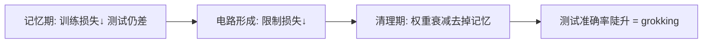

# Grokking 与突然泛化

我们完全反向工程了这些网络学到的算法：用离散傅里叶变换和三角恒等式，把加法变成圆上的旋转。

<footer>—— Nanda et al., Progress Measures for Grokking via Mechanistic Interpretability, ICLR 2023</footer>

Grokking 指训练集已经拟合之后很久，测试准确率才突然从随机涨到近乎完美。Power、Burda、Edwards、Babuschkin 与 Misra 在 2022 年于小算法任务（模加法、群运算）上系统报告了这一现象：过拟合阶段的测试性能可以长期极差，然后在继续训练中「顿悟」。表面上这像能力的不连续涌现。Nanda 等人随后在模加法 Transformer 上把学到的算法拆开，定义连续的进度度量，表明顿悟发生在记忆分量被清掉的时候，泛化电路其实早就在长。本篇写现象、机制、以及它和大规模涌现的类比能走多远。

## 问题

经典学习曲线里，训练损失与测试损失大致同进退。Grokking 把两条曲线拉开：训练准确率很快到 100%，测试准确率在过拟合平台上停留很久，然后在几乎不变的训练损失下突然上升。Power 等人用小型 Transformer 与 MLP，在模运算、置换群等任务上复现，并观察到权重衰减、数据量、模型宽度都会移动「顿悟」所需的步数。

若只有行为曲线，解释可以是任意的：隐式正则、随机游走碰巧走到平坦区、数据被突然「理解」。要区分这些故事，需要能在测试准确率仍然很差时，就测量泛化算法是否已经出现。这正是机制解释能提供的进度度量。

### 过拟合平台不是什么都没学

平台期的测试损失高，不表示内部没有结构。可能同时存在两条解：一条记忆训练集的查找表，一条真正的算法。训练损失对两者都满意；测试损失只认可后者。若记忆解的权重范数更大，权重衰减会慢慢偏向算法解。表面上的突变，来自测试度量对「记忆还是算法」的不连续敏感，而不是参数空间里的跳跃。

Power 等人的设定是小数据、可穷尽的算法表，和网页语料上的 LLM 涌现不是同一实验。把 grokking 直接叫做「大模型突然会推理的微型版」，是类比，需要额外证据。有用的移植是方法：用内部进度度量去拆开行为上的不连续。

## 方法

Nanda 等人的主实验：一层或两层 Transformer 学 $a+b \bmod p$，带权重衰减。他们发现网络把加数表示成某些频率上的正弦/余弦，再用三角积化和差实现模加，相当于在圆上旋转再读出。验证手段包括：权重与激活的傅里叶谱、在傅里叶空间做消融、以及用解析的旋转算法替换对应分量后性能几乎不变。

基于这一理解，定义两条进度度量。限制损失（restricted loss）：只保留关键频率，其余消融，看泛化电路单独的表现。排除损失（excluded loss）：只消融关键频率，看记忆通路还能否拟合训练点。两者在测试准确率突变之前就已经连续变化。

### 训练的三个阶段

主线实验被分成三阶段。记忆期：训练损失下降，排除损失下降，测试与限制损失仍高——模型在用非关键频率记表。电路形成期：限制损失开始下降，泛化机制进入权重，但记忆分量还在，测试仍差。清理期：权重衰减拆掉记忆分量，测试准确率陡升——grokking 发生在这里。突变是清理的表观，不是电路从零瞬间出现。

Liu 等人的 Omnigrok 等工作用权重范数与表示范数画相图，指出 grokking 与「表示要长到足够大、权重又被正则压住」的平衡有关。这与 Nanda 的清理故事相容：正则是把记忆解赶出赛道的力。

## 机制

模加的傅里叶算法为何被找到？正弦基对循环群是自然的，梯度下降从随机初始化里放大了这些频率，因为它们能用平滑函数拟合全部加法表，而不必为每个 $(a,b)$ 存一项。记忆解在有限训练集上一样能把训练损失打到零，而且往往形成得更快，所以先出现。权重衰减惩罚大范数的查找表，慢变量（算法频率）后来居上。测试准确率只在记忆被拆掉后才反映算法已经就绪。

### 进度度量相对行为度量

进度度量的要点是：它们在行为不连续之前连续可测。这为「涌现」提供了一种拆解策略——先反向工程最终算法，再定义该算法的内部强度，最后看强度是否平滑增长。Chughtai 等人在群运算上得到类似的阶段结构。若一种涌现现象找不到任何连续内部度量，才更像真正的相变；grokking 至少在模加上不是。

关键频率是事后知道的。进度度量依赖已经反向工程的算法，不能在训练开始前当通用早停器。它解释历史，不自动预测下一次顿悟何时到来。通用预测需要不依赖最终电路的代理量，例如权重范数、表示稀疏性，这些更弱、更可迁移。

数据量有阈值。太少则算法解不存在或正则来不及赢；太多则一开始就更像普通学习，平台变短。Power 等人画过数据分数与 grokking 延迟的关系。工程上若只关心测试性能，更简单的办法往往是加数据或加强正则，而不是空等顿悟。

## 边界与工程取舍

模加上的完美反向工程，目前没有在真实语言模型的「突然会某任务」上复现到同一精度。LLM 的数据不是封闭群表，记忆与算法的边界模糊。把 grokking 当训练配方（「过拟合后再多训一万步」）在大规模上通常不划算：计算应花在数据与目标函数，而不是等待清理期。它更有价值的是概念：行为涌现可以是度量的非线性，内部可以平滑。

正则选择影响是否出现 grokking。权重衰减是 Nanda 主线；dropout 等也能诱发。没有正则时，记忆解可以长期占据，测试不升。优化器、学习率、是否用满算法表的一部分做训练，都会改阶段边界。复现必须把这些超参写全。

不要把训练曲线上任何测试延迟上升都叫 grokking。学习率调度、数据顺序、评测集污染解除，都能造成「突然变好」。Grokking 特指：训练已饱和、持续过拟合之后、在同一数据分布上泛化陡升。定义收紧，讨论才有意义。

## 小结

- Grokking 是训练已拟合后测试性能延迟陡升的现象，Power 等人在小算法数据集上确立。
- Nanda 等人证明模加网络学的是傅里叶旋转算法，并用限制/排除损失显示内部进度是连续的。
- 三阶段为记忆、电路形成、清理；行为突变发生在清理，而不是算法诞生瞬间。
- 权重衰减等正则把高范数记忆解挤掉，使泛化解成为测试时的唯一通路。
- 与 LLM 涌现可类比的是「度量非线性」，不是「小群表训练配方可直接放大」。
- 出处：Power et al., *Grokking: Generalization Beyond Overfitting on Small Algorithmic Datasets*, 2022；Nanda et al., ICLR 2023（arXiv:2301.05217）。
