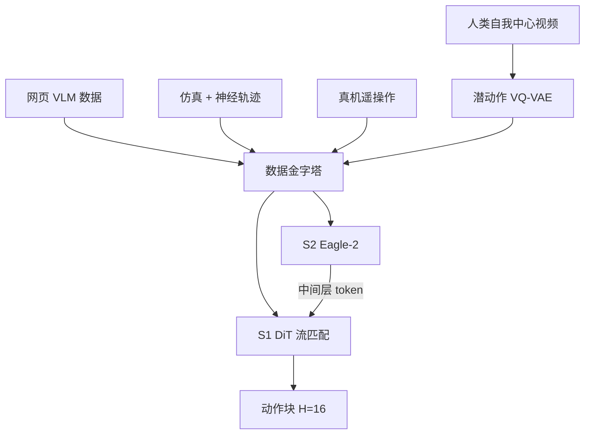

# NVIDIA GR00T N1

    
GR00T N1 是带双系统架构的视觉—语言—动作模型：视觉语言模块解释环境与指令，随后的扩散 Transformer 实时生成流畅的电机动作；两段紧密耦合、端到端联合训练。

    <footer>—— NVIDIA, GR00T N1: An Open Foundation Model for Generalist Humanoid Robots, arXiv:2503.14734</footer>

NVIDIA 在 2025 年 3 月 GTC 把 **Isaac GR00T N1** 写成「第一个开源、可定制的人形通才基础模型」。技术报告 arXiv:2503.14734，开发者博客 *Accelerate Generalist Humanoid Robot Development with NVIDIA Isaac GR00T N1* 给部署与数字。公开检查点 **GR00T-N1-2B** 实际约 22 亿参数（VLM 约 13.4 亿）。它吃图像与语言，出跨本体连续动作：桌面单臂到 Fourier GR-1 类人形。双系统隐喻与 Helix 同族，实现不同：System 2 是 Eagle-2 VLM，System 1 是带流匹配的 [DiT](/llm/dit-architecture)，而不是小回归策略。本篇写 N1 白皮书与 2025-03 博客；后来的 N1.7 换 Cosmos-Reason / Qwen3-VL 骨干，另文。

## 问题

人形硬件开始接近「能在人的空间里干活」，缺的是通才策略。单一任务从零训：数据贵、算力贵、换个桌面就塌。网页上没有「人形动作互联网」。跨本体联盟（[Open X-Embodiment](/llm/open-x-embodiment)）把许多臂的数据拼起来，论文仍形容为**数据群岛**：传感器、自由度、控制频率与坐标系不一致，加总并不等于互联网。N1 的问题是：如何用金字塔把网页、仿真、生成视频与真实遥操作收成同一套输入—输出，而不是再训一个岛上的专家。

第二个问题是推理与动作的频率差。VLM 适合 10 Hz 级语义；人形与灵巧手需要更高频的闭环。若把 VLM 最后一层当条件、动作头另训，两端会各说各话。N1 选择联合训练，并让 DiT 交叉注意 VLM 的**中间层**表征。

### 数据金字塔：量往下、本体特异性往上

底层：互联网视觉语言（进 VLM 预训练）与第一人称人类视频（Ego4D、EPIC-KITCHENS 等），无真值关节。中层：Omniverse / DexMimicGen 仿真轨迹，以及用视频生成模型从真实初帧「梦」出的神经轨迹。顶层：GR-1 等真机遥操作。博客写：Isaac GR00T Blueprint 在 11 小时内生成超过 75 万条合成轨迹，约合 6500 小时、九个月连续人工示范；合成与真机混合相对「仅真机」提升约 40%。论文把 88 小时级真机用生成模型扩到约 827 小时神经轨迹。数字来自官方，复现管道不开放到每一帧。

40% 与 76.8% 是博客表格里的政策成功率，评测在 GR-1 真机四类任务（抓放、关节物体、工业、协调）上相对 Diffusion Policy。仿真表是 RoboCasa / DexMG / GR-1 任务、每任务 100 条示范的平均成功率。跨论文比较必须带上同一套后训练数据量。

## 方法

System 2：Eagle-2（SigLIP-2 + SmolLM2），图像 $224\times 224$、pixel shuffle 后每帧 64 个视觉 token，与任务文本按聊天模板进 LLM。策略训练时**冻结语言模型部分**，从中间层（2B 档取第 12 层）取表征——官方发现比末层更快且下游成功率更高。System 1：DiT 变体，自注意作用在带噪动作块与本体状态上，交叉注意条件于 VLM token。不同本体用各自的 MLP 把状态/动作投到共享维，再在末端用本体特定解码器。动作块 $H=16$。流匹配损失

$$
\mathcal{L}_{\mathrm{fm}}(\theta)=\mathbb{E}_\tau\bigl\|V_\theta(\phi_t,A_t^\tau,q_t)-(\epsilon-A_t)\bigr\|^2,
$$

路径 $A_t^\tau=\tau A_t+(1-\tau)\epsilon$，时间分布为 Beta。推理 $K=4$ 步欧拉。L40、bf16 上采样一块 16 步动作约 63.9 ms；VLM 侧博客写约 10 Hz，动作侧论文写闭环可到 120 Hz。

无动作视频用 VQ-VAE 潜动作：编码 $(x_t,x_{t+H})$ 得到 $z_t$，解码从 $x_t,z_t$ 重建 $x_{t+H}$。量化前的连续嵌入当作「LAPA 本体」的流匹配目标，从而人类视频与机器人视频可检索到相似的左右伸手。神经轨迹另可用在真机上训的逆动力学模型打伪标签。仿真用 DexMimicGen 把少量示范切成物体中心片段再重放。预训练在异构混合物上端到端流匹配；后训练按单本体微调，并可 1:1 混入神经轨迹。2B 预训练约 5 万 H100 GPU 小时。

### 后训练接口是产品

开发者路径：把视频—状态—动作三元组收成与 LeRobot 兼容的 GR00T 数据集 → 校验 → PyTorch 微调 → 推理脚本接控制器或 Isaac 仿真。博客建议后训练最低一块 RTX A6000 或 4090；推理可 A6000 或 Jetson AGX Orin。这是开源基础模型的交付面：权重在 Hugging Face，脚本在 `NVIDIA/Isaac-GR00T`。

## 机制

双系统在 N1 里不是异步共享一个向量，而是 **DiT 每一步去噪都交叉注意 VLM token**。慢系统提供开放词汇与空间描述，快系统在同一计算图里积分动作。中间层条件减少延迟，也避免末层已经过度语言化、丢掉对控制有用的空间细节。潜动作把「没有关节的视频」变成可训的第四种本体，机制假设是：短时视觉变化与可迁移的手部运动原语对齐——论文用跨本体检索图支持这一点，不是证明动力学等价。

数据金字塔的机制是采样而不是简单拼接。人类视频与神经轨迹提供覆盖；真机提供可执行的校准。合成的 40% 增益说明中层不是装饰：在真机稀缺时，生成器与仿真负责组合从未遥操作过的「从 A 放到 B」。语言条件在仿真里靠干扰物体强制模型读指令，否则策略会忽略文本、只抓最近物体。

N1 引用 Kahneman 只作认知分层类比。工程上的 10 Hz / 120 Hz 是 GPU 上测得的模块速率，不是心理学实验。Helix 的 S1 是 80M 回归、200 Hz 上身；N1 的 S1 是 DiT 流匹配、跨本体块。不要把两个「System 1」画成同一张结构图。

### 开源检查点覆盖的是 2B 这一档

论文多次强调「一个模型、一套权重」做单臂、双臂与人形。公开物是 GR00T-N1-2B 与部分物理 AI 数据集，不是所有内部遥操作小时数。AgiBot-Alpha、OXE 子集（RT-1、Bridge-v2、DROID 等）被列为预训练真实来源。容量实验在论文里表明：小架构在 Bridge / RT-1 这类大数据岛上反而欠拟合，通才需要足够宽的主干——这与 OXE 原文对 RT-2-X 的观察同方向。

## 边界与工程取舍

N1 不是整机运动与平衡控制器；实验以桌面与人形双臂操作为主。仿真成功率仍远低于饱和。真机全数据 76.8% 相对扩散策略基线高，不等于产线 KPI。潜动作与 IDM 伪标签会把生成视频的物理错误写成「可模仿动作」。视频生成扩数据的算力账单（论文：约 10.5 万 L40 小时量级）本身不是小实验室可复制的。语言组件在后训练中冻结，指令跟随的上限受 Eagle-2 对齐质量约束。

不要把 2025 年 3 月的 N1 与后来的 N1.5/N1.7 混写成一个检查点。N1.7 换推理型 VLM、商业许可与「EgoScale」叙事，必须按当时模型卡另写。也不要把 Cosmos 世界模型平台（Predict1）与 GR00T 策略混成同一个权重。

出处：NVIDIA et al.，*GR00T N1: An Open Foundation Model for Generalist Humanoid Robots*，arXiv:2503.14734；开发者博客 https://developer.nvidia.com/blog/accelerate-generalist-humanoid-robot-development-with-nvidia-isaac-gr00t-n1/ ；新闻稿 2025-03-18 GTC。代码与权重：GitHub NVIDIA/Isaac-GR00T。

## 小结

- GR00T N1 是开源人形向 VLA：Eagle-2（S2）+ 流匹配 DiT（S1），联合训练。
- 公开 GR00T-N1-2B 约 22 亿参；动作块 16、推理约 4 步。
- 数据金字塔：人类视频潜动作、仿真/神经轨迹、真机；合成混合约 +40%。
- 真机 GR-1 全数据平均成功率博客报 76.8%，对照 Diffusion Policy。
- 后来的 N1.7 不在本检查点范围内。
- 出处：arXiv:2503.14734 与 NVIDIA 2025-03 官方博客。
