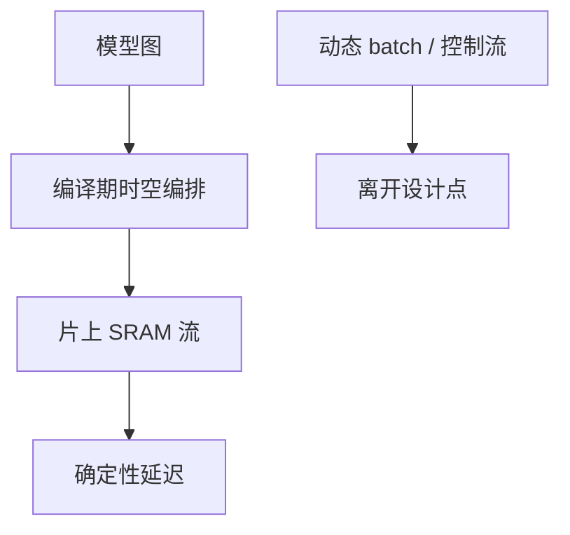

# Groq LPU 确定性

把调度从运行时挪到编译期：每拍数据在哪条线上，没有缓存未命中，也没有 NCCL 尾延迟。换来的是：模型必须被静态铺进芯片，动态 batch 与分支变成敌人。

<footer>—— Groq TSP / LPU 的公开体系结构叙述；对照 GPU 的动态 kernel 启动</footer>

[Cerebras](/llm/cerebras-wafer-scale) 用空间网格吞规模。本课 Groq 的 LPU / TSP 用 **确定性时序**：编译器把指令与数据运动在时钟上排好，推理延迟可预测。缺口是这种确定性与 LLM 服务的哪一部分合拍——decode 的小 batch、固定图——以及哪一部分不合拍——动态形状、投机、变长工具调用。它几乎不参加「训练集群 All-Reduce」叙事，对比时不要用 [预训练通信](/llm/pretrain-comm) 的指标硬套。

## 问题

GPU 推理的尾延迟来自抢占、缓存、NCCL、调度器、以及 kernel 启动。Groq 的主张是：SRAM 为主、显式编排、无传统缓存层次的偶然性，于是延迟分布窄。这对低 batch 的自回归 decode 有吸引力——正是 GPU 算术强度最低的区。

代价：片上 SRAM 容量限制权重驻留，大模型要切多芯片并在编译期铺流；动态控制流与不规则专家路由难编；训练的反向与动态图不是设计点。问题是 **确定性是推理 SLA 的工具，不是通用计算的超集**。

公开材料把 LPU 定位为推理。不要把某次演示的 tokens/s 写成可复现的集群规格。对比用机制（确定性调度、SRAM、编译器），用自家测量说话。

## 方法

编译器把计算图画成时空图：哪一拍哪条 SIMD 线做什么，数据从哪块 SRAM 到哪块。多芯片按流水或张量切分在编译期接好，运行时没有 Ring/Tree 选择。服务上要固定最大形状；padding 换确定性。投机解码、连续批处理的动态合并与这种静态图冲突——不是不能做，是要放弃一部分「无抖动」承诺或做多份静态特化。

与 GPU 集群对照：没有 [NVLink](/llm/nvlink) 域上的 NCCL 表，有的是编译器生成的芯片间同步。故障是整份静态日程失效，弹性语义不同。

## 机制

去掉缓存，就去掉了命中率带来的方差，也去掉了用容量换带宽的那层。权重必须在编译器的预算内铺开；超预算就切芯片，芯片间 $\beta$ 成为新墙——确定性系统对这条墙更敏感，因为没有运行时重叠可以「偶尔掩盖」。

训练需要的集体梯度同步、动态 mask、变长序列，会把静态日程打穿。因此 LPU 课放在「NVIDIA 之外」的推理分支，不要写进预训练机群的公平调度假设里。

确定性不等于更快。它等于可预测。GPU 在大 batch prefill 上仍可更高吞吐。对比必须声明 batch 与阶段（prefill vs decode）。

## 边界与工程取舍

不要用 GPU 的 MFU 直接打 LPU。不要假设 PyTorch eager 能跑。不要把编译时间从 SLA 里删掉——换模型就要重编。下一课 SambaNova 也是数据流，但强调可重配置数据通路与训练/推理更广的图，而不是 Groq 这种拍级确定性叙事。

## 小结

- LPU/TSP：编译期编排 + SRAM 流，推理延迟方差小。
- 设计点是静态图、低 batch decode；动态服务特性要特化或放弃。
- 大模型多芯片的墙是编译期铺流与片间 $\beta$，不是 NCCL 表。
- 确定性 ≠ 全面更快；声明 batch 与阶段再比。
- 出处：Groq 公开的 TSP/LPU 体系结构叙述。
