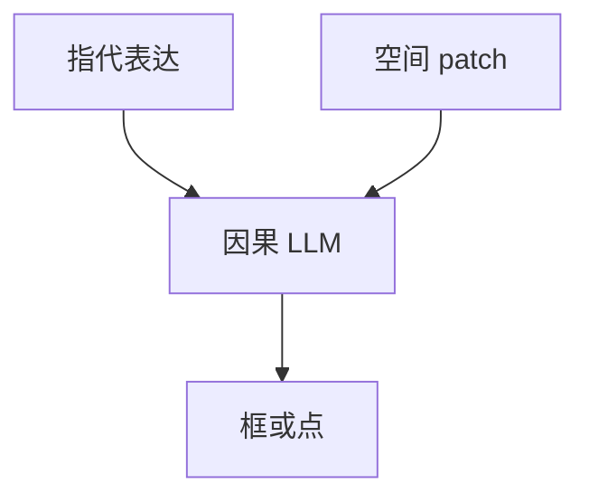

# 定位与指代

「左边那只猫」不是分类标签。短语必须落到像素坐标，语言侧的共现才不能顶替格子上的证据。

<footer>—— Peng 等 Kosmos-2；Chen 等 Shikra；指代基准 RefCOCO / RefCOCO+ / RefCOCOg</footer>

[上一课](/llm/vlm-hallucination)用 POPE 抓住乱认物体。缺口是绑定：名词、代词、关系短语要对准图上的区域，而不是只答「有」。后课 GUI 默认同一套指代，只是画布换成屏幕控件。

## 问题

[CLIP](/llm/clip) 对齐的是全局图与整句，不给词–区域。开放 VQA 可以靠主题蒙对。指代理解（REC）要求：给定指代表达，输出框；指代生成（REG）相反。RefCOCO 家族用游戏收集的短语，含位置（左边）、外观、关系；RefCOCO+ 弱化纯位置词，更考外观。

VLM 要把框写成可生成的 token：量化坐标、特殊位置词、或与文本交错的 `<x><y>`。没有这项监督，[LLaVA 投影器](/llm/llava-projector) 的 patch 序列只是「可能被注意到的键」，定位是涌现、不保证框准。

坐标协议是产品：归一到 $[0,1000]$、原图像素、还是 patch 下标，训练与推理必须同一套。分辨率一变，未归一的绝对像素会漂。

## 方法

Kosmos-2 把位置写进语言序列，用图文与接地数据联合训。Shikra 在对话里直接输出坐标，强调 referential dialogue。实现上：[ViT](/llm/vit-as-encoder) 必须保留空间 patch，不能只投 CLS；2D 位置（[2D RoPE](/llm/2d-rope)）让「左/上」可学。评测用 Acc@IoU，并分短短语与长关系句。不要用 POPE 替代 REC。

## 机制

指代成功时，注意力应把短语里的约束（颜色、方位、第几个）打到对应 patch 的键上，再把坐标解码出来。这给物体名词一条必须经过视觉格子的路径，比纯「是否存在」更难用语言先验蒙混——编造的物体没有稳定的框可抄。

## 边界

自然图框不是点击 UI。下一课把坐标系换成屏幕像素与控件，评测也从 IoU 换成点击命中。

## 小结

- 定位把短语钉到框/点，堵住只靠共现的物体幻觉。
- 必须保留空间 token 与坐标协议。
- RefCOCO 家族测的是指代，不是开放描述。
- 出处：Kosmos-2；Shikra；RefCOCO 系列。
