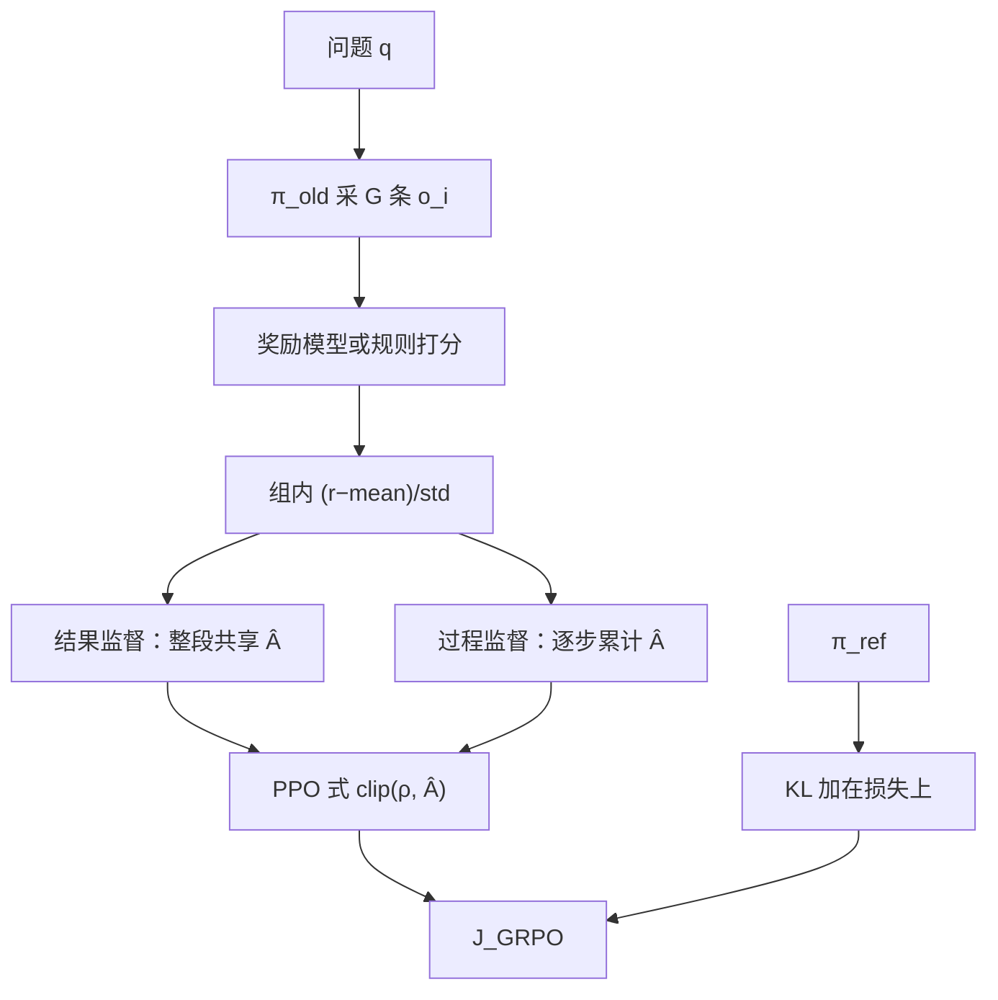

# GRPO 原文

    
价值函数通常要再放一个与策略同规模的模型，而语言模型又往往只在最后一个 token 给奖励；用同一题上多个输出的组内分数当基线，就能去掉 critic。

    <footer>—— Shao 等，DeepSeekMath: Pushing the Limits of Mathematical Reasoning in Open Language Models，2024</footer>

DeepSeekMath 7B 从 DeepSeek-Coder-Base-v1.5 继续预训练约 120B 数学相关 token，指令微调后 MATH 达到 46.8%，再经强化学习到 51.7%（64 路自洽 60.9%）。强化学习一节提出 Group Relative Policy Optimization（GRPO）：仍是 [PPO](/llm/schulman-ppo) 的裁剪代理，但不训练 $V_\psi$，改为对每个问题采一组输出，用组内奖励的均值与标准差标准化当作优势。KL 不写进逐步奖励，而作为与参考策略的散度直接加在损失里，并用 Schulman 2020 的无偏正估计。本篇按 DeepSeekMath 原文写 GRPO 与文中的统一范式实验；工程复述见 [GRPO](/llm/grpo)。DeepSeek-R1 后来沿用同一算法，不在本篇展开。

## 问题

PPO 的优势来自 GAE，GAE 需要逐步价值。LLM 的奖励模型通常只给完整输出一个标量，中间 token 没有真实 $r_t$，价值头要在长程上自举，难且贵。价值网络还常与策略同规模，显存翻倍。数学题上，同一问题的多份解答天然可比较：对错、格式、过程分都在同一量纲里。组内相对分数因此比「学一个全局 $V(s)$」更贴奖励模型的训练方式——RM 本身就是在同一题的比较上拟合的。

作者还希望把 RFT、DPO、PPO、GRPO 放进同一梯度模板：数据从哪来（在线/离线）、奖励如何变成梯度系数（规则/模型、结果/过程）、是否迭代更新 RM。GRPO 是这个模板里「在线采样 + 模型奖励 + 组相对系数 + 可选过程监督」的实例，不是独立于 RL 的新原理。

### 为何不把 KL 塞进奖励

InstructGPT 式 PPO 常在每个 token 的奖励里减 $\beta\log(\pi/\pi_{\mathrm{ref}})$，再拿去算 GAE。没有 critic 之后，再把 KL 混进 $r_i$ 会污染组内均值和标准差，使「相对好坏」与「离参考多远」缠在一起。原文把 KL 从优势里拿出来，加在目标的后面，并用

$$
\mathbb{D}_{\mathrm{KL}}[\pi_\theta\|\pi_{\mathrm{ref}}]=\frac{\pi_{\mathrm{ref}}}{\pi_\theta}-\log\frac{\pi_{\mathrm{ref}}}{\pi_\theta}-1
$$

保证该项非负。这是实现选择，与裁剪 $\epsilon$ 独立。

DeepSeekMath 的 RL 数据是 GSM8K 与 MATH 的思维链题目约 144K，刻意不含其它 SFT 题，以便观察域外是否跟着升。CMATH 等域外提升是论文报告的现象，不是算法对任意域外的保证。

## 方法

对问题 $q$ 从 $\pi_{\theta_{\mathrm{old}}}$ 采 $\{o_i\}_{i=1}^{G}$，奖励模型打分得 $\mathbf{r}$。结果监督把标准化分数赋给该输出的每一个 token：

$$
\hat A_{i,t}=\tilde r_i=\frac{r_i-\mathrm{mean}(\mathbf{r})}{\mathrm{std}(\mathbf{r})}.
$$

目标为

$$
\begin{aligned}
\mathcal{J}_{\mathrm{GRPO}}(\theta)
&=\mathbb{E}\Biggl[\frac1G\sum_{i=1}^{G}\frac1{|o_i|}\sum_{t=1}^{|o_i|}
\Biggl(\min\bigl(\rho_{i,t}\hat A_{i,t},\,\mathrm{clip}(\rho_{i,t},1-\varepsilon,1+\varepsilon)\hat A_{i,t}\bigr)\\
&\qquad-\beta\,\mathbb{D}_{\mathrm{KL}}[\pi_\theta\|\pi_{\mathrm{ref}}]\Biggr)\Biggr],
\end{aligned}
$$

其中 $\rho_{i,t}=\pi_\theta(o_{i,t}\mid q,o_{i,\lt t})/\pi_{\theta_{\mathrm{old}}}(o_{i,t}\mid q,o_{i,\lt t})$。过程监督则对每一步结束位置打过程奖励，在全体步骤分上做同样的均值–方差标准化，token 优势取其后各步标准化奖励之和。迭代 GRPO：用当前策略采样给 RM 造新数据，混入约 10% 历史回放继续训 RM，把参考策略换成当前策略，再继续训策略。

超参原文：策略学习率 $1\times 10^{-6}$，KL 系数 $0.04$，每题 $G=64$，最大长度 1024，训练 batch 1024，每次探索后策略只更新一轮（$\mu=1$）。从 DeepSeekMath-Instruct 出发，GSM8K $82.9\%\to 88.2\%$，MATH $46.8\%\to 51.7\%$，CMATH $84.6\%\to 88.8\%$。这些数字绑定该 7B 数学模型与该数据切片。

### 统一范式里 GRPO 处在哪一格

原文把梯度写成「数据源 × 奖励函数 × 梯度系数」。SFT/RFT 的系数对正例为 1、不对负例；DPO 的系数来自成对 logistic；PPO/GRPO 的系数是优势。在线 RFT 比离线 RFT 后程更强，说明采样分布跟着策略走有用。GRPO 相对在线 RFT 的增益来自「按奖励幅度区分强化与惩罚」：错的不只是不模仿，还按组内标准化被压低。过程监督优于结果监督，迭代更新 RM 尤其第一轮迭代有明显跳变。这些比较都在数学指令数据上进行，不要外推成「任意任务过程监督必胜」。

## 机制

### 组标准化与比较型 RM 同构

RM 在同一 $q$ 的 $(o_w,o_l)$ 上训练，绝对分数跨题不可比。组内减均值除标准差，把「这题上相对同组的 z 分数」交给优势，避免简单题的稳分淹没难题上的微弱正例。$G=1$ 时标准差未定义，算法退化。$G=64$ 是原文数学设定的生成预算，不是最小可用值；更小的 $G$ 出现在后续工程里，不在这篇论文的主配置中。

除以 $|o_i|$ 的 token 平均，减轻长解包揽梯度。结果监督下长错误解与短错误解得到同一 $\tilde r_i$，但长解有更多 token 乘上该优势，平均后才与短解可比。过程监督把信用分配到步骤边界，依赖过程奖励模型的切分质量；原文过程 RM 的训练遵循 Wang 等 2023 的数学过程监督设定。

组内 std 在全体答对或全体答错时接近 0，优势爆炸或为零。实现必须加 $\varepsilon$。原文公式未把 $\varepsilon$ 写进 $\tilde r$，工程上不可省略。全对组没有相对信号，与可验证奖励的「简单题饱和」是同一现象。

### 在线相对离线

RFT/DPO 用初始 SFT 的样本，GRPO 用 $\pi_{\theta_{\mathrm{old}}}$ 的实时样本。训练后期策略已离开 SFT，离线对不再覆盖当前会犯的错。这与 [WPO](/llm/wpo) 讨论的分布缺口是一件事：GRPO 用生成解决，WPO 用加权模拟。DeepSeekMath 的图显示在线 RFT 后程超过 RFT，GRPO 再超过在线 RFT，三者差在「是否在线」与「系数是否随奖励变」。

## 边界与工程取舍

GRPO 省 critic 显存，把成本转到 $G$ 份生成。数学可验证或有 RM 时组内对比干净；开放式对话里 RM 噪声会被标准化放大。原文 KL 系数 $0.04$、单次更新 $\mu=1$，与连续控制 PPO 多 epoch 不同：探索一次、更新一轮，近端比率更不容易失效。照搬 MuJoCo 的 $K$ 个 epoch 不是这篇论文的设定。

它仍要参考策略做 KL，不是无参考方法。奖励在 DeepSeekMath 里是训练出来的 RM（及过程 RM），不是 R1-Zero 那种纯规则；规则奖励是后续工作的选择。统一范式把 DPO 也看成简化 RL，这是概念地图，并不意味离线 DPO 与 GRPO 可互换超参。

MATH 51.7% 是「不使用外部工具与投票」的单次解码成绩；60.9% 是 64 样本自洽。引用时必须写明协议。RL 用的是英文指令子集，不是 120B 预训练本身。

### 何时不必上 GRPO

没有组采样预算，$G=1$ 时不要叫 GRPO。开放域偏好且已有稳定 critic 流水线时，PPO 仍是原文对比的对象，不是被定理淘汰。只有离线成对、不能部署生成环，用 DPO 家族。需要无偏留一基线而不是含自身的 mean/std，看 [RLOO 原文](/llm/rloo-paper)——DeepSeekMath 没有声称组标准化无偏。

## 小结

- DeepSeekMath 提出 GRPO：PPO 式裁剪目标，优势来自同题组内奖励标准化，无价值网络。
- KL 用无偏正估计加在损失上，不混进组内优势。
- 结果监督共享序列优势；过程监督把步骤奖励标准化后向后累计。
- 原文 $G=64$、$\beta_{\mathrm{KL}}=0.04$、每轮探索后 $\mu=1$ 次策略更新。
- 统一范式实验支持在线采样、按奖励调系数、过程监督与迭代 RM。
- 报告的 GSM8K/MATH 增益绑定 DeepSeekMath-Instruct 7B 与该 RL 数据。
- 出处：Shao, Wang, Zhu, Xu, Song, Zhang, Li, Wu, Guo，*DeepSeekMath: Pushing the Limits of Mathematical Reasoning in Open Language Models*，arXiv:2402.03300，2024。
