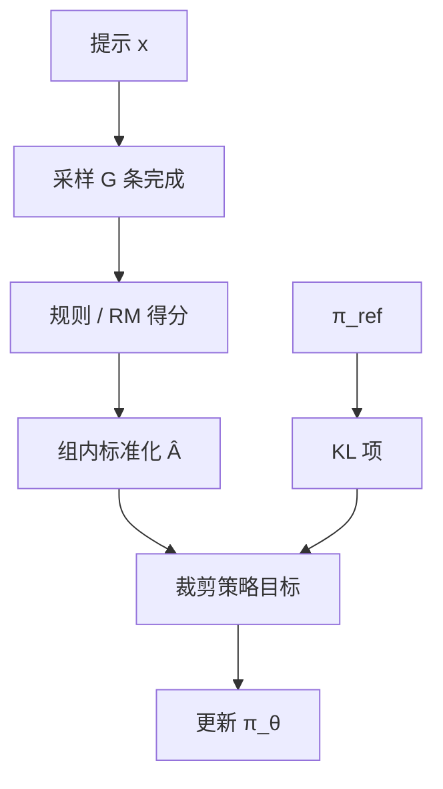

# GRPO

同一提示采一组完成，用组内奖励的均值与方差当基线，不再训练一个与策略同规模的 critic。

<footer>—— Shao et al., DeepSeekMath, 2024；DeepSeek-R1 采用同一群体相对策略优化</footer>

群体相对策略优化（Group Relative Policy Optimization, GRPO）在 DeepSeekMath 中提出，并作为 DeepSeek-R1 / R1-Zero 的强化学习算法。它仍是策略梯度：对采样出的 token 序列用优势加权的对数似然更新，并通常保留对参考策略的 KL。它改掉的是 [PPO](/llm/ppo-llm) 里那个价值函数——不再回归 $V_\psi(s_t)$，而是对每个提示采样 $G$ 条完成，用组内奖励标准化当作这条完成的优势。R1-Zero 在可验证奖励下用这套方法从基座直接 RL，长链与自检在生成行为里出现。本篇写组相对基线本身，推理时行为见 R1 专文。

## 问题

LLM-PPO 的 critic 贵且不稳：稀疏终点奖励、长地平线、价值头与策略抢表征，见 [Actor-Critic 稳定性](/llm/ac-stability)。数学与代码域又恰好能对同一题给出可比较的标量（对错、部分分、格式分），不同完成之间的相对好坏比「绝对价值函数」更好估。需要一种基线：不引入第二套大权重，又能在同题上把幸运采样与真更好的推理分开。

组采样是自然对照。Best-of-N 与 [RFT](/llm/rejection-sampling-rft) 只用上尾；策略梯度还要对组里较差的完成给负优势，主动压低。GRPO 把对照写成标准化分数，使一组里的相对名次成为 $\hat A$。

### 组大小为 1 时算法退化

$G=1$ 则没有组内均值与标准差，相对优势未定义或退化为常数，梯度失去基线，方差回到朴素 REINFORCE。复现 R1-Zero 却把组大小设成 1，长度与反思都不必出现。$G$ 与采样温度一起决定优势估计的噪声：过小则基线吵，过大则每步生成预算爆。报告里的 $G$ 以原文为准，不要从二手博客抄一列未注明的数。

「群体相对」比较的是同一提示下的多条 $y$，不是不同用户、不同题之间的分。跨题直接比绝对奖励，会把简单题的稳分当成高优势。标准化必须在组内做。

## 方法

对每个 $x$ 采 $y_1,\ldots,y_G\sim \pi_{\mathrm{old}}(\cdot\mid x)$，得标量 $r_i$（规则奖励或 RM）。组内

$$
\hat A_i = \frac{r_i - \mathrm{mean}(\{r_j\})}{\mathrm{std}(\{r_j\})+\varepsilon}
$$

序列内各 token 常共享同一个 $\hat A_i$（结果监督，不逐步打分）。再最大化类似 PPO 的裁剪目标，用 $\pi_\theta/\pi_{\mathrm{old}}$ 的比率乘 $\hat A_i$，并加对 $\pi_{\mathrm{ref}}$ 的 KL。没有价值损失，也没有 GAE 的 $\lambda$。R1 的奖励是规则式的：最终答案可核对，加上思维标签等格式约束；不管中间步骤写什么。

$$
J_{\mathrm{GRPO}}(\theta) \approx \mathbb{E}\Bigl[\frac{1}{G}\sum_{i=1}^G \min\bigl(r_i(\theta)\hat A_i,\,\mathrm{clip}(r_i(\theta),1-\epsilon,1+\epsilon)\hat A_i\bigr) - \beta\,\mathrm{KL}\Bigr]
$$

记号随实现略有出入（KL 进奖励还是进损失、是否逐 token 平均），但「组内相对 $\hat A$、无 critic」不变。生成与对数概率接口仍与 PPO 相同：要 $\pi_{\mathrm{old}}$ 与 $\pi_\theta$ 对同一 $y_i$ 对齐。

### 与 PPO 共用的，与不用的

共用：在线采样、近端裁剪、参考 KL、聊天模板与 mask。不用：价值头、GAE bootstrap、价值 clip。显存上少一份反向的 critic；生成成本上升为每提示 $G$ 条。墙钟是否更省，取决于 critic 是否本来就要与策略同卡训练。R1 规模上，省掉 critic 是为了把算力留给更长的思维链生成，而不是为了理论上更小的方差。

## 机制

标准化把绝对奖励的尺度拿掉：一组全对则 $\hat A\approx 0$，这组几乎不更新——没有相对信号。一组有对有错，对的得正优势，错的得负，策略提高「这道题上相对更好的那种写法」。这正是可验证域想要的：逼模型在同题上分出对错轨迹，而不是抬高所有题的平均套话分。全错组同样没有相对梯度；温度过低导致全错或全对，学习停滞，需要足够探索。

结果监督意味着中间错误但偶然答对的链也会得正 $\hat A$。假推理会被强化，与过程奖励模型不同。R1-Zero 接受这一点，换来不标注步骤。长度增长是因为更长的搜索在组内更容易撞到对的答案，相对优势偏向长样本；这是奖励设计的后果，不是 GRPO 公式里写了「鼓励长度」。若要压长度，必须把长度写进 $r_i$，或对超长完成扣分。

组内标准差接近 0 时除法不稳定，实现必须有 $\varepsilon$ 或直接跳过该组。不要在全对 batch 上看到「NaN 优势」还以为是奖励脚本错了。

## 边界与工程取舍

### 开放偏好域未必更好

RM 分数跨完成可比、但噪声大时，组内标准化会把 RM 的噪声放大成 ±1 的优势，策略拟合的是 RM 的组内抖动。此时未必比一个平滑的 $V$ 更好。GRPO 的主场是可验证或低噪声标量。偏好 RM 上仍可做，应先看组内 $r_i$ 的离散程度。

蒸馏小模型若只 SFT 轨迹、不再 GRPO，则没有这套相对基线，不要称为「GRPO 学生」。R1 报告把再 RL 留给社区。服务上 $G$ 只存在于训练；推理仍是单条（或另开 test-time 采样），不要把训练组大小写进网关。

与 [RLOO](/llm/rloo) 相比，GRPO 更常把组内标准差写进优势，并把近端裁剪留在目标里，因此在奖励量纲随题型跳动时更省事；RLOO 的留一均值在 $G$ 很小时更少把自身分数漏进基线。两者都需要同提示多采样，也都不能在 $G=1$ 时假装自己仍是群体方法。选哪一个，先看奖励是否已经标准化、以及实现栈更接近 PPO 还是更接近朴素 REINFORCE。

GRPO 不是 2025 年才第一次出现。R1 采用它；提出与数学推理实验在 DeepSeekMath（Shao 等, 2024）。写出处时不要把两年并成一篇。

## 小结

- GRPO 用同提示 $G$ 条奖励的均值方差构造优势，去掉 critic，保留裁剪与参考 KL。
- $G=1$ 退化；全对 / 全错组没有相对信号。
- 结果监督会强化假推理；长度来自奖励，需显式约束才会下降。
- 主场是可验证标量；高噪声 RM 上组内标准化可能放大抖动。
- 出处：Shao et al., DeepSeekMath, 2024；DeepSeek-AI, DeepSeek-R1, 2025。
