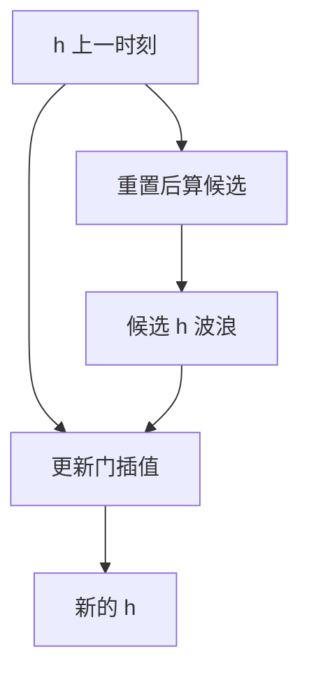

# GRU 对照

不必维持单独的细胞与隐状态两套向量；重置门与更新门也能做出可加的记忆，只是接口更瘦。

<footer>—— 据 Cho et al., Learning Phrase Representations using RNN Encoder–Decoder, EMNLP 2014 整理</footer>

[LSTM 门控](/llm/lstm-gating)给出 $c_t$ 与三个门。本课不重写常数误差转盘。缺口是：许多任务上并不需要输出门把细胞再包一层 $\tanh$；参数与状态可以更少。GRU 把记忆放在 $h_t$ 自己里，用更新门做插值、重置门控制候选如何读旧状态。本课对照机制，不宣布谁永远更好，也不进入编码器—解码器的整体图——那是下一课。

## 问题

LSTM 每步要维护 $c$ 与 $h$，四组仿射。部署与小数据上，这是明显的常数倍。问题：加法记忆是否必须拆成「细胞 + 读出门」？GRU 的回答是：用 $z_t$ 在旧 $h$ 与新候选之间插值，

$$
h_t=(1-z_t)\odot h_{t-1}+z_t\odot\tilde h_t,
$$

这已经是残差式加法。重置门 $r_t$ 乘在计算 $\tilde h_t$ 时所读的 $h_{t-1}$ 上，让候选可以忽略过去。缺口是同一长程动机下的另一参数化，便于后课 seq2seq 论文（Cho 等人正是在编码器—解码器里提出 GRU）时能读懂符号。

没有单独的输出门，意味着 $h_t$ 既是记忆也是对外接口。不能再「细胞里记着、对外少露」。这是表达力与简洁的权衡，不是实现省略。

### GRU 不是 LSTM 去掉一个门这么算术

LSTM 的遗忘与输入在通行实现里往往耦合（$i=1-f$ 的变体），看起来也像插值，但细胞仍经 $\tanh$ 与输出门才成为 $h$。GRU 的插值直接发生在 $h$ 空间，候选的非线性与重置纠缠。把参数量除以 $3/4$ 当成两者的定义差，会漏掉状态是否分开这条几何。对照时应说「记忆是否另存、$h$ 是否直接被加」，而不是只数 sigmoid 个数。

Cho et al., EMNLP 2014 的符号与后来教材略有出入。本课用更新门 $z$、重置门 $r$ 的通行写法。读原文时以论文公式为准，不要混用 LSTM 的 $f,i,o$ 名字。

## 方法

从 $(h_{t-1},x_t)$ 算 $z_t,r_t$，候选 $\tilde h_t=\tanh(W x_t+U(r_t\odot h_{t-1}))$，再按 $z_t$ 插值得到 $h_t$。反向沿插值的 $(1-z)$ 支路可以把梯度送到很早的 $h$，与 LSTM 的 $f\approx 1$ 同类。初始化更新门偏向「保持」同样有用。与 LSTM 一样，沿时间串行。解码器里用 GRU 还是 LSTM 不改变下一课的定长交接。

## 机制

长程：更新门接近 $0$ 的维（按上式 $(1-z)\approx 1$）把 $h$ 原样传递。短程改写走候选。重置门关闭时，候选几乎不看过去，相当于局部重写而不污染记忆维。经验上 GRU 与 LSTM 在许多基准上接近，差别小于学习率与层数；本课不提供排行。选择往往来自实现与延迟：少一组仿射，少一份状态。

堆叠多层 GRU 时，层与层之间仍建议走残差或至少对齐宽度，否则时间轴刚修好的增益会在深度轴上再乘一遍 $\rho$。这与前馈课相同：门控解决的是沿 $t$ 的乘法，不是沿层的乘法。双向 GRU 只是两个方向各一条递推，拼接后仍是定长交接的候选，并不提供对任意 $j$ 的读取。

两者都没有解决「回头看某一个过去位置」：要读 $x_3$，必须它当时被写入并一路传到现在。编码器把整句压进一个 $h_n$ 时，这个瓶颈下一课会变得刺眼。

## 边界

本课不写注意力。下一课[Seq2Seq 编码解码](/llm/seq2seq-encode-decode)把 GRU/LSTM 装进「一句进、一句出」的两个循环。后课默认：门控 RNN 作为可训的长程递推，LSTM 与 GRU 可互换地当作编码器积木，差别写在状态是否分家。不在本课根据某一基准宣布胜负。

## 小结

- GRU 用更新门在旧隐状态与候选之间插值，加法记忆不必另设细胞。
- 重置门控制候选是否阅读过去；没有 LSTM 那样的输出门。
- 对照看几何，不要只数门的个数。
- 仍是串行递推，不能随机访问过去某步。
- 多层时深度轴上的增益要另管，门控只修时间轴。
- 出处：Cho et al., EMNLP 2014。
