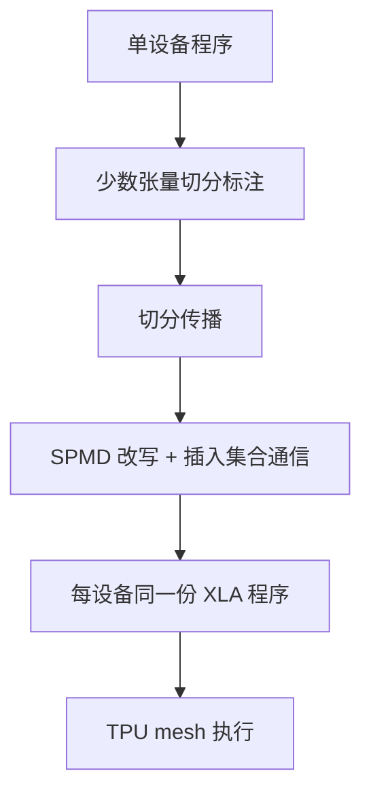

# GSPMD

程序仍按单设备写，只在少数张量上标注如何沿设备网格切开；编译器把切分推到整张计算图，并插入集合通信，使每台设备跑同一份 SPMD 程序。

<footer>—— Xu 等，GSPMD: General and Scalable Parallelization for ML Computation Graphs, 2021</footer>

GPU 栈里，数据并行、张量并行、流水线往往是三套运行时、三种通信组。Google 的 XLA 走另一条路：把并行收成**张量切分标注**，由编译器完成传播与改写。Xu、Lee、Chen 等人 2021 年的 GSPMD（General and Scalable Parallelization for ML Computation Graphs）把这条路写成可生产使用的分区器：有限标注、整图推断、一份程序跑所有设备。论文报告在最多 2048 个 Cloud TPU v3 核心上，对最大约万亿参数的模型达到 50%–62% 的算力利用率。本篇写分区语义与传播，不把 [GShard](/llm/gshard) 的 MoE 翻译实验再写一遍，也不把 [Pathways](/llm/pathways) 的调度层提前做成 GSPMD 的能力。

## 问题

手写并行有两头痛。一头是正确性：All-Reduce 该加在哪条边上、分片轴是否与点积的收缩维对齐、卷积的 halo 要不要交换，漏一次就静默错数。另一头是组合：数据并行切 batch、层内并行切隐藏维、空间并行切图像、权重更新再切一份、流水线切层——每加一维就改一遍算子。模型开发者被逼着把网络定义与设备拓扑焊死。

GSPMD 要的分离是：网络仍看成一块巨大的逻辑张量；用户只在关键输入、权重或激活上给出 `mesh_split` 一类提示；其余算子的切分由编译器补全，并插入 All-Reduce、All-Gather、Reduce-Scatter、halo exchange 等，使分片后的图与单设备图数学等价。换策略时改标注，不改层定义。

### 一种切分表示覆盖多种并行

论文强调表示简单但够用：张量沿设备 **mesh** 的某些轴切开，其余轴复制。数据并行是 batch 维对准 mesh 的 replica / data 轴；层内模型并行是隐藏维对准 model 轴；图像模型的空间切分是高宽维对准 mesh；稀疏专家是专家维对准 mesh。流水线被收成「沿层方向的向量化移位缓冲」上的张量切分，而不是另写一套运行时。于是「混合并行」变成「同一张量不同维切在不同 mesh 轴上」，而不是多个互不认识的通信库。

SPMD 的意思是所有设备跑同一份程序，用设备坐标去取自己的片。MPMD（每台设备不同程序）更适合异构流水，但难生成、难调试。GSPMD 押 SPMD，是为了和 XLA 的整图编译、静态形状友好的 TPU 内核一致。

## 方法

用户在 TensorFlow 或 JAX 里写单设备数值，在少数张量上调用切分 API（论文中的 mesh 标注；JAX 后来经 `NamedSharding` / `PartitionSpec` 把意图编进 StableHLO，再由 XLA 里的 GSPMD 读取）。编译器做两件事。

**传播**：类似类型推断。已知部分张量的切分，按算子语义推出操作数与结果应如何切。矩阵乘在收缩维对齐时变成各设备本地 GEMM 加 All-Reduce；收缩维被切而对方未切时，可能先 Gather 再乘。逐元素算子沿同维传播切分。归约若沿着被切的轴，就变成局部归约加跨设备 All-Reduce。冲突时用优先级与启发式——生产系统必须处理「用户只标了权重、激活未标」这种残缺输入。

**改写**：把逻辑图变成每设备图，插入通信，使每个设备只看见自己的片。这就是分区器（partitioner）。输出仍是一份 HLO，所有 TPU 核心执行它。论文把这条路径用到稠密 Transformer、稀疏 MoE、三维 U-Net 等，并开源 Lingvo 配置供 Cloud TPU 复现。Google 后续博文还给出若干大模型利用率：例如 LaMDA 级稠密解码器在 1024 个 TPU v3 上约 56.5%，MLPerf BERT 级约 480B 在 2048 个 TPU v4 上约 63%。那些数字属于特定模型与特定 MLPerf / 内部配置，不是分区器的常数。

### 从 GShard 注解到通用分区器

GShard 已经用轻量 API 加 XLA 扩展去切 MoE 翻译模型。GSPMD 把同一套思想泛化到「常见机器学习计算图」，并解决生产里的残缺标注、混合范式、内存与步时近线性扩展。可以把它看成 GShard 分区器的后继与推广：MoE 仍是切分的一种，而不是唯一客户。再往后，OpenXLA 的 **Shardy** 在 MLIR 里重做传播与分区，JAX 文档写明此前用户经 GSPMD 走 XLA HLO；迁移指南存在，本篇不把 Shardy 的方言细节写成 2021 年论文的内容。

`jax.lax.with_sharding_constraint` 一类提示，相当于在中间张量上补锚点，防止传播选到通信更贵的切法。完全手动的 `shard_map` / 显式集合通信是另一条路：编译器少管，用户多写。GSPMD 的默认价值是「少写通信」。

## 机制

传播能成立，是因为多数 ML 算子是张量代数：切分是维上的等价关系，可以沿数据流前进或后退。困难点在「切分与算子语义不一致」时必须通信。通信体积由**被切开却需要完整视图的那些维**决定。好的标注让收缩发生在本地，All-Reduce 只出现在真正需要求和的轴上；坏的标注会在每层 Gather 整份激活，步时被 ICI 吃掉。利用率 50%–62% 说明在论文的网格与模型上，通信没有把 TPU 脉动阵列饿死，不是说任意标注都能打到这个区间。

部分切分（partial tiling）允许一个张量在某些 mesh 轴上切、在另一些轴上复制。这是混合并行的代数形式：例如 batch 切在 data 轴、隐藏维切在 model 轴，权重在 data 轴复制、在 model 轴切开。权重更新还可以再切（weight-update sharding），让优化器状态不在所有副本上完整存在——精神上接近 ZeRO，但是由编译器插通信，而不是由数据并行运行时管生命周期。

GSPMD 不调度跨 Pod 的异构任务，也不替代运行时的弹性。它假定一次编译看到的设备网格是静态的。网格跨越 ICI 与数据中心网络时，把哪一维放在慢网上，是用户的 mesh 轴选择问题，见 [TPU 训练栈](/llm/tpu-training)。

### 静态形状与动态稀疏

TPU 内核喜欢编译期已知的形状。MoE 的 token 数因路由而变，GShard / GSPMD 用容量因子把缓冲区做成静态上限：超容量则丢弃或溢出到备份，而不是运行时变长 All-to-All。这是编译器分区能处理稀疏计算的前提。动态控制流过多、自定义算子没有切分规则，传播会停，用户必须补标注或手写分区。这是边界，不是失败。

## 边界与工程取舍

不要把 GSPMD 理解成「全自动并行、零标注」。论文写的是 hints。标注切在错误的维上，编译器会忠实生成昂贵的通信。不要在 GPU 上假设同一套 XLA 分区器自动吃满 NVLink：GSPMD 的主战场是 XLA + TPU；GPU 上即便走 XLA，集体通信后端与拓扑启发式也不同。

不要把 2048 核心上的利用率抄到另一代 TPU 或另一模型当 KPI。不要填写未在论文或 Cloud 文档出现的 ICI 单通道速率。调试应先看切分传播后的 HLO：哪条边插入了 All-Gather，往往比看 Python 层的 `pjit` 更直接。

出处：Xu 等，*GSPMD*，arXiv:2105.04663；Google Research 博文 *General and Scalable Parallelization for Neural Networks*。JAX 侧今日默认分区器可能是 Shardy，读当时运行时的 `jax_use_shardy_partition` 一类标志，不要把 2021 年的 HLO 分区器当成 2026 年 JAX 的唯一实现。

## 小结

- GSPMD 是 XLA 里的编译期 SPMD 分区器：少量表切分标注，整图传播，插入集合通信。
- 数据、层内、空间、权重更新、以及收成张量切分的流水线，共用一种 mesh 切分表示。
- 论文在最多 2048 个 TPU v3 核心、最大约 1T 参数上报告 50%–62% 利用率；后续博文有其他模型的点值。
- 它推广 GShard 的分区思想，本身不是 MoE 路由算法，也不是集群调度器。
- 坏标注会产生合法但昂贵的通信；静态容量是稀疏层可编译的前提。
- 出处：Xu 等，*GSPMD*，2021；对照 [GShard](/llm/gshard) 与 [TPU 训练栈](/llm/tpu-training)。
