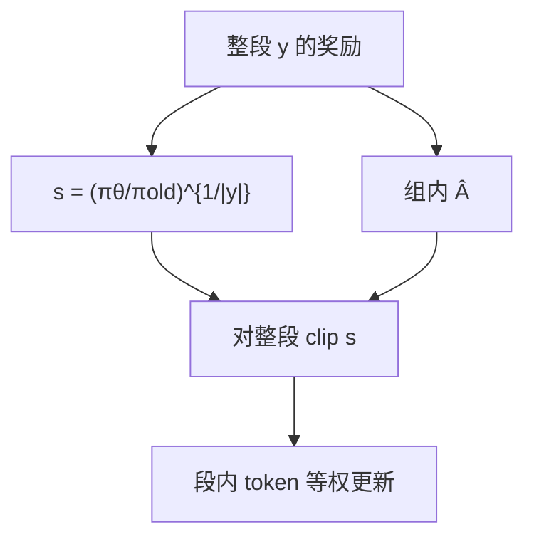

# GSPO

    
奖励打在整段回复上，重要性权重却按 token 来乘，目标是不适定的；把比率改成长度归一的序列似然，裁剪与优化才和奖励同一粒度。

    <footer>—— Zheng 等，Group Sequence Policy Optimization，arXiv:2507.18071；Qwen Team</footer>

[GRPO](/llm/grpo) 去掉 critic，仍把 PPO 的 **token 级**重要性比率 $w_{i,t}=\pi_\theta(y_{i,t}\mid\cdot)/\pi_{\mathrm{old}}(y_{i,t}\mid\cdot)$ 留在目标里。Qwen 团队的 **GSPO** 认为：大模型、长回复、再把一个大 rollout batch 切成多个 mini-batch 做 off-policy 时，这种比率不再执行重要性采样该做的分布校正，只是在每个位置注入高方差噪声，再被 clip 放大，直至不可逆崩塌。[Qwen3](/llm/qwen3-report) 后期 RL 把 GSPO 当作可缩放的算法基座。本篇写序列级比率与 MoE 上为何不再需要 Routing Replay。

## 问题

RL 要吃满硬件，rollout batch 往往很大，再切成例如 4 个 mini-batch 更新，样本来自 $\pi_{\mathrm{old}}$ 而梯度对 $\pi_\theta$，必须有 off-policy 校正。重要性采样的合法用法是：从行为分布抽**多个** $z$，用 $\pi_{\mathrm{tar}}(z)/\pi_{\mathrm{beh}}(z)$ 校正期望。GRPO 却对**每一个**下一词分布只抽一个 $y_{i,t}$ 就写一个比率。单样本比率没有校正能力，方差随长度累积。作者观察到一旦崩塌，回滚检查点、改 clip、加长生成或换题集都救不回来。

第二条是 MoE。Qwen3-30B-A3B 上，一次梯度更新后同一条回复的激活专家可改约 **10%**（48 层）。Token 级 $w_{i,t}$ 比较的是两条不同子网络的对数概率，比率失去意义。层数越深，这种路由挥发越明显，GRPO 在巨型 MoE 上的崩塌往往不可逆：回滚检查点再微调 $\varepsilon$、加长生成或换题集，作者说都救不回来。他们曾用 **Routing Replay**：缓存 $\pi_{\mathrm{old}}$ 的路由，在 $\pi_\theta$ 上重放，才能让 GRPO 收敛。这额外占显存与通信，还冻结了专家的实际容量——策略不能在更新后使用新路由，等于训练一个被旧专家图绑住的稠密子网。GSPO 要同时回答「长链 off-policy 稳定」和「不要再为 MoE 写特殊补丁」。

### 优化单位应等于奖励单位

结果奖励 $r(x,y)$ 是序列标量。Token 级 clip 会丢掉整段里一部分位置、保留另一部分，等于用残缺序列去拟合整段回报。GSPO 的原则是：重要性权重、clip、优势、目标全部在**序列**上定义。

GSPO 的 clip 区间是 $3\times 10^{-4}$ 与 $4\times 10^{-4}$ 量级，与 GRPO 的 $0.2/0.27$ 不是同一量纲：一边是几何平均后的序列比率，一边是逐 token 比率。不要把 0.2 抄进 GSPO。

## 方法

组相对优势不变：

$$
\hat A_i=\frac{r(x,y_i)-\mathrm{mean}_j r(x,y_j)}{\mathrm{std}_j r(x,y_j)}.
$$

序列级比率取长度归一的似然比（几何平均）：

$$
s_i(\theta)=\Bigl(\frac{\pi_\theta(y_i\mid x)}{\pi_{\mathrm{old}}(y_i\mid x)}\Bigr)^{1/|y_i|}
=\exp\Bigl(\frac1{|y_i|}\sum_t\log\frac{\pi_\theta(y_{i,t}\mid\cdot)}{\pi_{\mathrm{old}}(y_{i,t}\mid\cdot)}\Bigr).
$$

目标对整段 clip：

$$
\mathcal{J}_{\mathrm{GSPO}}=\mathbb{E}\Bigl[\frac1G\sum_i\min\bigl(s_i\hat A_i,\,\mathrm{clip}(s_i,1-\varepsilon,1+\varepsilon)\hat A_i\bigr)\Bigr].
$$

长度归一把不同 $|y|$ 的比率拉到同一数值范围，否则少数 token 的似然变化会让序列比爆炸。梯度上，GSPO 用同一个 $s_i\hat A_i$ 去乘该回复**所有** token 的 $\nabla\log\pi$，即段内等权；GRPO 则让每个 token 乘自己的 $w_{i,t}$，权重可在 $(0,1+\varepsilon]$ 或 $[1-\varepsilon,\infty)$ 间乱跳。

**GSPO-token。** 需要逐步优势（多轮 RL）时，令 $s_{i,t}=\mathrm{sg}[s_i]\cdot \pi_\theta(y_{i,t})/\mathrm{sg}[\pi_\theta(y_{i,t})]$，数值上 $s_{i,t}=s_i$，但 $\hat A_{i,t}$ 可按 token 改。$\hat A_{i,t}=\hat A_i$ 时与 GSPO 等价。

实验：从 Qwen3-30B-A3B-Base 冷启动，rollout 切 4 个 mini-batch。GSPO clip 左/右 $3\mathrm{e}{-4}$ / $4\mathrm{e}{-4}$；GRPO 对照精心调到 $0.2/0.27$ 且**必须** Routing Replay。GSPO 无 Routing Replay 仍稳定，同算力下训练奖励与 AIME'24 / LiveCodeBench / Codeforces 曲线更高。被 clip 掉的 token 比例比 GRPO 高约两个数量级，但样本效率更好——作者以此说明 GRPO 的 token 梯度本身很噪。

## 机制

几何平均把「整段有多 off-policy」收成一个接近 1 的标量。Clip 一次，要么整段进梯度，要么整段丢掉，不再出现「前半段还在、后半段被裁」的残缺信用。MoE 上，个别专家抖动会改若干 token 的 $\pi(y_t)$，但语言模型整体仍能给整段一个稳定的 $\pi(y\mid x)$；序列似然对路由噪声不敏感，故不必重放路由。作者还观察到一个反直觉现象：GSPO 裁掉的 token 比例比 GRPO 高两个数量级，用更少的位置做梯度估计，训练奖励与榜分反而更好。这说明 GRPO 留下的那些「没被 clip 的 token」并不等于高质量样本，只是噪声里碰巧落在信任域内的位置。持续加训练算力、定期换题、加长生成，在 GSPO 曲线上仍能涨，是他们把该方法写进后续 Qwen3 后训练的理由。

训练引擎与推理引擎的对数概率常对不齐。GSPO 只用序列级似然，理论上更容忍这种误差，甚至可以考虑直接用推理引擎返回的似然、省掉训练引擎重算。这是基础设施潜力，不是论文主实验的默认实现。

### 与 DAPO / CISPO 不在同一根轴

[DAPO](/llm/dapo) 仍是 token 级比率，改的是上下 $\varepsilon$、零梯度组与平均方式。[CISPO](/llm/minimax-m1) 把 clip 从比率移到 IS 权重，仍按 token 更新。GSPO 改的是**比率的定义域**。三者都批评 GRPO 的 clip，但「放宽上界」「永远不丢 token」「整段丢或留」是三个不同处方。Qwen 报告里的 MoE 崩塌，前两剂都不针对专家抖动。

## 边界与工程取舍

GSPO 的几何平均是对真序列重要性权重的有偏近似（长度归一）。后续有工作指出它扰动了奖励与 KL 的原则性权衡；若目标是渐进无偏，不要把 GSPO 写成最后理论形态。序列级 clip 在需要逐步信用（过程奖励、多轮工具）时粒度粗，要用 GSPO-token 并自己定义 $\hat A_{i,t}$。

主实验是 Qwen3 MoE 冷启动 + 可验证奖励。稠密小模型、短回复上，token 级噪声未必致命，GSPO 的收益会缩小。Clip 分数虽高，被丢掉的整段可能含稀有正例；题集过窄时要盯被 clip 的奖励分布。

「最新 Qwen3 的增益归功于 GSPO」是 2507.18071 与 Qwen 博客的说法，对应报告撰写时的后训练。不要回溯成 Qwen3 技术报告（2505.09388）里已经写死的公式。

### 何时不必换 GSPO

没有 MoE、回复短、单次更新几乎 on-policy（$\mu=1$），GRPO / DAPO 往往够用。没有组采样（$G=1$），组相对优势与 GSPO 一并失效。要 $k=1$ 的通用 RLHF，看 [REINFORCE++](/llm/reinforce-plusplus)。

## 小结

- GSPO 用长度归一的序列似然比做重要性权重，对整段 clip，组内优势仍相对。
- 段内 token 等权；避免 GRPO 单样本 token 比率的高方差累积。
- MoE 上不依赖 Routing Replay，让专家在更新后自由改路由。
- 实验 clip 约 $3\mathrm{e}{-4}/4\mathrm{e}{-4}$；被裁 token 更多，训练效率仍高于调过的 GRPO。
- 出处：Zheng 等（Qwen Team），*Group Sequence Policy Optimization*，arXiv:2507.18071；https://qwenlm.github.io/blog/gspo/ 。
