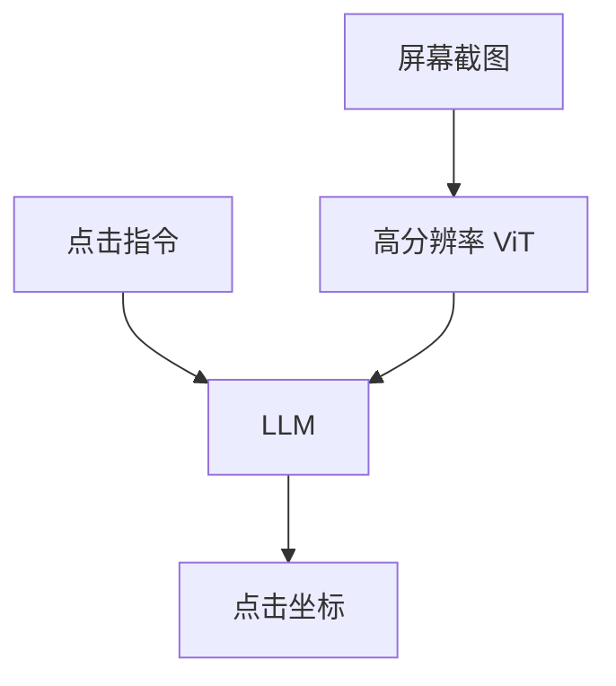
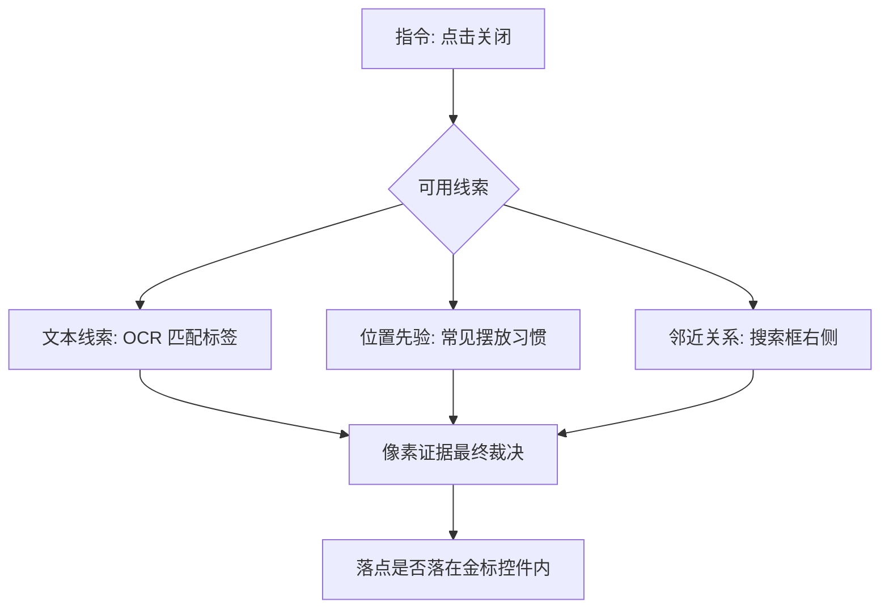

# GUI 定位

屏幕上的「提交」是一块像素控件，不是自然图里的物体名词。点偏一个图标，动作就错成另一个 API。

<footer>—— Cheng 等 SeeClick / ScreenSpot；Hong 等 CogAgent</footer>

[上一课](/llm/grounding-referring)在照片上输出框。缺口是 GUI：截图、图标、文字按钮、多层窗口，目标是可点击的点或控件框，供代理执行。后课图表默认：又一类必须读结构的人造画布，但任务从点击换成读数。

## 问题

自然图预训练（[CLIP](/llm/clip)、[ViT](/llm/vit-as-encoder)）看的是物体与场景。UI 是平面设计：细字、低对比图标、重复列表项，224 squish 会先毁掉可点目标。指令「点击关闭」在不同皮肤下外观不同，必须靠文字、位置与邻近元素，而不是「关闭按钮」这个物体类。

「224 squish」指把任意比例的截图硬压成 ViT 默认的 224×224 输入：1920×1080 的桌面面积约是它的 41 倍，压完按钮文字糊成一团。这就是 GUI 模型要高分辨率或切块编码、不能照搬自然图预处理的原因。

SeeClick 把 GUI grounding 从代理规划里拆出来：先在截图上把指令落到坐标，再谈规划。ScreenSpot 覆盖移动 / 桌面 / Web，按文本控件与图标分列——图标更难，因为少了 OCR 捷径。CogAgent 用更高分辨率视觉与 GUI 数据训专门的截图理解。

输出点还是框是协议。点击任务常用归一化坐标；框便于调试，但代理最终要一个点。元素 HTML 树若可得，像素 grounding 仍必要：渲染后的真源是截图。

## 方法

数据：截图–指令–坐标三元组，覆盖分辨率与主题。模型侧：原生或 [AnyRes](/llm/anyres) 分辨率 + 二维位置；[LLaVA 投影器](/llm/llava-projector) 浅桥仍可用，但冻 CLIP、低分辨率几乎做不成图标。评测：点击是否落在金标控件内（ScreenSpot），不要用 RefCOCO IoU 代替。规划基准（Mind2Web 等）应与纯 grounding 分列，否则分不清是看错还是计划错。

常见误区：拿 RefCOCO 的 IoU 高分当 GUI 能力。IoU 容忍把框画大一点凑重叠，而点击必须落进控件内部——偏半个按钮就可能触发另一个动作。ScreenSpot 用「点是否命中金标控件」判定，两种指标不可互换。

```mermaid
flowchart TD
  SHOT["屏幕截图"] --> VIT["高分辨率 ViT"]
  INS["点击指令"] --> LLM["LLM"]
  VIT --> LLM
  LLM --> XY["点击坐标"]
```

## 机制

GUI 定位把语言约束（标签文本、第 n 个、相对「搜索框右侧」）打到细格子上。OCR 能力与分辨率直接决定文本按钮；图标依赖外观与布局关系。语言先验「关闭在右上角」在移动 App 里经常错，必须被像素证据覆盖。

一条指令落地时，模型实际在几种线索之间做裁决：

```mermaid
flowchart TD
  INS["指令: 点击关闭"] --> C{"可用线索"}
  C --> T["文本线索: OCR 匹配标签"]
  C --> P["位置先验: 常见摆放习惯"]
  C --> N["邻近关系: 搜索框右侧"]
  T --> J["像素证据最终裁决"]
  P --> J
  N --> J
  J --> PT["落点是否落在金标控件内"]
```

## 边界

点对了不等于任务完成：弹窗、延迟、权限会让执行失败。下一课换成图表与表：结构是轴与单元格，不是可点控件。

可以把它想成「眼睛」与「手」的分工：grounding 只负责眼睛看准坐标；弹窗、加载延迟、权限确认是「手」执行时遇到的意外。评测把两者混在一起，就分不清是看错了还是没点到。

## 小结

- GUI 定位是截图像素上的指代，服务点击而不是描述。
- 分辨率与 UI 数据比加宽投影更关键。
- ScreenSpot 把文本控件与图标分开报。
- 出处：SeeClick；CogAgent。
