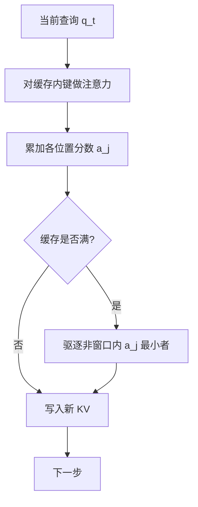

# H2O KV 淘汰

注意力质量集中在一小撮重击中 token 上；缓存里同时留下它们和最近窗口，就可以在固定槽位上继续生成，而不把中间历史整段保留。

<footer>—— Zhang, Sheng, Zhou, Chen 等，H2O: Heavy-Hitter Oracle，NeurIPS 2023</footer>

解码时 KV 随长度线性涨，最终会先于权重把显存打满。[窗口淘汰](/llm/kv-eviction) 只留最近 $w$ 个位置，实现简单，却会切掉文首汇点、也会丢掉远处仍被反复点名的实体。Zhang、Sheng、Beidi Chen 等人的 H2O（Heavy-Hitter Oracle）观察：少数 token 贡献了大部分累积注意力分数，称为 heavy hitters（H2）；去掉它们质量明显掉，只留最近窗口也不够。策略是在固定预算 $k$ 下动态保留 **H2 ∪ 最近 token**。本篇写累积分数、驱逐规则与和汇点方法的差别，不把量化 KV 或分页 LRU 写成淘汰。

## 问题

完整缓存的可见集是 $\{1,\ldots,t\}$。预算 $k<t$ 时必须选一个子集 $S_t$，后续 softmax 只在 $S_t$ 上归一化。选错的代价不可逆：驱逐等于让模型失忆，将来即使该 token 会变成关键，也找不回来。H2O 把这写成在线驱逐：每步最多丢掉一个旧槽，腾给新 token。

局部窗口假设「只有近邻有用」，在对话指代、文档问答里不成立。纯累积注意力的全局 top-$k$ 又会丢掉「刚刚出现、还没累积起分数、但马上要用」的词。论文用 OPT、LLaMA、GPT-NeoX 上的可视化说明：累积分数高度稀疏，且与词的共现相关；屏蔽 H2 会显著伤生成。于是预算要同时满足两种角色：长期重击中，以及短期局部上下文。

### 重击中不是汇点

[Attention Sink](/llm/attention-sink) 说的是文首几个位置吸走归一化质量，即使语义空洞。[StreamingLLM](/llm/streaming-llm) 因此钉住前 $k$ 个下标再滑窗。H2 是**内容上**被许多查询反复打高分的 token，可能在序列中部（实体名、问题里的关键词）。汇点几乎总在开头；H2 随文本变。两者常重叠（BOS 既是汇点也可能累积高分），但策略目标不同：汇点修的是滑窗破坏配分函数，H2O 修的是「中间重要证据被滑掉」。

H2O 是淘汰：被丢掉的键以后不再参与点积。QUEST 一类方法保留全部 KV、按当前查询挑选加载，失败模式是近似注意力而不是失忆。不要用同一套「压缩率」去比这两种对象。

## 方法

每个已缓存位置 $j$ 维护累积注意力

$$
a_j \leftarrow a_j + \sum_{h}\mathrm{softmax}(q_t^\top k_j/\sqrt{d})_h
$$

（实现上对头求和或取平均，论文用累积和。）新 token 到来、缓存满时，在「非最近窗口」的槽里驱逐 $a_j$ 最小的那个，写入新 KV，并把新位置纳入最近窗口。预算切成两块：一部分给 H2，一部分给 recent。论文常用约 20% 的 KV 预算（相对完整长度）在多种零样本任务上接近全缓存质量。

### 贪心 H2 与子模视角

理想的 H2 需要事后才知道哪些 token 全局重要，生成时不可得。在线算法用截至当前的累积分数当 oracle 的贪心替代。论文把驱逐写成动态子模最大化的变体，并论证在温和假设下贪心 H2 与「真正的」H2 驱逐行为接近。工程上不必实现那套证明，但要记住：分数必须在**未被驱逐的集合上**累积。已经丢掉的位置没有机会再加分，早期误杀无法纠正。

最近窗口的长度是超参。太短，局部句法崩；太长，H2 配额被挤掉，远处证据丢失。H2 配额太小则退化成滑窗；太大则新 token 还没被当成「最近」就被低分清掉。调参应在真实任务的长生成上做，而不是只看短补全的困惑度。

## 机制

机制是「用历史注意力当重要性的充分统计，并强制给新 token 一段保护期」。累积和偏向**已经活得足够久、且多次被看重**的位置，这与「持久重要性」同类，也是 [Scissorhands](/llm/scissorhands) 的邻居。H2O 的特色是把 recent 与 H2 显式拆成两段预算，并给出子模分析。共现强的词更容易成为 H2：它们在数据里常一起出现，注意力头学会把它们当锚点。

吞吐收益主要来自更小的 KV：同样显存可以加大 batch，或在卸载系统里少换页。论文基于 FlexGen 一类实现，相对 DeepSpeed ZeRO-Inference、HuggingFace Accelerate、FlexGen 基线给出最高约 29× / 29× / 3× 的吞吐，同 batch 延迟可降约 1.9×。这些数字含系统效应（更少 offload），不是纯注意力核的加速。现代分页引擎上应重测：淘汰减少的是逻辑可见长度，还要看核是否按稀疏集合高效读取。

FlashAttention 不物化完整注意力矩阵。若实现「先算完整 softmax 再累加 $a_j$」，会把 IO 感知核的好处打掉。生产实现需要在核内维护每键的标量分数，或退回到可观测注意力的较慢路径。分数统计的开销必须算进端到端。

### 和仅最近缓存、仅 H2 的对比

论文消融：同样 20% 预算，只留最近窗口质量差；用局部统计冒充 H2 也不如累积全局分数。H2 提供长程锚点，recent 提供正在展开的句子。缺任何一侧都会在某一类任务上露馅：总结需要远处主题词，对话需要刚刚说的槽值。

## 边界与工程取舍

淘汰不可逆，不适合「先闲聊、最后才问文档第 3 节」这种查询与重要性时间错位的负载——那是 [QUEST](/llm/quest-kv) 强调 query-aware 的动机。累积分数对早期 token 有偏：活得久的更容易变成 H2，新出现的专名要靠 recent 保护。多头之间重要性不一致，按头独立维护 $S$ 更准也更费内存；按层共享一套驱逐则更粗。

GQA 下分数应聚合到 KV 头，否则同一键被多个查询头重复加分，尺度乱掉。与 sink 同时用时，文首几个位置应禁止驱逐，以免配分函数塌掉。不要把 20% 当成常数：更长上下文、更难的针检索，预算要加。HELM 与 lm-eval-harness 上的短任务会高估淘汰的安全性。

H2O 改变的是模型看见的上下文，不是无损加速。评测必须看任务质量，不能只报吞吐。宣传「压缩 KV」时写明：这是近似生成，与投机解码的分布保持不是一类保证。

## 小结

- H2O 在固定预算下保留累积注意力高的 heavy hitters 与最近窗口，在线驱逐其余 KV。
- 重击中是内容锚点，与文首汇点不同；两者常同时需要。
- 在线分数是对理想 H2 的贪心近似；误杀不可恢复。
- 论文约 20% 预算在多种任务上接近全缓存；吞吐数字含卸载系统效应。
- 与 FlashAttention、GQA、sink 集成时要改分数维护，而不是物化稠密注意力。
- 出处：Zhang et al., *H2O: Heavy-Hitter Oracle for Efficient Generative Inference of Large Language Models*，NeurIPS 2023；arXiv:2306.14048。
