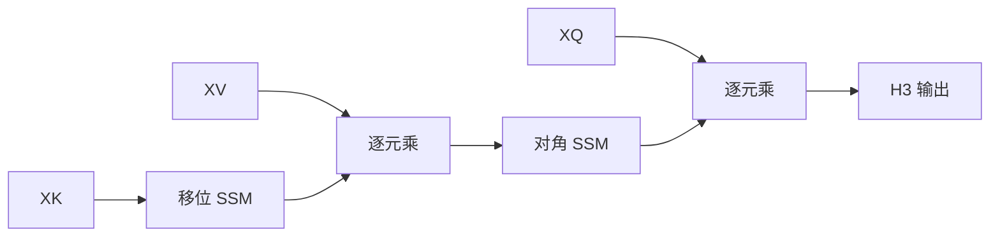

# Hungry Hungry Hippos

    
现有 SSM 过不了联想回忆：既要比对不同位置的 token，又要把配对过的值存进对角状态。两层 SSM 加逐元乘，把注意力擅长的那一招补上。

    <footer>—— Fu et al., Hungry Hungry Hippos: Towards Language Modeling with State Space Models, ICLR 2023</footer>

Gu 等人的 S4 证明结构化状态空间可以做长程序列，但在语言建模上仍明显落后 Transformer。Fu、Dao、Ré 等人 2023 年用合成语言诊断缺口：注意力能轻易做的联想回忆（associative recall）——见到键 $a$ 就取回先前与 $a$ 配对的值——当时的 SSM 只有五成左右正确率。他们提出 H3（Hungry Hungry Hippos）：堆叠一个移位 SSM 和一个对角 SSM，并在投影 $Q,K,V$ 之间插入逐元乘法。移位用来留下近邻 token 的日志，乘法用来比较，对角 SSM 用来把选中的值写入长记忆。再配上 FlashConv（分块 FFT 卷积加状态传递），H3 才能训到十亿参数。本篇写 H3 层与这篇诊断，S4 的 HiPPO 推导见状态空间本源，后续的 [Hyena](/llm/hyena) 把乘法–长卷积链又推深一层。

## 问题

离散 SSM 是

$$
x_t=A x_{t-1}+B u_t,\qquad y_t=C x_t.
$$

线性、时不变时，它等价于一条长卷积。S4 把 $A$ 做成适合长记忆的结构，训练用卷积核，推理用递推，复杂度对长度近线性。缺的不是记忆长度，而是**内容选择**：语言模型需要「把当前 token 与过去某处比较，再决定读哪一段」。注意力用 $q^\top k$ 做比较；线性时不变 SSM 对所有输入共用 $(A,B,C)$，没有乘法门，过不了联想回忆。

合成任务把缺口拆成两刀。第一，记住过去的 token：状态必须能把 $u_t$ 拷进 $x$，再移位传下去。第二，比较：当前查询要与过去的键相乘，而不是相加。现成的 S4 层两项都弱。H3 的设计目标是：在仍用 SSM 原语（因而能走卷积/扫描）的前提下，构造一层就能解联想回忆的机制，并在 OpenWebText 上把与 Transformer 的困惑度缺口从约 3.4 收到约 0.4。论文标题里的 Hippo 指向 HiPPO 记忆先验；Hungry Hungry 是在说：只吃长卷积不够，还得吃「比较」和「移位日志」。

## 方法

### 移位 SSM 与对角 SSM

H3 把输入投影成 $X_Q,X_K,X_V$。对键的一路，使用移位矩阵 $A$：状态向量像队列，$[a,b,c]\mapsto[0,a,b]$，把最近若干步的信息原样往后传。这是局部日志，不是压缩记忆。对值被门控之后的一路，使用对角 $A$（S4D 一类），每个隐维度独立衰减，负责长程保存。两者都是离散 SSM，训练时仍可写成卷积。

### 乘法门：从线性注意力借来的比较

H3 显式对照线性注意力：那里 $\phi(K)$ 与 $V$ 外积再被 $Q$ 读出。H3 用 SSM 替换其中的非线性与求和。头维为 1 时，层写成

$$
\mathrm{H3}(X)=\mathrm{SSM}_{\mathrm{diag}}\bigl(\mathrm{SSM}_{\mathrm{shift}}(X_K)\odot X_V\bigr)\odot X_Q.
$$

$\mathrm{SSM}_{\mathrm{shift}}(X_K)\odot X_V$ 的含义是：若前一位置的键与当前值该配对（移位对齐后逐元乘很大），就把值放进后续记忆；对角 SSM 持续输出这段记忆；最后与 $X_Q$ 相乘，仅当当前查询匹配该键时才读出。论文在附录里构造了一组权重，使单层 H3 解特定键值对 $(a,3)$ 的联想回忆：移位+乘法决定「是否写入」，对角状态存 $3$，查询门决定「是否读出」。

多头时每头一套移位宽度与对角状态。整体仍是次二次：卷积核长度 $L$ 时 FFT 卷积 $O(L\log L)$。这与「再加一层注意力」不同，全部交互仍在 SSM 与逐元乘里。

### FlashConv：让 SSM 在 GPU 上训得动

表达力够了，朴素 FFT 卷积在中等长度上仍吃不满 Tensor Core，状态在块边界还要传递。FlashConv 把序列切块，块内融合的 FFT 卷积，块间传递 SSM 状态，避免物化整段卷积核与中间激活。没有这条，H3 很难扩到十亿参数与真实语言建模。论文同时给出 H3–注意力混合：多数层 H3，少数层 softmax，OpenWebText 上可以超过纯 Transformer——说明缺口被补上之后，SSM 主干已经能承担大部分工作。FlashConv 不是新的序列模型，是 H3 能成为语言模型层的系统条件。只复现层公式、用未融合 conv1d 扫十万长度，会得出「H3 很慢」的假结论。

## 机制

联想回忆需要一条可寻址的槽。注意力的槽是键的位置，地址是点积。H3 的槽是对角 SSM 的某些维度：写入条件由「键的移位拷贝 × 值」决定，读出条件由查询乘法决定。移位的宽度限制了「键必须出现在值附近」这一局部对齐；若键值在序列上隔得很远才配对，单层移位窗口不够，要靠多层或更大状态。这与注意力「任意距离只要点积高」不同，也解释了为何合成任务上 H3 能打满、真实语言仍略逊：自然语言的共指距离分布更长尾。

乘法是唯一的非线性比较。没有它，两层 SSM 仍是线性时不变级联，等价于更长的卷积，解不了「仅当匹配时写」。有了它，整体对输入是双线性/三线性的，和线性注意力同族，但求和被对角动力学替代，状态有衰减，不会像朴素线性注意力那样把所有外积无界累加。

混合注意力层补的是 H3 仍然弱的全局精确匹配。论文把这当作工程扩展而不是承认失败：纯 H3 已接近，插少数注意力把头对齐到 Transformer。后来 Hyena 证明：把「乘法+长卷积」重复多阶、并用隐式滤波器参数化，可以在不插注意力的情况下再逼近一截。

## 边界与工程取舍

H3 不是通用 softmax 替换：针测距离超过移位状态宽度时，要加深或加宽状态，或混注意力。对角 SSM 的数值与初始化（HiPPO / S4D）仍敏感，乱初始化会失去长记忆。语言建模的 0.4 困惑度缺口是 OpenWebText、中等规模上的数字，不能直接当成今日 LLM 的缩放定律。

与 [Mamba](/llm/mamba) 的关系：Mamba 把选择放进输入相关的 $\Delta,B,C$；H3 把选择放进显式的 $Q,K,V$ 乘法与两种 $A$。Mamba 更晚、更强调硬件感知扫描；H3 更早指出「SSM 缺比较」。不要用 H3 层去替代已经在扫的 Mamba 块，除非在消融里单独验证联想回忆。

FlashConv 依赖块大小与 FFT 长度对齐。块太小，状态传递频繁；块太大，融合核的共享内存装不下。推理时可以改回递推，状态是移位缓冲加对角隐状态，仍与长度无关，但实现要与训练卷积核一致，否则训练/推理鸿沟会表现为「合成任务过了、生成胡言」。合成任务满分只说明层里存在一条解联想回忆的构造，不说明该构造会被梯度找到。真实语言上的 0.4 困惑度缺口，才是「机制在数据里是否被用上」的证据。

## 小结

- H3 针对 SSM 过不了联想回忆：缺移位日志与跨位置比较。
- 层公式是对角 SSM（移位 SSM$(K)$ $\odot$ $V$）再 $\odot$ $Q$，灵感来自线性注意力。
- 单层可构造权重解键值回忆；OpenWebText 上大幅收窄与 Transformer 的差距。
- FlashConv 的分块 FFT 与状态传递是可训练性的一部分。
- 与注意力混合可超过纯 Transformer；纯 H3 仍略弱于全局点积。
- 选择发生在乘法门，不是 softmax；后续 Hyena / Mamba 走不同的选择参数化。
- 出处：Fu, Dao, Saab, Thomas, Rudra, Ré, *Hungry Hungry Hippos: Towards Language Modeling with State Space Models*, ICLR 2023；SSM 骨架来自 Gu 等人的 S4。
