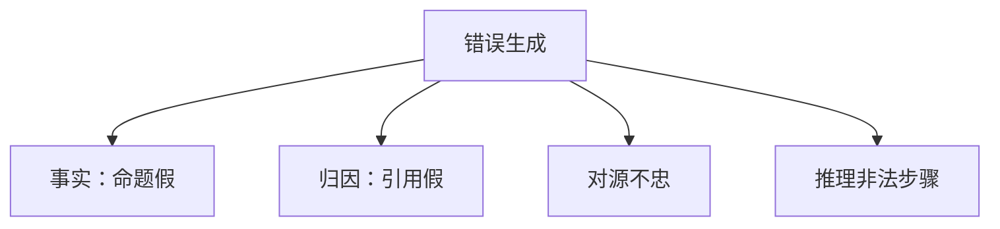

# 幻觉分类

不是所有假话都是一类病。事实编造、错误引用、无根据的推理，对应不同的持有集和不同的训练补丁。

<footer>—— 对照 Ji 等幻觉综述的分类习惯；事实轴见 [SimpleQA](/llm/simpleqa-freshqa)</footer>

[上一课](/llm/faithful-cot)把「说得像推理」从「算得对」里拆开。本课把**假内容**再拆开：幻觉分类。主干已有诚实与引用课；缺口是产品上把一切错误叫幻觉，导致检索、拒答、解码温度被当成同一味药。

## 问题

[虚构引用](/llm/honesty-citations) 是幻觉的一种：有来源形态、无来源事实。另一些是封闭书知识错误、过时知识、工具返回被改写、以及推理链上的非法步骤。若只用「幻觉率」一个数，RAG 系统会与纯参数模型比错对象：前者的错更常是检索未命中后的脑补，后者是记忆与校准。

本课钉三类，后课弃权只处理「知道自己不知道」那一类。

## 方法

三类。**事实幻觉**：可核验命题为假。**归因幻觉**：命题或许可真，但引用、页码、链接是编的。**忠实性幻觉**（对源文本）：摘要/RAG 中添加源里没有的约束。评测必须分列：封闭书 QA、引用可解析率、忠实度（源约束）。不要把数学算错算进事实幻觉——那是推理错误，走可验证奖励。

「幻觉」在临床是感知，在 LLM 是生成。词已经用滥。写报告时宁可写「封闭书错误 / 归因错误 / 对源不忠」，把幻觉留作口头统称。

## 机制

事实错误来自参数里的错误相关与过自信解码。归因错误来自「学术文风」先验：人类文本常带引用形态，语言模型会补全形态。对源不忠来自上下文与参数记忆的混合——[长上下文是否取代 RAG](/llm/long-context-vs-rag) 没有取消混合，只是把源放进窗口。分类的用处是选补丁：事实走检索与校准，归因走强制引用解析，对源走抽取约束。

## 边界

本课不给越狱式「诱导编造」的提示。下一课弃权是事实轴上的动作，不是归因解析器。版权与记忆化是另一条法律/提取轴，再后一课才写。

## 小结

- 幻觉要分事实、归因、对源不忠；推理错误单列。
- 单指标幻觉率会让 RAG 与闭书模型比错。
- 补丁按类选，不共用一个温度旋钮。
- 出处：幻觉综述的分类习惯；SimpleQA / 引用课。
