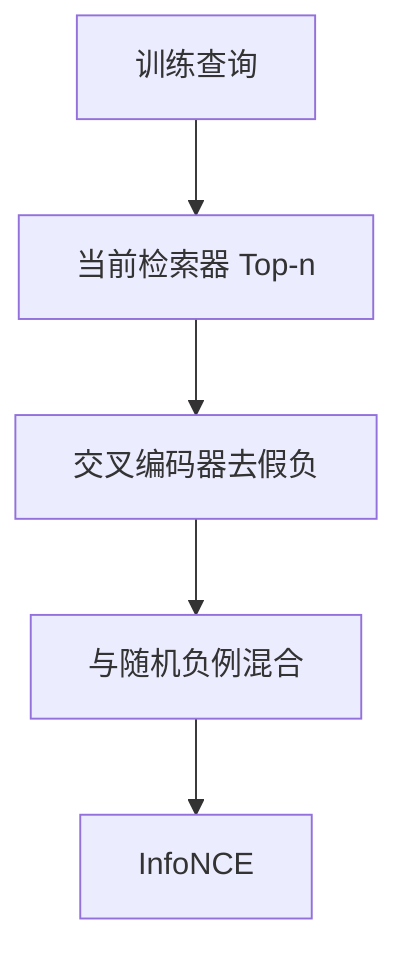

# 难负例挖掘

批内随机负例太容易，模型学会的是主题分类。要把「看起来像、其实不答」的文档挖出来，度量才进入细粒度。

<footer>—— Karpukhin 等 DPR 的 BM25 负例；Xiong 等 ANCE 的用当前模型挖负例</footer>

[上一课](/llm/contrastive-infonce)的 InfoNCE 梯度由高分负例主导。随机批内负例分数往往很低，梯度接近零。本课写难负例。缺口是训练分布：负例从哪来、何时会变成假负。后课 Matryoshka 默认空间已经靠难负例撑开，而不是靠加维。

## 问题

Karpukhin 的 DPR 用 BM25 检索到的高分但标注不相关的段落当负例，比随机负例强。静态挖一次会过时：模型更新后，难例集合不再难。Xiong 等 ANCE 用当前检查点异步建索引、检索难负例，空间跟着模型走。RocketQA 等再引入交叉编码器去假负：双塔认为难、交叉编码器认为相关的，不当负例。

假负例会伤害召回：同义改写被推远。只追「最难」还会不稳定，损失被少数噪声对主导。需要混合：随机、BM25、模型挖到的、以及少量金标难负。

难负例不是越多越难越好。验证应看细粒度对（易混淆实体、相反极性），不是只看主题级召回。

## 方法

流水线：用现索引对训练查询取 Top-$n$ 非正例 → 可选交叉编码器过滤 → 与批内随机负例混合进 InfoNCE。更新频率：过勤则索引抖动、过慢则负例变易。文档侧挖掘（对每个文档找易混查询）对称可用。标注预算应花在「双塔高分、标注员说不相关」的切片上。

## 机制

随机负例只要求 $z_q$ 离开无关主题的云团。难负例要求在同一主题云团内部把正确段落与近邻段落分开，于是表示必须编码约束、实体与极性。ANCE 的异步更新是在对正在移动的流形做近似硬负采样；延迟过大，挖到的是旧流形上的难例，对新模型又变易。

## 边界

没有标注时，交叉编码器本身会错，去假负会去掉真难例。应抽检。下一课 Matryoshka：同一套对比目标下，如何让截断后的短向量仍然可用。

## 小结

- 难负例把对比学习从主题分类推进到细粒度匹配。
- 静态 BM25 负例会过时；用当前模型挖并去假负。
- 与随机负例混合，避免被噪声对主导。
- 出处：Karpukhin 等 DPR；Xiong 等 ANCE；RocketQA 去假负。
