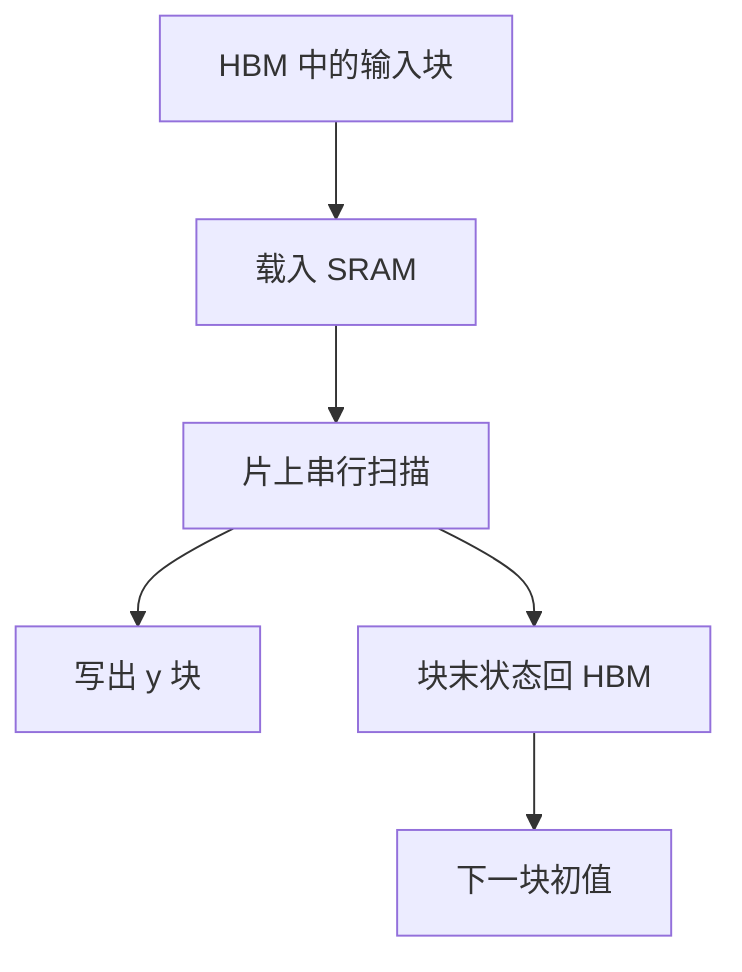

# 硬件感知扫描

不把长度为 $n$ 的状态写回 HBM，而是在 SRAM 里完成一块扫描，只把块间边界传出去。

<footer>—— Gu &amp; Dao, Mamba, 2023（硬件感知算法一节）</footer>

[上一课](/llm/selective-scan)给出逐步 $h_t=\overline{A}_t h_{t-1}+\overline{B}_t x_t$。按 token 逐步在 HBM 上读写 $h$，带宽会先于 FLOPs 把训练拖死：状态宽 $N$、序列长 $n$、再乘 batch 与通道，流量不可接受。本课补 Mamba 论文里的硬件感知实现：像 FlashAttention 一样，把扫描当成**片上算法**，数学对象不变。下一课分块并行形式把结合律写显式，和本课的片上分块是同一件事的代数版。

## 问题

选择性之后没有卷积，不能靠 FFT 一次读完 $x$ 写出 $y$。朴素循环每步从 HBM 读 $h$、写 $h$，算术强度极低。GPU 要的是大矩阵乘，扫描却是依赖链。缺口不是改动力学，而是：**在不物化完整状态序列的前提下完成扫描与反传**，把 HBM 流量从 $\Theta(nN)$ 的多次读写收到块边界级。

FlashAttention 重算注意力分块；这里重算或片上累积的是线性 RNN 状态。思想同源，算子不同。不要把本课写成 FlashAttention 教程。

硬件感知是实现约束进入算法设计，不是「换一张更快的卡」。同一公式，物化状态与不物化，速度可以差一个数量级。

## 方法

沿长度切块。每块把 $x$、$\Delta,B,C$ 相关投影载入 SRAM，在片上串行更新 $h$，块结束只把最终状态写回 HBM，作为下一块的初值。输出 $y$ 可以在片上用 $C_t h_t$ 当场写出，不必存所有 $h_t$。反向：再读块内输入、从块末状态反向扫描，或重算块内前向，用检查点换带宽。

工作区大小由 SRAM 限制，块长 $B$ 选到放得下 $B\times N$ 量级的状态与输入。$N$ 过大则块必须极短，收益消失——这是状态维的硬件上限，后课会与召回质量对质。

### 与矩阵乘的关系

输入投影、输出投影仍是 GEMM，占大部分 FLOPs。扫描内核占带宽。优化扫描是为了不让这条依赖链把 GEMM 饿死。把整个 SSM 层融合成一个核（投影+扫描+门）是工程极限，课序只要求理解「状态不写回」。

## 机制

结合律保证块间只需传递一个状态向量，块内顺序不能乱。这与注意力分块不同：注意力分块还要沿 $K$ 维做 softmax 归约，需要多遍或在线 softmax。扫描的归约是状态本身，单次前向即可，反向再走一遍。数值上片上用较高精度累积 $\overline{A}$ 的连乘，避免半精度下衰减链下溢成全零状态。

并行度来自 batch、通道、头（SSM 常按通道独立扫描），不是来自打乱时间。时间维在块内仍串行。这规定了占用：通道数不够时，扫描核填不满 SM。

编译器不会自动把 PyTorch 的 for 循环变成这种核。没有融合扫描，Mamba 层在实际速度上打不过即便更费 FLOPs 的注意力短上下文。

## 边界

本课不引入新的模型能力。换设备（TPU 的 SRAM 层级不同、NPU 的向量扫描原语不同）要重写核，算法意图不变。错误的检查点会让反传多读数倍 HBM，表面上「实现了扫描」却无加速。下一课用结合律把块内也可以写成可并行的矩阵形式，那是为了训练更长块与更通用的线性注意力，不只是 SRAM 技巧。

## 小结

- 硬件感知扫描避免物化整段状态，只在 SRAM 内更新、HBM 上传递块边界。
- 数学仍是上一课的选择性扫描；变的是存储层级。
- 反向靠块内重算或反向扫描，用计算换带宽。
- 状态维 $N$ 受 SRAM 限制；无融合核则理论线性时间兑不现。
- 出处：Gu & Dao, 2023。
