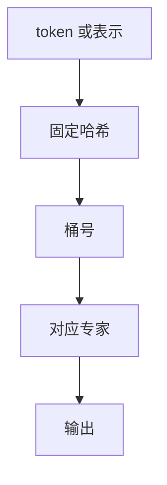

# 哈希路由

用固定哈希把 token 分到专家，路由没有可学习参数，负载由哈希决定，也不再需要辅助损失。

<footer>—— Roller, Sukhbaatar &amp; Weston, Hash Layers For Large Sparse Models, NeurIPS 2021</footer>

[上一课](/llm/state-size-vs-context)把序列记忆预算钉死，并声明 MoE 专家数不是状态维。主干 [MoE 路由](/llm/moe-routing) 用可学习线性把 token 送到 top-$k$ 专家，再靠均衡损失对抗崩塌。本课从补层「MoE 进阶」起笔：先问能不能**去掉可学习路由**。哈希层用 token 身份或特征的固定哈希选专家。后课 Soft MoE、无辅助损失均衡，都默认你会「可学习门不是唯一分派器」。

## 问题

可学习路由有三笔税：门参数与其不稳定、辅助损失与主损失抢梯度、训练与推理的负载不一致。[Switch](/llm/switch-transformer) 把 $k$ 收到 1，税还在。缺口是：若只想要稀疏参数、不在乎「这个专家语义上专精什么」，能否用无参数的哈希保证负载近乎均匀，把优化还给专家本身。

Roller 等人的 Hash Layers 在大稀疏模型上验证这条。哈希键可以是 token id、位置、或上一层表示的量化——课序默认 token 特征哈希，强调固定性。

哈希路由仍是 token choice：每个 token 独立进桶。它不是 expert choice，生成时也没有未来泄漏问题。

## 方法

对 token 表示 $x$ 或离散 id，计算 $h=\mathrm{hash}(x)\bmod N$，把 $x$ 送到专家 $E_h$。可用若干独立哈希取 top-$k$ 个桶，模拟多专家。训练与推理同一哈希，无 dropout 式随机门。容量因子仍可保留：桶过满时溢出到第二哈希，避免极端碰撞。

没有路由 logits，就没有「把概率乘回输出」的 Switch 变体问题。专家输入是硬分派的 $x$。若哈希只看 token id，同一词永远进同一专家，词表被静态划分；若看连续表示，须先量化，否则浮点扰动会改变桶——那又引入抖动，后课会写。

### 均衡如何得到

理想哈希下各桶期望均等。真实语言模型的 token 分布极不均：高频功能词会打满某些桶，若哈希键是 id。因此实践中更常哈希连续特征或加盐，让高频词仍能散开。均匀是哈希质量问题，不是辅助损失问题。

## 机制

可学习路由的好处是专家可以按内容聚类（句法专家、代码专家）。哈希放弃聚类，换稳定性与零路由参数。专家仍会在自己看见的数据子集上特化，但特化轴是哈希切开的任意切片，不一定可解释。微调时哈希不变，专家分工被冻在切片上，不能靠改门把一类新任务送到少数专家——这与后课 MoE 微调的可学习门形成对照。

计算图没有 All-to-All 之前的 softmax 门，但 All-to-All 仍在：token 仍要按桶聚到拥有该专家的设备。[通信比](/llm/moe-comm-compute-ratio) 课会算这笔，哈希只省了门，不省通信。多哈希取 $k$ 个桶时，碰撞与均匀改善，但同一 token 仍可能被送进语义无关的一对专家，专家内部的分拣负担随 $k$ 涨。

固定哈希与位置绑定会让「第 $i$ 个位置总进专家 $i\bmod N$」，负载均匀但语义灾难。不要用位置当唯一哈希键。

## 边界

需要内容特化的任务上，哈希通常弱于可学习 top-$k$。哈希碰撞把无关 token 塞进同一专家，专家内部还要自己分拣，浪费宽度。不能把哈希层的检查点改回可学习门而不重训。下一课 Soft MoE 走另一极端：每个 token 与每个专家都有软组合，均衡天生，但不再稀疏。

## 小结

- 哈希路由用固定分派换掉可学习门与辅助损失，负载靠哈希质量。
- 专家仍会在切片上特化，但轴不一定语义可解释，微调也不能改门。
- 不省 All-to-All；只省路由参数与其不稳定性。
- 词表 id 哈希会被词频打歪；位置哈希会毁语义。
- 出处：Roller et al., NeurIPS 2021。
