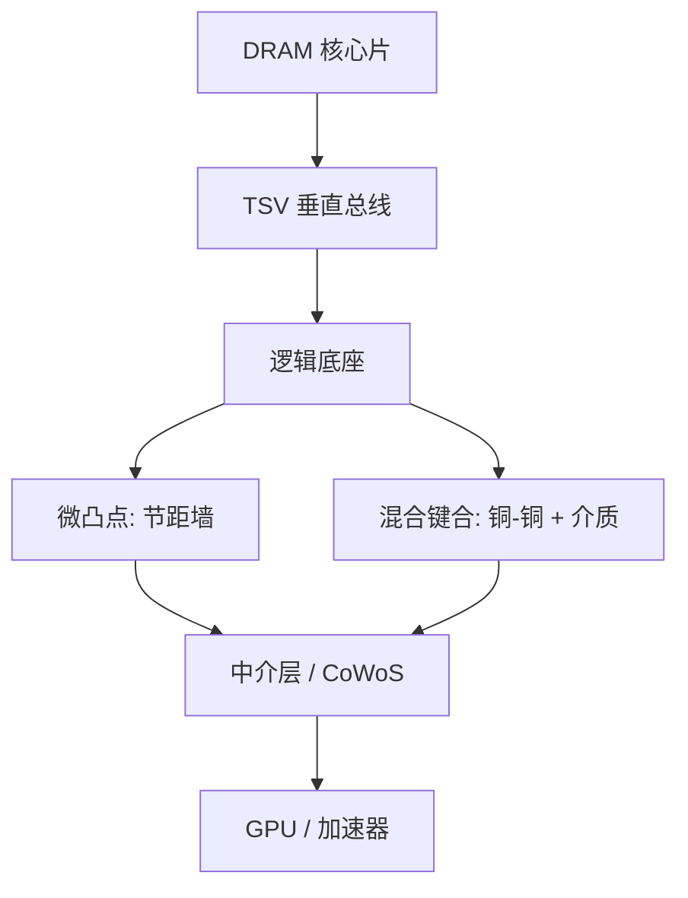

# HBM 堆叠与混合键合

高带宽存储器把多片 DRAM 叠在底座上，用宽 I/O 换带宽；带宽的下一步不再只靠拉高每针速率，而靠把凸点节距收进混合键合能提供的互连密度。

<footer>—— 对照 JEDEC HBM 标准族与堆叠互连的公开演进</footer>

HBM（High Bandwidth Memory）是 JEDEC 标准化的堆叠 DRAM：多片核心裸片通过硅通孔（TSV）连到逻辑底座，再以极宽的接口接到邻近的 GPU 或加速器，通常坐在 [2.5D 中介层](/llm/cowos-2p5d) 上。HBM2/2E/3/3E 一代代加高堆叠层数、加宽有效带宽，微凸点与 TSV 的节距、电流和热成为墙。混合键合（hybrid bonding）把铜对铜与介质对介质在同一平面键合，互连节距从数十微米级走向个位数微米，I/O 数目和电源完整性一起改写。它不是另一种封装商标，是堆叠互连从焊接凸点换成晶圆级键合界面。

## 问题

加速器要的是 TB/s 级的邻近存储器，片外 GDDR 的针数和能耗先顶住。HBM 的答案是：把 DRAM 立体叠起来，接口做到 1024 位量级（后续代际再扩），用中介层走很短的微凸点。JEDEC 文件（HBM2 的 JESD235 族、HBM3 的 JESD238 族等）规定的是电气、时序、容量与栈配置，并不规定你必须用哪一种键合。微凸点在节距缩到约 $30$–$40\,\mu\mathrm{m}$ 之后，凸点共面、底部填充、电迁移和能布下的 I/O 数目开始不够支撑下一代位宽与供电。

热是另一堵墙：栈越高，上层 DRAM 离散热越远，刷新与刷新管理已经写进标准，但物理上的结温仍由键合界面热阻和底座功耗决定。问题是：在 JEDEC 兼容的带宽与容量目标下，如何把互连密度和热阻同时做成可制造，而不是只把数据速率再乘一个系数。

### 带宽预算：位宽 × 速率 × 通道

粗算 $B \approx N_{\mathrm{pin}} \times f \times \mathrm{DRAM\ stacks}$。HBM3E 一类产品靠更高的每针速率和更高栈（8Hi/12Hi）把单栈推到约 TB/s。HBM4 公开讨论把接口位宽再翻倍量级，微凸点阵列的面积和中介层逃逸会先爆。加针比加速率更吃节距；这正是混合键合的命题：同样硅面积上放下更多垂直通孔与键合垫。

不要把 HBM 写成「更快的 DDR」。它是宽、短、高功耗密度的栈，测试、修复（软/硬修复）、温度与刷新都按栈来，而不是按单片 DIMM 来。JEDEC 兼容保证的是接口合同，良率和热要各家工艺自己收。

## 方法

现行量产 HBM 多用微凸点把 DRAM 片与底座、以及底座与中介层连起来，片间 TSV 提供垂直总线。混合键合路径是：晶圆或裸片表面做极平坦的铜垫与介质，对准后键合，铜形成金属通路，介质提供机械与绝缘。节距可进到 $10\,\mu\mathrm{m}$ 以下并继续走，I/O 密度按面积平方反比涨。键合可以是晶圆对晶圆（W2W）或裸片对晶圆（D2W）：W2W 吞吐高但对齐与良率绑定整片；D2W 可选已知好裸片（KGD），更适合昂贵的逻辑底座。

对 HBM，混合键合可以发生在 DRAM 片之间、DRAM 与底座之间，以及——在更激进的集成里——底座与逻辑之间。每一处都要把 TSV、键合垫、应力和后续减薄对齐。测试要从「凸点后可探针」改成「键合前表面可测、键合后只能通过边界与 BIST」，故障隔离更难。

### 与中介层的分工

HBM 栈再密，逃逸仍要落到中介层或有机基板上才能接到 GPU。混合键合提高的是栈内部和栈—底座的密度；中介层上的 RDL/TSV 若不变，只是把瓶颈挪到 [CoWoS](/llm/cowos-2p5d) 的微凸点或 RDL 节距。完整故事是：栈内混合键合 + 中介层侧也收节距，带宽才能从 JEDEC 纸面走进系统。

## 机制

微凸点是焊接：有焊料、IMC、底部填充，机械上靠凸点阵列的塑性与聚合物。节距缩小后焊料体积不够，IMC 变脆，底部填充流动困难。混合键合是固相铜连接加介质键合，界面热阻更低、互连电阻更小，但要求纳米级粗糙度、洁净和控制的铜凹陷（dishing）。键合后的退火让铜膨胀形成可靠接触；应力会传到 DRAM 的电容与晶体管，刷新时间和变差必须重新表征，不能假设「只是换了凸点」。

TSV 密度随键合节距一起涨，Keep-out 区吃掉 DRAM 阵列效率。栈越高，TSV 良率按片数连乘，修复与冗余必须按 JEDEC 允许的方式设计进底座。混合键合若在片间引入周期性空洞或对准系统偏差，会表现为特定 DQ 组或特定层的失效，而不是随机 bit。

混合键合不是 3D NAND 那种串行存储堆叠的同义词。HBM 要的是宽同步接口、可测底座和与逻辑封装的共存。把「已经会堆 NAND」直接写成「已经会 HBM 混合键合」，会低估对准、测试与 DRAM 应力。

### 供电与信号完整性

位宽翻倍意味着电源针和地针也要翻，否则 SSN 把眼图吃掉。混合键合提供更密的电源垫，但中介层和基板的平面仍要接得住电流。HBM 的功耗是加速器系统功耗的显项：带宽用不满时，栈仍在漏电和刷新。系统侧要与 JEDEC 的功耗状态、温度读出一起调度，而不是只在 RTL 里把总线开到最大。

## 边界与工程取舍

JEDEC 保证多源接口，不保证每家的键合技术可互换。换键合等于换应力、换测试插入点、换合格率模型。W2W 在 DRAM 这种高良率存储上较顺，逻辑底座若用 W2W 会把逻辑缺陷乘到整栈。D2W 混合键合的对准吞吐是产能墙，与 CoWoS 产能叠加，会成为 AI 加速器交货的隐藏节拍。

不要用「混合键合 HBM」替代热设计。界面热阻降了，底座和 GPU 的热密度可能更高，散热路径仍要穿过盖、硅、以及可能的液冷。标准会继续加速率与位宽；物理上先撞的是键合节距、中介层逃逸和系统热，而不是协议条款写不下。

引用 HBM 带宽时写清代际（HBM3 / 3E / 4）、栈高、以及是 JEDEC 规范峰值还是某家产品实测。把新闻稿 TB/s 直接写进板级功耗，会漏掉有效利用率与热降额。

## 小结

- HBM 按 JEDEC 把堆叠 DRAM 与宽短接口标准化，系统侧通常经 2.5D 接到加速器。
- 微凸点节距限制 I/O 与供电密度；混合键合用铜—介质界面把节距推进到微米级。
- 键合改变热阻、应力和测试插入，DRAM 刷新与变差必须重表征。
- W2W 与 D2W 的良率经济学不同，昂贵底座倾向已知好裸片。
- 栈内密度必须与中介层逃逸一起扩，否则瓶颈只是挪位置。
- 多源接口不等于键合工艺可互换。
- 出处：JEDEC HBM 标准族（JESD235 / JESD238 等）；堆叠与混合键合公开工艺论述。
