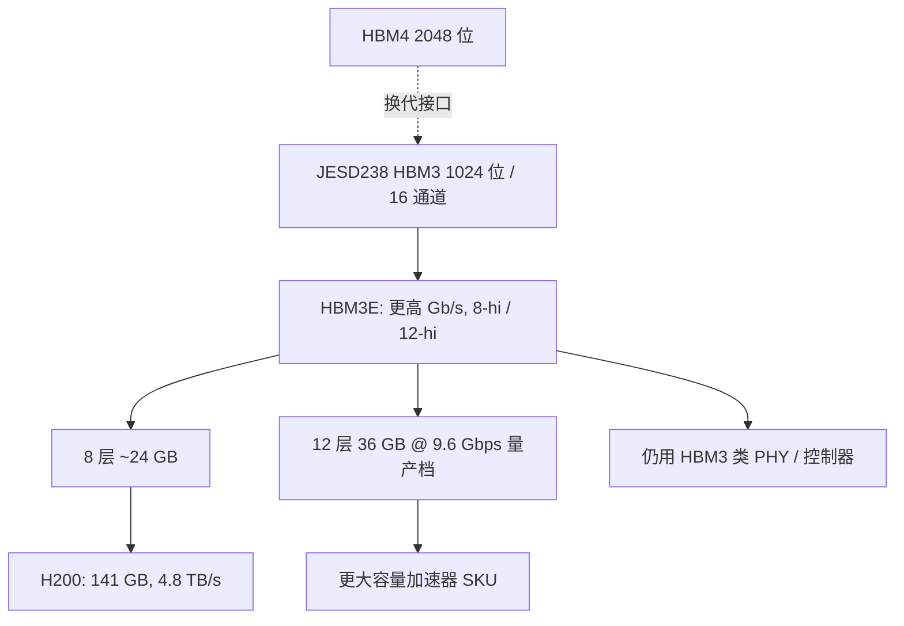

# HBM3E

HBM3E 是 HBM3 接口合同上的速率与容量延伸：1024 位、16 通道保持不变，每针数据率与栈高把单栈带宽推过 1 TB/s，并在 12 层上给出 36 GB 量级的立方。

<footer>—— 对照 JEDEC JESD238 HBM3 标准族，以及 SK hynix 对 12 层 36 GB、9.6 Gbps HBM3E 量产的公开说明</footer>

HBM3（JESD238）把堆叠 DRAM 的主流接口钉在 1024 位、16 个独立 64 位通道上，规范峰值数据率在 6.4 Gb/s 一档。加速器要的是更多容量和更高 $B$，又不想立刻换一套 2048 位的凸点图——那是 [HBM4](/llm/jedec-hbm4) 的事。各家因此在同一套 HBM3 控制器与通道架构上把每针速率和栈高往上推，产品名写成 **HBM3E**（Extended）。SK hynix 在 2024 年 9 月宣布全球首款 12 层 HBM3E 量产：36 GB 每立方、9.6 Gbps 针速。NVIDIA 把 HBM3e 做到 Hopper 的 H200：产品页写 **141 GB**、**4.8 TB/s**，相对 H100 的 80 GB HBM3 与 3.35 TB/s 是容量与带宽同时加一档。本篇写 3E 作为「仍在 JESD238 家族里的产品代际」，以及它怎样改 LLM 的容量墙与带宽墙。不把 9.6 Gbps 反推成每一张 H200 的实测针速。

## 问题

H100 SXM 的公开规格是约 80 GB HBM3、3.35 TB/s。70B 级权重在 FP16 下约 140 GB，单卡放不下；即便量化进卡，长上下文 KV 仍把容量墙顶穿。带宽墙上，decode 每步扫权重，时间下界是字节除以 $B$。只加 Tensor Core、不加 $B$ 与容量，推理并发和上下文先爆。需要一种换代：封装凸点图和控制器协议尽量不动，DRAM 核更快、叠得更高。这就是 3E 相对 3 的命题。

接口不变意味着中介层逃逸和 PHY 可以在 HBM3 签核基础上做速率延伸，而不是像 HBM4 那样重做 2048 位阵列。代价是：每针更快，眼图和功耗更紧；12 层要把芯粒减薄才能维持与 8 层相近的封装高度，热阻和机械变差。SK hynix 新闻稿写：12 层产品把每片 DRAM 减薄约 40%，用 TSV 叠到与此前 8 层相同的厚度量级，容量相对 24 GB 的 8 层 3E 增加 50%。减薄不是免费的：破片、翘曲、混合键合或 MR-MUF 工艺的选择，决定谁能量产 12 层。

### 针速、单栈带宽与整卡规格分开写

公开乘积：1024 位 × 9.6 Gb/s 给出 $1024/8 \times 9.6 = 1.2288\,\mathrm{TB/s}$ 每栈的规范式峰值。Rambus 等 IP 厂商把 HBM3E 控制器写到 9.6 Gbps、约 1229 GB/s 接口带宽，与此一致。整卡数字是另一回事。H200 产品页是 141 GB 与 4.8 TB/s，那是 NVIDIA 对该 SKU 的系统规格，已经包含栈数、实际运行速率、以及实现降额，**不要**用 6 × 1.23 TB/s 去「核对」4.8 是否算错——运行针速不必等于供应商宣传的最高 bin。H100 的 3.35 TB/s 同样低于「全宽 × HBM3 规范峰值 × 栈数」的纸面乘积。规划用产品页；理解物理用每栈公式。

HBM3E 不是一份与 JESD238 并列的全新标准名，而是 HBM3 标准族上的扩展速率与栈配置的产品称呼。控制器兼容 HBM3，是这条路线能快速进 H200 / 部分 Blackwell SKU 的原因。HBM4 才换 2048 位与 JESD270-4。

## 方法

选型时先问栈高与容量。8 层 24 GB 是 3E 进入 H200 一类 GPU 时的常见立方；12 层 36 GB 把单栈容量再加半，同样八栈就能从约 192 GB 走到约 288 GB 量级（具体 SKU 以加速器手册为准）。带宽看针速档：8.x 到 9.6 Gbps 的不同 bin 决定每栈 $B$，再乘栈数。电源与刷新按 HBM3 的通道模型，但更高速率下的 I/O 功耗和 12 层的刷新窗口必须按 3E 器件手册，而不是按初版 HBM3。

系统侧，H200 相对 H100 几乎是「同一代 Tensor Core，换一档内存」。产品页把稀疏 FP16 / FP8 峰值写在与 H100 SXM 同类的 1,979 / 3,958 TFLOPS，内存则从 80 GB / 3.35 TB/s 走到 141 GB / 4.8 TB/s。对 LLM 的含义是：拐点 $P/B$ 左移（$B$ 涨、$P$ 基本不动），decode 与长上下文从容量墙和带宽墙上各松一扣；prefill 大 GEMM 仍然吃算力，3E 不是给 Tensor Core 翻倍。Blackwell 产品材料把 HBM3e 再推到约 8 TB/s 与更大容量，那是下一代 GPU 加上更多/更快的 3E 栈，不是 H200 的数字，见 [Blackwell 推理](/llm/blackwell-infer)。

封装仍坐在 [CoWoS](/llm/cowos-l-r) 一类 2.5D 上。3E 的凸点节距与 HBM3 同类，中介层版本往往可延续，这是相对 HBM4 的交货优势。12 层减薄后，热界面与盖内 TIM 更敏感：上层芯粒更怕 GPU 热点。布局上仍要把高热逻辑与 DRAM 立方的距离、以及液冷或均热片一起算，见 [堆叠与混合键合](/llm/hbm-hybrid-bonding)。

### 供应与三家

JEDEC 接口多源：SK hynix、Samsung、Micron 都公开做过 3E。新闻稿级事实以各厂为准——例如 SK hynix 宣布 12 层 36 GB、9.6 Gbps 量产时间在 2024 年 9 月。谁给哪一款 GPU 供货、良率如何，不是标准内容，也不要写成定律。加速器交期经常被 3E 立方而不是逻辑晶圆卡住：CoWoS 产能和 HBM 产能是两条线。规划集群时把「HBM3E 栈」写成物料，和 GPU 核、NVLink 交换机并列。

## 机制

HBM3 的宽同步接口用很多 DQ、相对中等的每针速率，换带宽效率。3E 把每针往上推，均衡、时钟和电源完整性裕量变窄，所以有不同速度 bin。16 个独立通道让控制器把命令打散；伪通道再切并行。12 层 TSV 的良率按层数连乘，修复与冗余必须按标准允许的方式做进底座。减薄后的芯粒更易受键合应力影响刷新时间，表征必须按 12 层重新做，不能用 8 层的刷新表。

屋顶线上，$B$ 从 H100 的 3.35 TB/s 到 H200 的 4.8 TB/s，约 1.4 倍（NVIDIA 产品页对带宽的对照口径）。容量约 141/80 ≈ 1.76 倍。权重与 KV 的字节若不变，decode 时间下界按 $1/B$ 降；能放下的上下文与并发按容量升。量化仍然有意义：3E 加的是物理 $B$ 与 GB，量化加的是有效工作集。两者叠用，不要用 3E 当「可以不再量化」的理由——质量与校准是另一合同。

NVIDIA H200 产品页写「第一款提供 141 GB HBM3e、4.8 TB/s 的 GPU」，并对照 H100 近乎双倍容量与 1.4× 内存带宽。这是整卡规格。SK hynix 的 9.6 Gbps / 36 GB 是存储厂立方规格。混在一句里写「H200 = 9.6 Gbps」没有产品页依据。

### 与 decode、KV 的对应

Decode 近带宽墙：同样的权重扫描，4.8 TB/s 相对 3.35 TB/s 把扫描时间往下压一截，前提是 kernel 真的打满 HBM、而不是卡在启动或 NVLink。长上下文：KV 按 $n \times \mathrm{层} \times \mathrm{头} \times d$ 涨，141 GB 相对 80 GB 直接提高「不卸主机」的上限。卸到 CPU 要付 PCIe 或 C2C，远慢于 3E。MoE 专家若驻留卡上，容量同样决定能放几个专家而不走 NVLink 取权重。3E 不改变集合通信屋顶线：那是 NVLink / 网卡的事。

## 边界与工程取舍

不要把 HBM3E 写成 HBM4。不要用 9.6 Gbps 的单栈公式去替代 H200 的 4.8 TB/s。不要假设 12 层立方已经出现在每一款标注 HBM3e 的 GPU 上——H200 的 141 GB 对应的是该产品页的栈配置，与 12×36 GB 不是同一句话。不要忽略 12 层减薄带来的热与机械风险。H100 NVL 等形态的内存规格与 SXM 不同，对照时读对应表格。

HBM4 到来之后，3E 仍会作为一代量产主力存在一段时间：封装成熟、控制器成熟、供应链已经烧过。换 2048 位要等中介层与 PHY 一起换代。规划「下一代」时写清是 3E 的更高栈/更高 bin，还是真正的 JESD270-4。

出处：JEDEC JESD238 HBM3；SK hynix *Begins Volume Production of the World's First 12-Layer HBM3E*（36 GB、9.6 Gbps、12 层、相对 8 层减薄）；NVIDIA H200 产品页（141 GB HBM3e、4.8 TB/s；H100 对照 80 GB / 3.35 TB/s）。IP 侧 9.6 Gbps / ~1.23 TB/s 见 Rambus HBM3E 控制器公开说明。

## 小结

- HBM3E 在 JESD238 的 1024 位 / 16 通道上延伸针速与栈高，控制器兼容 HBM3。
- 单栈纸面带宽在 9.6 Gbps 时约 1.23 TB/s；12 层量产档公开 36 GB。
- H200 整卡规格是 141 GB、4.8 TB/s，与宣传针速分栏引用。
- 对 LLM，3E 同时松容量墙与带宽墙，不提高 Hopper 的 Tensor Core 峰值。
- 12 层减薄、热和供应是交货约束；HBM4 才换位宽。
- 出处：JEDEC JESD238；SK hynix 与 NVIDIA 公开产品说明。
