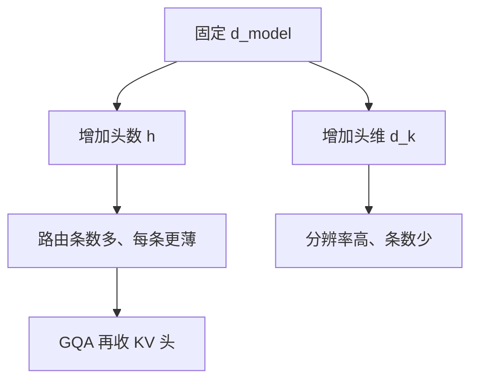

# 头维度对头数

多头把 $d_{\mathrm{model}}$ 切开并行路由；头数与每头维度的乘积被宽度钉死，多一头就薄一头。

<footer>—— Vaswani et al., Attention Is All You Need, NeurIPS 2017；头可剪枝的实证见 Michel et al., Are Sixteen Heads Really Better than One?, NeurIPS 2019</footer>

[上一课](/llm/multi-token-attention)让单头的 $q,k$ 先带上局部邻居，但仍假定头数与 $d_k$ 已经选好。主干 [多头](/llm/mha) 写过 $d_{\mathrm{model}}=h\cdot d_k$ 的切分，没有把这对超参当成课序里的对象。本课补：宽度固定时，多头还是厚头，并对照 [GQA](/llm/gqa) 的 KV 头。后课长度缩放假定 $d_k$ 已知，因为温度与 $\sqrt{d_k}$ 绑在一起。

## 问题

Vaswani 等人取 $h=8$、$d_k=64$。更宽的模型习惯保持 $d_k=128$ 左右加头，而不是把 $d_k$ 加到 512。Michel 等人又显示许多头可以在推理时关掉。缺口是一条设计约束：**头数管的是并行的路由条数，头维管的是每条路由的点积分辨率**，二者在固定 $d_{\mathrm{model}}$ 下互为代价，不能同时拉满。

[门控注意力](/llm/gated-attention) 按头关断、CLA 按层共享 KV，都默认头已经切好。切错了，后面的共享与门都在错误的粒度上操作。

$d_k$ 进入 [SDPA](/llm/sdpa) 的 $\sqrt{d_k}$。改头维不只改表达力，也改默认温度。比较头数时要控制缩放，否则在比两件不同的数值设定。

## 方法

给定 $d_{\mathrm{model}}$，选 $h$ 使 $d_k=d_{\mathrm{model}}/h$ 整除（或允许投影把头拼接维与模型维解开，此时参数量另计）。查询头可以多于 KV 头：GQA 令 $h_{\mathrm{kv}}\lt h_q$，$d_k$ 仍按查询头切。评测应在相同 FLOPs 或相同参数下扫 $(h,d_k)$，而不是只报一个最大 $h$。

实践区间：$d_k\in[64,256]$ 居多。过小，点积分辨率不够，头再多也是噪声路由；过大，头数不够，无法同时维持多种读模式，多头名不副实。Michel 的剪枝说明训练可以养冗余头——那是优化动态，不是说设计时该把 $h$ 加到极限再靠剪枝。

### 与宽度缩放的耦合

加宽 $d_{\mathrm{model}}$ 时有两条惯用路径：保持 $d_k$ 加 $h$，或保持 $h$ 加 $d_k$。前者增加路由条数，后者增加每条的容量。GQA/MQA 出现后，第三条是 $h_q$ 随宽度涨、$h_{\mathrm{kv}}$ 涨得更慢，把缓存从这条乘法里解开。

## 机制

每个头是一个低维内容寻址器。$d_k$ 太小，键空间碰撞多，不同模式挤在同一点积里。$h$ 太小，所有模式必须挤进少数子空间，残差流里的叠加更严重。多头的本意是让 softmax 在不同子空间里各自尖峰；头维则保证尖峰所在的空间还能分得清键。

推理剪枝能去掉的头，往往是从未学到独特路由的副本。训练时保留它们可能有助于优化的随机性，部署时不该把「可剪」理解成「当初不该存在」——那是另一笔计算账。

输出投影把 $h\cdot d_v$ 混回 $d_{\mathrm{model}}$。头之间的交流只发生在这里和残差流，不发生在 softmax 内部。加头却不配足够的 $d_v$，输出投影变成瓶颈。

## 边界

本课不给封闭最优公式。任务若偏精确检索，略厚的 $d_k$ 更稳；若偏多样路由（代码里同时要对齐括号、变量、缩进），略多的 $h$ 更稳。硬件上 $d_k$ 过小会让矩阵乘不饱满；$d_k=128$ 常是吞吐与表达的折中，不是理论值。下一课的长度缩放会再乘一个与 $n$ 有关的因子，不要在本课把 $\sqrt{d_k}$ 改成 $\sqrt{n}$。

## 小结

- 固定宽度下头数与头维互为代价：前者是并行路由，后者是点积分辨率。
- $d_k$ 同时决定 SDPA 温度；比较结构时要控制缩放。
- GQA 把缓存从查询头数上解开，不回答 $d_k$ 该多大。
- 可剪枝不等于设计时该堆冗余头。
- 出处：Vaswani et al., NeurIPS 2017；Michel et al., NeurIPS 2019。
