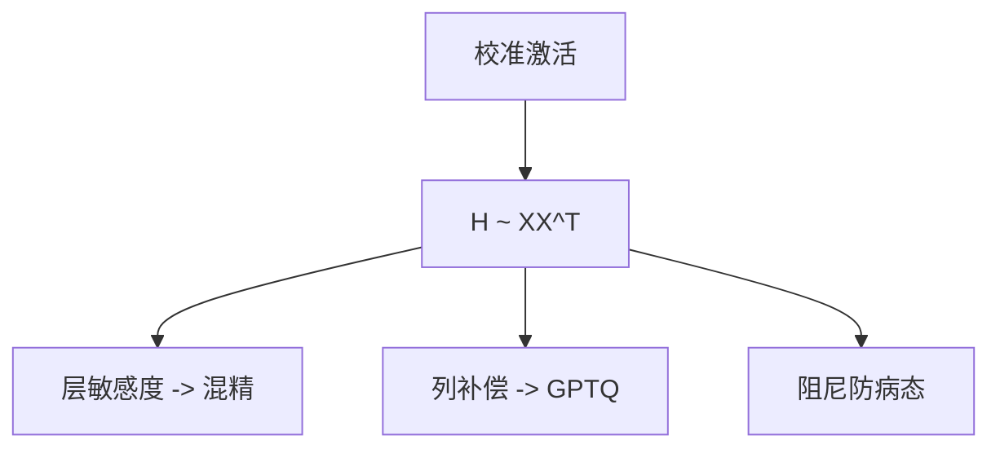

# Hessian 感知量化

损失对参数的二阶告诉你：同样一步台阶，打在高曲率方向上更疼。量化顺序与补偿应沿着 Hessian，而不是沿着 $|w|$。

<footer>—— 对照 HAWQ 一类 Hessian 感知混合精度；LLM 规模的可用实例是 GPTQ</footer>

[AdaRound](/llm/adaround) 在格子上选上或下。[GPTQ](/llm/gptq) 主课已经把 OBQ 的二阶补偿做成可跑完 175B 的算法。本课补的是 **课序缺口**：为何二阶出现、HAWQ 如何用 Hessian 分配 bit、以及不要把「Hessian 感知」当成又一篇独立配方去重导 GPTQ。后课混精搜索会用到「层的敏感度」这一标量。

## 问题

一阶（梯度）在训练末期接近零，对「哪一个权重更怕量化」几乎没信号。二阶 $H\approx \partial^2 L/\partial w^2$ 描述损失曲面的曲率：大特征值方向上，离散化同一 $\Delta w$ 引起的 $\Delta L$ 更大。幅度剪枝与 RTN 都忽略这一点，于是删/量化了「权小、曲率大」的连接——激活大时正是这些。

全模型 Hessian 不可存。层内用 $\|WX-\hat WX\|^2$ 时，$H$ 与 $XX^\top$ 成正比，这就是 GPTQ 用校准激活代替损失 Hessian 的理由。HAWQ 一类工作则用 Hessian 谱给不同层/块分配不同 bit。问题是 **用哪一个 Hessian、在哪一层近似**，不是「算真·$\nabla^2 L$」。

OBQ / OBS 来自最优脑损伤传统：用二阶估计删掉某个权重的损失增量。GPTQ 把它从「每步搜最不疼的那个」改成固定列序，否则 LLM 跑不完。

## 方法

三条落地，由轻到重：

1. 层敏感度：用 Hessian 迹或最大特征值给层打分，敏感层留 8 bit，其余 4 bit——混精搜索的启发式，下一课。
2. 层内重建：GPTQ 按列量化并用 $H^{-1}$ 补偿剩余列。细节不重复，链到主课。
3. 与 AdaRound 结合：二阶告诉补偿，舍入告诉离散点；工程上常只做 GPTQ。

校准 $X$ 质量决定 $H$ 质量。阻尼 $\lambda I$ 防病态，过大则退化成 RTN。

## 机制

二次型 $(w-\hat w)^\top H (w-\hat w)$：在 $H$ 的主轴上误差被放大。独立 RTN 在这些轴上的投影是相干的。补偿 = 在未量化子空间做牛顿步减小同一二次型。因此 Hessian 感知不是「更平滑的 round」，而是 **把离散化当约束的二次优化**。

层间：真损失 Hessian 有跨层耦合。逐层 $XX^\top$ 忽略耦合，所以前层量化后必须用新激活校准后层。这是近似的边界，也是必须逐层真实路径前向的原因。

## 边界与工程取舍

不要每步用自动微分估全模型 Hessian。不要把 HAWQ 的层 bit 分配直接抄到 Transformer 而不重测——注意力与 MLP 的谱不同。不要认为 2-bit 在二阶补偿下仍自由：网格本身的不可补偿分量会占主导，见 GPTQ 主课。下一课把敏感度变成搜索：混合精度。

## 小结

- 二阶刻画「哪一方向怕量化」；幅度与 RTN 看不见它。
- 层内 $H\sim XX^\top$，GPTQ 是可扩展的补偿算法。
- 层间用迹 / 特征值做 bit 分配启发式。
- 校准与阻尼决定 $H$ 是信号还是退化成 RTN。
- 出处：HAWQ；OBQ；GPTQ（ICLR 2023）作为 LLM 实例。
