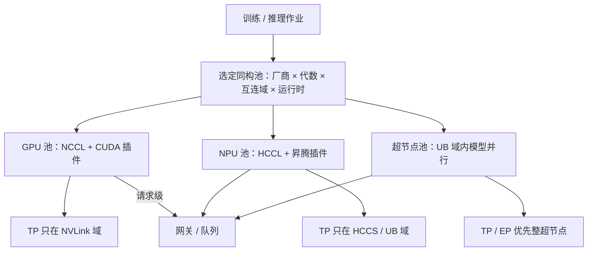

# 异构集群调度

    
调度器看见的若只是「加速器张数」，就会把张量并行组拆到两种不会集合通信的芯片上；异构首先是拓扑与运行时，其次才是装箱。

<footer>—— 对照华为云 CCE 对 GPU / NPU 分插件接入与 Volcano 拓扑感知调度的公开说明</footer>

智算集群里同时出现 NVIDIA GPU、昇腾 NPU、鲲鹏 CPU 已经是常态：有的机房按供应混装，有的在 [CloudMatrix 384](/llm/cloudmatrix-384) 超节点内部就把 NPU 与 CPU 池化。Kubernetes 默认只懂 CPU / 内存；加速器靠 Device Plugin 上报。华为云 CCE 把这件事拆成两套 AI 套件——NVIDIA GPU 一套、Ascend NPU 一套——再用 Volcano 做队列、优先级和拓扑感知。本篇写**异构调度要守的边界**，不发明未公开的装箱启发式，也不把某一云厂商控制台的默认策略写成标准。

## 问题

同构 GPU 集群的口诀是：一个 TP 组绑在同一 NVLink 域，副本用数据并行散开。换成异构之后，口诀失效的方式有三种。**设备指令集不同**：CUDA 核不能在 NPU 上跑，CANN 图不能在 GPU 上跑，混进同一进程的「一半 worker」没有集合通信可做。**互连不同**：GPU 侧 NCCL 走 NVLink / IB，昇腾侧 HCCL 走 HCCS / UB / RoCE，跨厂商没有一种可把 All-Reduce 接到一起的公开库。**资源语义不同**：GPU 可 MIG 或按卡共享；NPU 有芯级独占、虚拟化 vNPU、以及超节点内按 UB 域切的逻辑加速器。调度器若只用 `nvidia.com/gpu: 8` 与 `huawei.com/ascend-*` 的整数相加来凑「16 卡」，会得到无法启动的 Pod。

第二层问题是代数混部。昇腾 910B 与 910C 的自定义算子按 `SOC_VERSION` 分支编译，[vLLM-Ascend](/llm/vllm-ascend) 的核不是一份二进制打天下。把 910B 与 910C 塞进同一 TP 组，即使 HCCL 能建链，核形状与 UB / HCCS 带宽也不在同一档。异构包括「两代昇腾」，不只是「GPU 对 NPU」。

### 上报与可调度资源必须分开命名

CCE 文档把 GPU 与 NPU 写成不同插件、不同资源名。NPU 独占调度按张申请；拓扑感知调度还要看板内互连，减少碎片和拥塞；虚拟化则把一张物理 NPU 切成若干 vNPU，资源名带算力与内存规格。GPU 侧同样有整卡、共享、虚拟化三条。调度器的第一步不是打分，是**拒绝跨资源名的凑数**。用户清单里应写「本作业的加速器类型」，而不是「任意 8 张加速器」。

Volcano 在 CCE 里与 CloudMatrix 网络拓扑感知做过集成，这是产品文档中的能力描述。具体打分权重、超节点内是否允许跨柜 TP，以你集群里安装的调度器版本为准，不要把邻区 GPU 的 GPU-Affinity 插件配置抄到昇腾节点上。

## 方法

把异构集群画成若干**同构池**，池之间只做请求级路由，不做层内集合通信。池的键至少包括：厂商（NVIDIA / 昇腾）、代数（A100 / H100 / 910B / 910C）、互连域（NVLink 机柜 / UB 超节点 / 普通 PCIe 盒）、运行时（vLLM-CUDA / vLLM-Ascend / MindIE）。作业在提交时选定一个池；调度器在池内做拓扑感知装箱：TP 组落在同一互连域，副本可跨域。

节点标签与污点是落地手段。GPU 节点与 NPU 节点用 `device-vendor`、`npu-arch`、`nvlink-domain` / `ub-domain` 区分；Device Plugin 只在本类节点上报本类资源。Kube-scheduler 或 Volcano 的 predicate 必须检查：Pod 请求的资源名在节点上存在，且节点标签与作业的亲和一致。CloudMatrix 上还要把「本超节点 UB 域」当成可分配对象，避免把 8 路 TP 拆到两个超节点再走 RoCE——那是把 Scale-Up 作业降成 Scale-Out。

在线推理与离线训练混部时，用队列和优先级，而不是用「NPU 上再叠一个 GPU 作业」。CCE 的云原生混部谈的是 CPU 超卖与在离线；加速器混部若没有虚拟化切分，不要假设一张 910C 能安全地跑两个不同框架的 worker。

### 请求级异构与层内异构

请求级异构是合法的：同一个 OpenAI 网关后面，A 模型在 GPU 副本，B 模型在昇腾副本，按 `model` 字段分流，见 [KV 感知路由](/llm/kv-aware-routing) 的「先认模型再认缓存」。层内异构不合法：同一层的 TP All-Reduce 不能一半 NCCL、一半 HCCL。专家并行若跨出 UB 域，通信语义变成 RDMA 平面，延迟档位变了，那是 Scale-Out，要按跨超节点来规划，而不是当「调度器聪明地借了几张别的卡」。

CPU 与 NPU 的异构是另一条轴。CloudMatrix 把鲲鹏与 910C 都挂在 UB 上，论文里写明可按负载组合内存型缓存节点与计算型 NPU。调度的是**池化后的角色**（prefill 池、decode 池、KV 内存池），不是把 CPU 核当成一张假 GPU 写进 `nvidia.com/gpu`。擎天 DPU 上的 MatrixResource / MatrixLink 代理负责超节点内的实例与链路，这层在普通 CCE 节点上并不存在。

资源名 `huawei.com/ascend-310` 与 `huawei.com/ascend-1980` 出现在企业文档里，对应不同昇腾产品。抄错资源名时，事件是 `Insufficient huawei.com/...`，看起来像容量不足，其实是节点根本没有这种设备。先对插件与资源名，再扩容。

## 机制

Device Plugin 通过 kubelet 注册扩展资源，scheduler 只看见整数配额。拓扑感知要额外的设备拓扑（哪几张卡在同一 HCCS / UB 平面）。没有这张图，Volcano 也只能做「节点上 NPU 数量够不够」，把同节点但跨平面的卡绑进一组，HCCL 性能会掉到你以为的域内带宽以下。超节点场景下，爆炸半径是整域：通信柜或 UB 平面故障应把该超节点从池里摘掉，而不是继续往半通域里塞 TP。

异构还改变故障与滚动。GPU 镜像含 CUDA 驱动用户态，NPU 镜像含 CANN；滚动升级不能用同一 DaemonSet 往两类节点推驱动。探针必须分运行时：vLLM 的 `/health` 与 MindIE 的探针不是同一个语义。取消与 KV 释放仍按各引擎自己的规则，见 [sse-cancel](/llm/sse-cancel)，调度器不负责把 GPU 页表翻译成 NPU 块表。

### 利用率不是把卡填满

混部的诱惑是把空闲 NPU 借给 GPU 作业的溢出队列。若运行时不能在该卡上执行，填满只是制造 Pending。即便虚拟化切了 vNPU，共享的是同一 Cube 与 HBM，延迟 SLA 会互相踩。异构调度的一阶目标是**正确性与通信域**，二阶才是利用率。利用率用同构池内的连续批、分时队列、虚拟化来做，不要用跨厂商拼卡。

## 边界与工程取舍

不要在没有共同集合通信库的前提下做跨厂商 TP / EP。不要把 CloudMatrix 超节点当 48 台互不往来的 8 卡机来调度——那是买了 UB 却只用以太网编程模型，与 [机柜作为一块逻辑加速器](/llm/rack-as-accelerator) 的教训相同。不要假设 CCE 的 GPU 虚拟化参数能套到 vNPU。不要编造未公开的超节点内端口级调度算法。

成本账：异构池增加了镜像、驱动、监控和值班手册的份数；收益是供应可替代、以及超节点内 CPU 内存池给 KV 用。若集群很小、只有一种加速器，不要为「异构」上两套插件。

出处：华为云 CCE《调度概述》与 AI 套件（NVIDIA GPU / Ascend NPU）说明、Volcano 在 CCE 上的队列与拓扑感知描述，以及 CloudMatrix384 论文中 CPU/NPU 池化与三平面网络。不引用未公开的调度器源码阈值。

## 小结

- 异构调度先按厂商、代数、互连域、运行时分同构池，池内做 TP，池间只做请求级分流。
- GPU 与 NPU 用不同 Device Plugin 和资源名；跨资源名凑卡会得到无法通信的进程组。
- 两代昇腾也是异构；插件核与带宽不共享同一假设。
- CloudMatrix 上的异构还包括 UB 上的 CPU 内存池与 NPU 计算池，按角色调度而不是按「假 GPU」。
- 利用率在同构池内做；跨厂商填卡不是调度，是配置错误。
- 出处：华为云 CCE 调度与 AI 套件文档；CloudMatrix384 公开论文中的资源池化。
