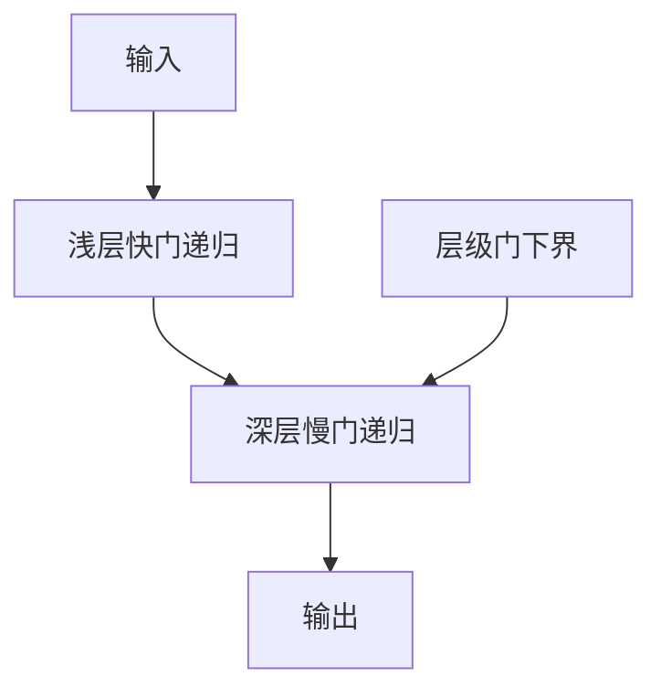

# HGRN

用层级衰减门让浅层快忘、深层慢忘，在线性递归里做出多时间尺度，而不走注意力。

<footer>—— Qin et al., Hierarchically Gated Recurrent Neural Network for Sequence Modeling, NeurIPS 2023</footer>

[上一课](/llm/gated-linear-attention)的状态是键值外积矩阵，遗忘门作用在这份矩阵上。更老、更窄的路线是：状态就是向量，门是对角或标量，把 RNN 做强。HGRN（Hierarchically Gated RNN）把**层级时间尺度**写进门的结构：层越深，门越倾向保持。本课补这条，是为了后课 delta rule、TTT 仍有一个「向量状态 RNN」的参照，也避免把所有线性模型都说成 GLA。

## 问题

GLA 与对角 SSM 都能多尺度，但多尺度来自不同头或不同通道的独立门。人若希望**深度本身编码时间尺度**——浅层处理局部，深层持有篇章——需要门的先验随层变，而不是等优化自己发现。缺口是一种显式层级门控：层次 $l$ 的遗忘下限更高，强制长程信息走深层递归。

HGRN 不是 SSM 的 HiPPO 矩阵，也不是 softmax。它是门控 RNN 族，训练用并行扫描（门在对角时结合），推理常数状态。复杂度与 Mamba 同类，归纳偏置不同。

HGRN2 把若干点改到更接近线性注意力。本课以层级门为主，不把版本号写成另一课。

## 方法

对每层每通道，$h_t=\mu_t\odot h_{t-1}+(1-\mu_t)\odot \tilde{x}_t$，其中 $\mu_t=\sigma(\cdot)$ 且被加一个随层增加的下界或偏置，使深层 $\mu$ 更接近 1。输入 $\tilde{x}_t$ 来自前一层输出的投影。可以再加输出门。整网叠多层这种递归，层间仍残差。

并行化：$\mu_t$ 只依赖当前输入时，对 $h$ 是对角仿射，走[分块并行](/llm/chunked-parallel-form)。若门依赖 $h_{t-1}$，结合律变复杂，往往禁止，以保住训练核。

### 与 LSTM / GRU 的课序位置

LSTM 的门依赖上一隐状态，难以扫描并行，大模型训练不用它当主干。HGRN 把门限制成输入依赖加层级先验，换取可并行。这是「RNN 要进 LLM 主干」必须付的结构税，与 Mamba 限制 $A$ 为对角同类。

## 机制

层级下界相当于手工 curriculum：深层无法选择完全重置，长程 token 更可能活过浅层的快门。浅层则允许低 $\mu$，快速跟踪局部语法。相对 HiPPO 的多项式基，这里不声称最优投影，只声称深度对齐时间常数，好初始化、好优化。

容量上向量状态是 $\Theta(d)$ 每层，比 GLA 的 $\Theta(d^2)$ 小，比「一层对角 SSM 扩到很大 $N$」更依赖**叠层**来加记忆。混合架构里 HGRN 块常插在注意力块之间当便宜的局部/中程滤波器。不要把它与 [Mamba](/llm/mamba) 的选择性对角通道互换：HGRN 的层级先验写在深度上，Mamba 的选择写在时间步的 $\Delta_t$ 上，可以叠，但不是同一旋钮。

层级先验过强会让深层学不会遗忘过时篇章状态（话题切换）。下界应是弱偏置，不是把 $\mu$ 钉死在 0.99。

## 边界

HGRN 不提供内容寻址表，精确召回仍弱。不要与 HiPPO 的「最优记忆」口号互换引用。把 LSTM 换上扫描核却保留 $h$ 依赖门，不是 HGRN，也通常训不动大宽度。下一课 delta 规则会把更新从「插值遗忘」改成「用新键擦除旧关联」，那是联想记忆，不是层级时间尺度。

## 小结

- HGRN 用随深度变强的遗忘下界，在可扫描 RNN 里强制多时间尺度。
- 门须主要依赖输入，才能走分块并行；依赖 $h$ 的 LSTM 式门不在本课。
- 向量状态省容量、弱于矩阵状态与注意力表；深度用来堆时间常数。
- 先验过强会损害话题切换时的遗忘。
- 出处：Qin et al., NeurIPS 2023。
