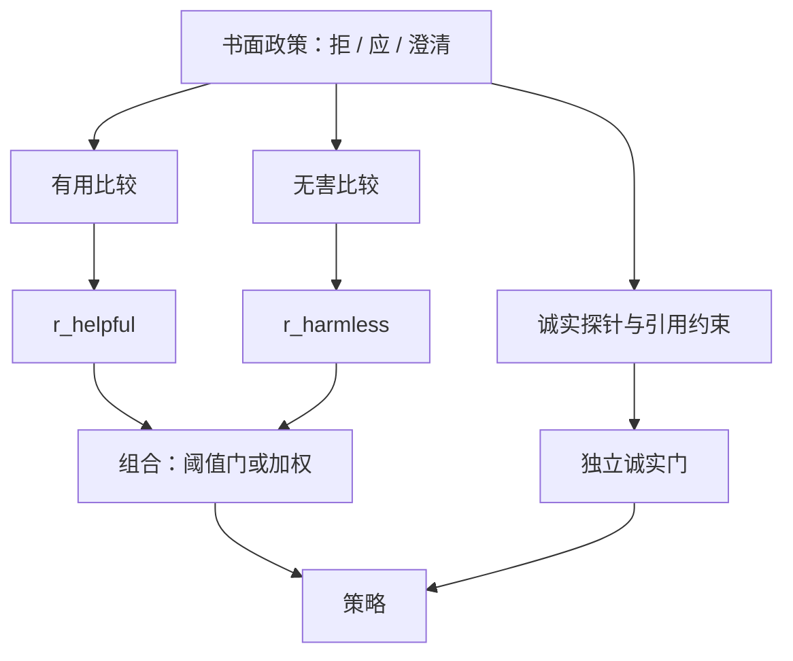

# 多轴偏好：有用/诚实/无害

有用、诚实、无害不是同一条分数的三个别名；它们经常互相卡住，必须分开写进指南、比较协议和评测表，而不能指望一个标量自己排好序。

<footer>—— Askell et al., A General Language Assistant as a Laboratory for Alignment, 2021；Bai et al., Training a Helpful and Harmless Assistant with RLHF, 2022</footer>

Askell 等人把对齐实验室的目标收成三个轴：有用（Helpful）、诚实（Honest）、无害（Harmless），合称 HHH。有用要求模型按用户意图做事、在含糊时追问；诚实要求不编造、不确定时说不确定、不隐瞒已知限制；无害要求不协助造成伤害、不无故冒犯。Bai 等人随后的 HH-RLHF 把其中两条——有用与无害——做成可训练的成对偏好，并公开了 Anthropic 的 HH 比较集。本篇写多轴为什么不能压成一个 [奖励模型](/llm/reward-model) 标量、比较协议怎么拆、以及评测必须成对看哪些曲线。诚实轴与引用幻觉见 [虚构引用](/llm/honesty-citations)；无害推得过猛见 [过度拒绝](/llm/over-refusal)。

## 问题

单一偏好问题是：标注员在「哪一条更好」里当场权衡三件事，残差被模型当成一种质量。开放问答里更长、更会道歉、更会附和用户的回答，常常同时抬高「有用」的表面分、压低诚实与无害的真实符合度。Askell 的实验室设定已经指出冲突：用户要危险帮助时，有用与无害相反；用户持有错误前提时，有用（顺着说）与诚实（纠正）相反；拒答过宽则无害上升、有用下降。HH-RLHF 的经验是：把有用比较与无害比较分成两套数据、两套偏好模型，冲突才会变成可调的组合规则，而不是藏在标注方差里。

把三轴写成口号再交给众包，得到的是平均人格，不是可审计政策。政策必须先回答：哪一类请求必须拒、哪一类必须答、不确定时默认偏向哪一轴。没有这张表，HHH 只是三个英文词。

### 三轴冲突不是标注噪声

噪声是同一轴上两人看法不同；冲突是同一条 $(x,y)$ 在两轴上的序相反。用户问「把这段合同改得对我更有利」：有用轴可能偏好改稿，无害/诚实轴可能偏好指出这不是法律意见并拒绝伪造条款。若只采一条总序，赢的往往是「先免责再尽量改」的折中腔，两边都不满意。正确做法是允许同一对在不同轴上标出相反的胜者，下游用分头 $r_{\mathrm{H}},r_{\mathrm{Hon}},r_{\mathrm{HH}}$ 或词典序（先过无害阈值，再比有用，诚实用独立探针约束）。Llama 2 把有用与安全分头，是同一工程判断。

Askell 2021 的 HHH 是评测与写作指南的坐标系；Bai 2022 的 HH-RLHF 是把 H 与 Harmless 做成偏好学习的数据与 RL 流程。不要把实验室论文里的定性轴，直接写成 HH 数据集已经覆盖了诚实。HH 公开集对「无害 vs 有用」更密，对「引用是否真实」更稀。

## 方法

收集：每个提示至少服务一个主轴。有用集来自真实或仿真的助手请求，比较「完成意图的质量」；无害集来自红队与政策类别，比较「拒、改写、给替代」是否符合书面政策；诚实集来自可知真值或可知无知的题（事实、引用、能力边界），比较「对、说不知道、给出处」是否优于流畅编造。指南要写清平局：两条都无害但一条更啰嗦，有用轴可以分胜负，无害轴应标平。Bai 等人强调无害数据需要对抗性提示，因为清洁的危害关键词测不到包装后的失败。

建模：分头奖励或分头比较，推理时再组合。组合不是唯一的。阈值门：无害分低于 $\tau$ 则走拒答模板，否则最大化有用。加权和：$r=\lambda_{\mathrm{H}} r_{\mathrm{H}}+\lambda_{\mathrm{HH}} r_{\mathrm{HH}}$，权是产品超参，必须在过拒绝曲线上扫。诚实很少适合直接加进同一 PPO 标量，因为它的失败（虚构文献）在成对「看起来更专业」里往往赢；更稳的是独立评测门加检索约束，见诚实篇。

评测表最少四列：有用（指令遵循、人工或 Arena 类）、无害（政策类别上的配合率，只用公开套件接口）、过拒绝（表面敏感但应回答）、诚实（已知题准确率、虚构引用率、拒答是否承认无知）。只报无害下降或只报有用上升，都会选出单轴过拟合的检查点。Askell 的实验室写法是把三条行为描述给评测员；工业上要把描述收成可重复的题集，否则「HHH 分」不可比。

### 指南里的词典序与加权

标注指南应显式规定冲突时的优先级。常见词典序：无害优先于有用，诚实优先于「听起来有用」。这不是道德哲学声明，而是为了降低标注方差：没有词典序，有的标注员会完成危险请求并标赢，有的会拒并标赢，[BT 模型](/llm/bradley-terry) 会拟合噪声。加权用于轴内：有用轴上完整性高于文采；诚实轴上正确高于详尽。指南外的美学不要偷偷进比较，否则 HHH 会被文风吞掉。

## 机制

成对数据把轴投影到胜负。若比较者在无害题上仍按「谁答得全」选，无害头会学成有用头的副本。HH-RLHF 把两套比较分开，等于把投影矩阵写成块对角，冲突留给组合层。RL 或 [DPO](/llm/dpo) 沿组合后的标量上升：$\lambda_{\mathrm{HH}}$ 过大，策略进入过拒绝；$\lambda_{\mathrm{H}}$ 过大，策略在边界题上配合。KL 只限制走多远，不告诉你走的是哪一轴。因此分头不是多此一举，是让「走哪一轴」成为可调参数。

诚实更难进同一机制。虚构但带文献格式的回答，在有用比较里常赢，因为信息密度的表面更高。无害比较也不惩罚编造论文，除非指南写了「不得伪造出处」。于是三轴里诚实最容易被另外两轴的梯度盖掉。机制上的补救是：诚实不靠同一 $r$ 的第十三项权重，而靠可检查的约束（检索到的才允许引用）和单独探针（见诚实篇）。

「更无害」在比较里经常长得像更长的道歉。无害头会和 [长度偏置](/llm/length-bias-rm) 耦合。长度匹配的比较、或对拒答长度设上限，是无害轴的数据补丁，不是 HHH 定义自带的。

### 红队只覆盖无害轴的一部分

Bai 等人的无害数据依赖人写对抗提示。这提高了无害头在「像红队的题面」上的分辨率，但不自动提高诚实或有用。把红队题拿去当有用比较的 $x$，会污染有用头。三轴要三套提示分布：日常助手、政策类别与对抗包装、可知真值。共享提示可以，但标签必须按轴分列，不能一条总序复制三遍。

## 边界与工程取舍

HHH 不是完备基。公平、隐私、版权、工具调用的副作用，常常单列政策，不要硬塞进无害。多语言上，英语无害模板混进其他语言有用数据，会出现只在英语拒、在其他语言配合或乱拒。轴的定义要按语言与产品线版本化。

众包能标有用，未必能标无害与诚实，见 [专家 vs 众包](/llm/expert-vs-crowd)。无害需要政策训练与抽检；诚实需要答案键或检索。用同一批标注员三轴全标，是成本上的假省：方差会变成「看起来像助手」。Constitutional AI 把无害比较改成原则驱动的 [AI 反馈](/llm/aif-as-preference)，减轻人直接看有害内容，但不取消书面原则，也不自动覆盖诚实。

产品上不要对外承诺「已优化 HHH」而不给四列表。HHH 是坐标系。坐标没有刻度时，营销句和训练目标不是同一对象。

公开 HH 数据有用，但政策不是你的政策。用 HH 训无害头再在自己的类别上测，会有盲区。应把 HH 当预训练式的偏好先验，用自己的政策比较做适应，并报告域外无害与过拒绝。

## 小结

- Askell 的 HHH 把对齐拆成有用、诚实、无害三轴；轴间冲突是结构问题，不是标注噪声。
- Bai 的 HH-RLHF 把有用与无害做成分头偏好；诚实通常需要独立探针与可检查约束。
- 比较协议按轴分列，冲突用词典序或阈值门处理，再扫组合权重。
- 评测必须同时看有用、无害配合率、过拒绝、诚实，单列会选出单轴过拟合。
- 无害比较易与长度、道歉腔耦合；有用比较易奖励虚构的详尽。
- 出处：Askell et al., *A General Language Assistant as a Laboratory for Alignment*, 2021；Bai et al., *Training a Helpful and Harmless Assistant with Reinforcement Learning from Human Feedback*, 2022。
